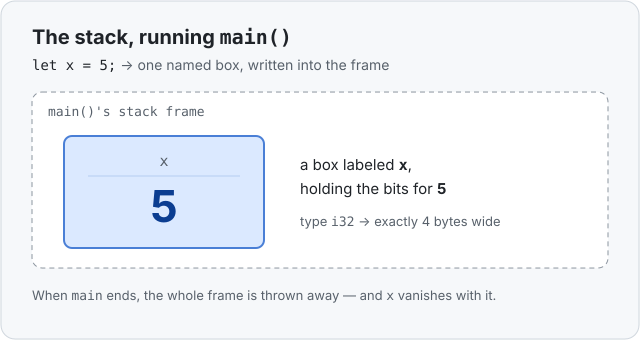

# Concept 01 · A number in a variable — Under the hood

> Pair: [Use it](use-it.md) · **Under the hood** (you are here)
> Track: [From-Zero: Rust](../README.md)

You've seen *how* to write `let x = 5;`. Now the part that makes everything later make
sense: **where does that `5` actually go?**

## The stack
When your program runs, it gets a strip of fast, tidy memory called the **stack**.
Every time a function is called, it's handed its own section of the stack — a **stack
frame**. So `fn main()` running means one thing to picture: *a frame for `main`
exists.*

`let x = 5;` then does exactly one physical thing: it **reserves a small box inside
`main`'s frame, labels it `x`, and writes the bits for `5` into it.**



That box is exactly **4 bytes** wide — because `5` is an `i32` (a 32-bit integer, and
32 bits = 4 bytes), and the compiler knows that size *before the program ever runs*.
Known size means it reserves exactly that much room, no guessing. (*Why* size is such
a big deal gets its own lesson soon.)

## It lives and dies with its block
The box for `x` exists from the `let` line until the closing `}` of the block it's in.
When `main` finishes, its **entire frame is thrown away in one go** — and the box for
`x` vanishes with it. You never clean it up by hand; the stack reclaims the frame
automatically the moment the function ends.

So the whole story for a simple number is: **one named box, on the stack, gone at the
end of its block.** Hold onto that picture. Everything harder later — the heap,
ownership, borrowing — is just what happens when a value is too big, or needs to live
*longer*, than this simple box allows.

## Predict the memory
Before you expand the answer, work it out from the picture above.

```rust
fn main() {
    let a = 10;
    let b = 20;
}
```

How many boxes are there, where do they live, and when do they disappear?

<details>
<summary>Show the answer</summary>

**Two boxes**, both on the **stack**, inside `main`'s frame — one labeled `a` holding
`10`, one labeled `b` holding `20`, each 4 bytes wide. They disappear **together**,
the instant `main`'s frame is thrown away at the closing `}`.
</details>

## Next
- [Concept 02 — Frozen by default, and `mut`](../README.md) revisits this exact box
  and asks the obvious next question: can you change what's *inside* it?
