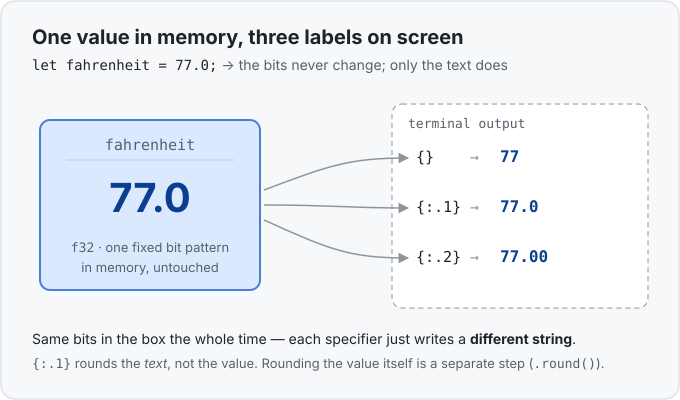

# Interlude 01a · Printing and formatting — Use it

> Interlude: a **single lesson** (no separate "Under the hood" — formatting isn't a
> memory topic, so there's no new memory picture to draw).
> Track: [From-Zero: Rust](../README.md)

You met `println!("{x}")` back in [Concept 01](../01-a-number-in-a-variable/use-it.md)
and we waved past it. This interlude slows down and actually teaches it, because
you'll print something in almost every program you write.

## The idea
Printing has two separate parts: a **value** (living in its box in memory) and the
**text** you draw on the screen to describe it. `println!` builds that text from a
*template* — a string with **holes** in it — and fills each hole with a value.

```rust
fn main() {
    let x = 5;
    println!("{x}");
}
```

- `println!` is a **macro** (the `!` marks it). It prints a line of text, then a
  newline.
- `"{x}"` is the template. The `{ }` is a **hole**; `{x}` means "fill this hole with
  the value named `x`."

Output:
```
5
```

## Filling the holes — two ways

**Named / captured (`{x}`)** — put a variable's name straight inside the braces. This
is the cleanest style when you're printing a variable you already have:

```rust
let apples = 3;
println!("I have {apples} apples");   // I have 3 apples
```

**Positional (`{}`)** — leave the braces empty, and pass the values after the
template, in order. The first empty `{}` takes the first value, the second takes the
second, and so on:

```rust
let celsius = 25;
let fahrenheit = 77;
println!("{} Celsius = {} Fahrenheit", celsius, fahrenheit);
// 25 Celsius = 77 Fahrenheit
```

Both styles produce the exact same text. Named is tidiest for plain variables; empty
`{}` earns its keep when the thing you're printing is an expression, not a name (you
can't write `{a + b}`, but `{}` with `a + b` after the comma works fine).

## Format specifiers — the part after the `:`

Inside a hole you can add a colon and *instructions* for how the value should look:
`{:.1}`, `{:>8}`, and so on. The one you'll reach for constantly is **precision** for
numbers — `.N` fixes how many digits show after the decimal point:

```rust
let value = 7.0;
println!("{value}");       // 7      <- plain: the trailing .0 is dropped
println!("{value:.1}");    // 7.0    <- forced to one decimal place
println!("{value:.2}");    // 7.00   <- two places
println!("{:.2}", 3.14159); // 3.14  <- rounds to fit
```

This is where a Celsius→Fahrenheit result of `77.0` prints as `77` under `{}` but as
`77.0` under `{:.1}`. (It came straight out of a
[practice challenge](../../../challenges/celsius-to-fahrenheit/README.md).)

Precision is just one specifier — the same slot also does width, zero-padding, and
alignment (`{:5}`, `{:05}`, `{:>8}`). Full reference in the
[Rust handbook: `{:.1}` format specifiers](../../../languages/rust.md#format-spec).

## What's really happening (the one idea to hold)

Here's the thing that trips people up, and the closest this lesson has to an "under
the hood":

**`{:.1}` changes the text, never the value.**

Your number `7.0` is one fixed bit pattern sitting in its box. `{}`, `{:.1}`, and
`{:.2}` don't touch those bits — they each produce a *different string describing the
same value*. Same coin in the drawer; different price tags in the window.



Why this matters: if a result looks "rounded" on screen, the stored value is **not**
rounded — only the printout is. Rounding the number itself is a separate operation
(`value.round()`), which *does* change the bits. Display and value are two different
layers.

## A peek at `{:?}` — debug printing

Plain `{}` only works for types that have a "human-facing" display. Many types —
tuples, arrays, and your own structs — don't, but they have a **debug** view instead,
reached with `{:?}`:

```rust
let point = (3, 4);
println!("{point:?}");    // (3, 4)
```

Rule of thumb: `{}` is for output meant for a person; `{:?}` is for output meant for
*you*, the programmer, while poking at things. You'll meet `{:?}` properly again once
you're printing structs.

## Poke at it
Try each and predict the output first:
- Print the same float with `{}`, `{:.0}`, and `{:.3}`. What does `{:.0}` do to `7.0`?
- Swap a `{name}` hole for an empty `{}` plus an argument — confirm the output is identical.
- Try `{:?}` on a plain number like `5`. Does it still work? (It does — debug is defined for numbers too.)

## Exercises
Write, run, and check each against its solution file.

1. **Same value, two labels** — [starter](exercises/1-starter.rs) ·
   [solution](exercises/1-solution.rs). Store one price, then print it plainly and
   again with exactly two decimals — proving the value didn't change, only the text.
2. **Rebuild the challenge line** — [starter](exercises/2-starter.rs) ·
   [solution](exercises/2-solution.rs). Given a Celsius and a Fahrenheit value, print
   `25 Celsius = 77.0 Fahrenheit` — Celsius plain, Fahrenheit to one decimal.
3. **Debug a pair** — [starter](exercises/3-starter.rs) ·
   [solution](exercises/3-solution.rs). Put two numbers in a tuple and print it with
   `{:?}`.

You've passed when all three compile, run, and print what you expect.

## Next
- Back to the memory spine: [Concept 02 — Frozen by default, and `mut`](../02-frozen-by-default-and-mut/use-it.md).
- Reference for everything above: [Rust handbook](../../../languages/rust.md#format-spec).
