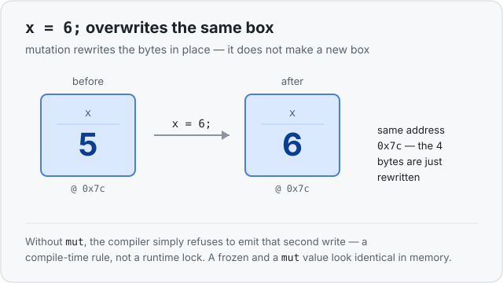

# Concept 02 · Frozen by default, and `mut` — Under the hood

> Pair: [Use it](use-it.md) · **Under the hood** (you are here)
> Track: [From-Zero: Rust](../README.md)

You saw that `mut` lets you reassign a variable. The question that actually matters:
when `x = 6` runs, **what happens to the box in memory?**

## Mutation rewrites the same box
Recall Concept 01: `let mut x = 5;` reserves one 4-byte box on the stack, at some
address, and writes `5` into it. When `x = 6;` runs, it does **not** make a new box.
It writes the bits for `6` into **the exact same 4 bytes**, at the exact same address.
The old `5` is simply overwritten.



So mutation is *in place*: same slot, same address, new contents. That's the whole
mechanical difference between a `mut` variable and a frozen one — a frozen variable is
written **once** and never again.

## "Frozen" is a compile-time rule, not a runtime lock
Here's the part experienced programmers often expect to work differently: immutability
in Rust costs **nothing** at runtime. There is no lock, no flag, no check while the
program runs. `let x = 5;` (no `mut`) just means the **compiler refuses to emit** a
second write to that box — it's a rule enforced entirely *before* the program runs. A
frozen `i32` and a `mut` `i32` are byte-for-byte identical in memory; the only
difference is which writes the compiler will allow you to type.

## Why this isn't the same as re-declaring
The [Use it](use-it.md) lesson noted that `let x = 6;` (a second `let`) is different
from `x = 6;` (mutation). Now it's physical:

- `x = 6;` — **same box**, contents overwritten. One address, start to finish.
- `let x = 6;` — a **new box** (its own address); the old one still sits there until
  the scope ends, just unreachable by that name.

That's why shadowing gets its own concept later: it's a different thing happening in
memory, not just a different way to write the same thing.

## Predict the memory
```rust
fn main() {
    let mut x = 5;
    x = 6;
}
```

Two questions before you expand the answer:
1. After `x = 6`, is `x` at the **same address** as before, or a new one?
2. Did making `x` mutable (instead of frozen) change how much memory it uses?

<details>
<summary>Show the answer</summary>

1. **Same address.** `x = 6` overwrites the same 4-byte slot in place — mutation never
   relocates the box.
2. **No.** A `mut i32` and a frozen `i32` are identical in memory (both 4 bytes on the
   stack). `mut` only changes what the *compiler* lets you do; it adds nothing at
   runtime.
</details>

## Next
- [Concept 03 — Types have sizes](../README.md): we've been saying "4 bytes" — next is
  *why* the compiler always knows that number, and what breaks if it can't.
