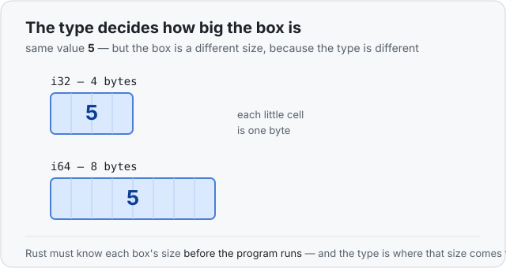

# Concept 03 · Types have sizes — Under the hood

> Pair: [Use it](use-it.md) · **Under the hood** (you are here)
> Track: [From-Zero: Rust](../README.md)

We keep saying a number's box is "4 bytes." This lesson is about *why Rust always knows
that number* — and why it's the whole reason Rust cares about types.

## Why Rust must know the size
Back to the shelf. When Rust sets aside a box for a variable, it has to know **how big**
to make it — you can't reserve a space on a shelf without knowing the size of what's
going there. And Rust figures all of this out **before the program ever runs**, while
the compiler is still reading your code.

So where does the size come from? The **type**. `i32` means "a 4-byte box." `i64` means
"an 8-byte box." The type is the compiler's answer to the question *"how much room do I
set aside?"* That's the real reason Rust always wants to know the type of everything —
not to be fussy, but because it literally cannot lay out the memory without the size.



## Same value, different box
The number `5` stored as an `i32` sits in 4 bytes. The exact same `5` stored as an
`i64` sits in 8 bytes. The value is identical — the box is a different size, purely
because the type is different. Bigger number types can hold bigger numbers, and they
pay for it with more room on the shelf.

## The cliffhanger
Notice something: every type so far has a size Rust knows up front. But what about a
thing that can **grow** — say a piece of text you keep adding letters to? How do you
reserve a fixed-size box for something whose size you don't know yet, and that might
change *while the program is running*?

You can't — not with the simple shelf boxes we've used so far. That exact problem is
the door to the next big idea, the **heap**, coming in a few lessons. Hold the question
in mind; it's what makes the rest of Rust click.

## Predict the memory
```rust
let a: i32 = 5;
let b: i64 = 5;
```

Both boxes hold the number `5`. Do they take up the same amount of room?

<details>
<summary>Show the answer</summary>
<p><strong>No.</strong> <code>a</code> is <strong>4 bytes</strong> (it's an <code>i32</code>) and <code>b</code> is <strong>8 bytes</strong> (it's an <code>i64</code>). Same value, different-sized boxes — the size comes from the <strong>type</strong>, never from the value inside.</p>
</details>

## Next
- [Concept 04 — Functions and the call stack](../README.md): what happens to these
  boxes when you start calling functions.
