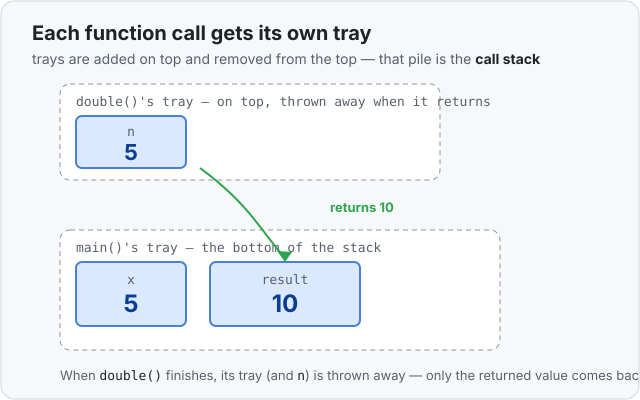

# Concept 04 · Functions and the call stack — Under the hood

> Pair: [Use it](use-it.md) · **Under the hood** (you are here)
> Track: [From-Zero: Rust](../README.md)

Back in Concept 01 you saw that a running function gets its own **frame** — its own
section of the shelf — where its boxes live. This lesson is about what happens to those
frames when one function **calls** another.

## A stack of trays
Picture each function's frame as a **tray**. When the program starts, `main`'s tray is
sitting on the table. The moment `main` calls `double`, a **brand-new tray for `double`
is set down on top** of main's. `double`'s own boxes — its parameter `n`, and anything
else it makes — live on *that* top tray.



While `double` runs, its tray is the one on top, and that's where all its work happens.
The instant `double` **finishes**, its whole tray is **lifted off and thrown away** —
`n` and everything on it vanish at once. Only the value it returns is handed back down
to `main` (copied into `result`'s box).

Trays are always added to the top and taken off the top — last one on, first one off.
That's why this pile is called the **call stack**: every function call is a tray pushed
on, and every return is a tray popped off.

## The input was a copy
When `main` called `double(x)`, the `5` sitting in `x` was **copied** into `double`'s
own box `n`. They are two separate boxes on two separate trays. So if `double` changed
`n`, `main`'s `x` wouldn't move at all — different boxes. (That's how it works for
simple numbers; the fuller story of what gets copied and what doesn't is the coming
soon in Concept 06 — and it's the start of ownership.)

## Predict the memory
```rust
fn add_one(n: i32) -> i32 {
    let result = n + 1;
    result
}

fn main() {
    let x = 5;
    let y = add_one(x);
}
```

Two questions before you peek:
1. When `add_one` finishes, what happens to its boxes `n` and `result`?
2. Is `main`'s `x` changed by anything that happened inside `add_one`?

<details>
<summary>Show the answer</summary>

1. `n` and `result` live on `add_one`'s tray. When it returns, that tray is thrown
   away and **both vanish**. Only the returned value (`6`) comes back, copied into `y`.
2. **No.** `main`'s `x` is a separate box on main's own tray. Its `5` was *copied* into
   `n`, not shared — so nothing inside `add_one` could touch it.
</details>

## Next
- [Concept 05 — Expressions, statements, and return](../05-expressions-statements-and-return/use-it.md):
  first, a short detour on how a value actually comes *out* of a function (that
  no-semicolon rule). Then Concept 06 — `Copy` types — picks up the "what gets copied?"
  question from just above.
