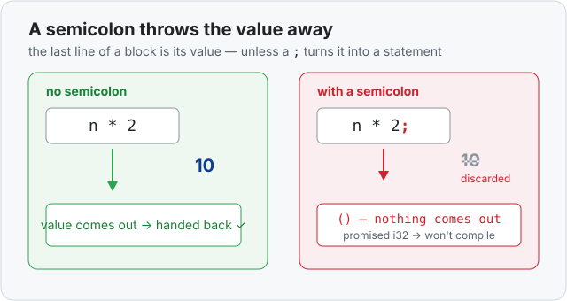

# Concept 05 · Expressions, statements, and return — Under the hood

> Pair: [Use it](use-it.md) · **Under the hood** (you are here)
> Track: [From-Zero: Rust](../README.md)

This one isn't about the shelf — it's about how Rust **reads** your code. That's what
explains a rule which otherwise looks like magic: why *deleting a semicolon* changes
what a function does.

## Expressions produce values; statements don't
Rust sorts the pieces of your code into two kinds:

- An **expression** is anything that **produces a value**. `5` is an expression (it
  produces `5`). `n * 2` is an expression (it produces `10`). Even a whole block
  `{ … }` is an expression — it produces the value of the **last expression inside it**.
- A **statement** does something but produces **no value**. `let x = 5;` is a statement
  — it sets up a box, but "setting up a box" isn't itself a value.

## The semicolon turns an expression into a statement
This is the whole trick: **putting a semicolon after an expression turns it into a
statement — and that throws the value away.**

- `n * 2` — an expression; its value `10` is available to be used.
- `n * 2;` — now a statement; the `10` is computed and then **discarded**. What's left
  is "nothing," which Rust writes as `()` and calls *unit* (an empty value).



## A function body is a block
A function's `{ … }` is a block, and a block's value is its **last expression** (when
that last line has no semicolon). Put the two facts together:

- `fn double(n: i32) -> i32 { n * 2 }` — the block's value is `10`, so that's what the
  function hands back. ✅
- `fn double(n: i32) -> i32 { n * 2; }` — the last line is now a *statement*, so the
  block produces `()` (nothing). But you promised `-> i32`. Mismatch → **compile
  error**: *expected `i32`, found `()`*. Caught before the program ever runs.

And `return x;` is simply the other door: "stop here and hand back `x` right now" —
which is how you leave a function **early**, from the middle.

## Why this turns out to be lovely
Because blocks are expressions, lots of things *produce values* in Rust that don't in
many other languages. Soon you'll write things like:

```rust
let biggest = if a > b { a } else { b };
```

— where the whole `if` hands back a value. Same rule, everywhere: the last thing in a
block, with no semicolon, is what the block is worth.

## Predict the value
```rust
fn mystery(n: i32) -> i32 {
    n + 1;
}
```

Does this compile? If not, why?

<details>
<summary>Show the answer</summary>

**No.** The `n + 1;` has a semicolon, so it's a *statement* — the value is thrown away
and the block produces `()` (nothing). But the function promised to hand back an `i32`,
so Rust stops with *expected `i32`, found `()`*. Delete the semicolon and it works.
</details>

## Next
- [Concept 06 — `Copy` types](../README.md): back to the shelf, and the very start of
  ownership.
