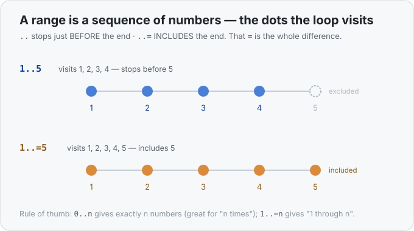

# Interlude 05a · Loops and ranges — Use it

> Interlude: a **single lesson**. Loops and ranges are everyday tools, not a memory
> topic, so there's no separate "Under the hood" — the one small picture you need
> (a range is just a sequence of numbers) lives right here.
> Track: [From-Zero: Rust](../README.md) · Sits after [Concept 05](../05-expressions-statements-and-return/use-it.md)

## The idea
So far every line of code ran **once**. But you constantly want to do something *many
times* — print ten rows, multiply the numbers 1 through 5, step through a list. The tool
for "do this again and again" is a **loop**, and the most common loop walks over a
**range** — a little value that stands for a run of numbers like *1, 2, 3, 4, 5*.

Ranges are the star of this lesson. They look tiny — just `1..=10` — but they hide a
few real questions (What does `..` vs `..=` mean? Can the ends be variables? How do you
count *down*? When should you use a different kind of loop instead?). We'll answer all
of them.

## The `for` loop, and your first range
```rust
fn main() {
    for i in 1..=5 {
        println!("{i}");
    }
}
```
```
1
2
3
4
5
```

Read `for i in 1..=5` as: *"let `i` be each number in the range 1 to 5, in turn, and run
the block once for each."* The `1..=5` is the **range**. The `for` loop pulls one number
out of it at a time, names it `i`, and runs the body — five times, with `i` being 1, then
2, … then 5.

That's the whole shape of a `for` loop: `for <name> in <range> { <body> }`. The range
decides *which* numbers; the loop just visits them.

## The one that trips everyone: `..` vs `..=`
There are **two** ways to write a range, and the difference is one character:

- `1..5` — an **exclusive** range: `1, 2, 3, 4`. It stops *just before* 5.
- `1..=5` — an **inclusive** range: `1, 2, 3, 4, 5`. The `=` means *"and include the end."*



That's genuinely the only difference — the `=` pulls the last number into the sequence.
So why does Rust offer both? Because each fits a different job perfectly:

- **`0..n` (exclusive)** gives you *exactly `n` numbers*: `0..3` is `0, 1, 2`. That's ideal
  for "do something `n` times," and for walking the positions of a list (a list of length
  `n` has positions `0` through `n-1`, which is exactly `0..n`).
- **`1..=n` (inclusive)** gives you "`1` through `n`" literally. That's what you want for a
  multiplication table `1..=10` (you *do* want the 10) or a factorial `1..=n` (you *do*
  want the `n`).

When your loop is off by one — running one time too few or too many — the first thing to
check is whether you meant `..` or `..=`.

## The ends can be anything — including variables
A range isn't special magic syntax; the two ends are just **values**. Anything that
produces a number works there, so you can absolutely use variables:

```rust
fn main() {
    let low = 3;
    let high = 7;

    for i in low..=high {
        println!("{i}");     // 3, 4, 5, 6, 7
    }
}
```

The ends can even be expressions — `0..numbers.len()` (from `0` up to the list's length),
or `start..start + 5`. Rust works out the two end numbers first, then the loop walks
between them.

## Counting the other way — `.rev()`
A plain range only ever counts **upward, one step at a time**. This is the trap: you might
try to count down by flipping the ends —

```rust
for i in 10..=1 {           // ⚠️ compiles, but prints NOTHING
    println!("{i}");
}
```

`10..=1` isn't an error — it's simply an **empty** range. Rust reads it as "start at 10 and
go up until you reach 1," and since 10 is already past 1, there's nothing to visit.

To actually go downward, build the range the normal (upward) way and then **reverse** it
with `.rev()`:

```rust
for i in (1..=10).rev() {
    println!("{i}");        // 10, 9, 8, ... 1
}
```

Two things to notice: the range needs **parentheses** — `(1..=10).rev()` — so `.rev()`
applies to the whole range, and `.rev()` hands back the same numbers in the opposite
order. (Under the hood a range is a thing you can iterate, and `.rev()` is one of several
handy operations that come with iterables — you'll meet the rest much later; for now, just
"`.rev()` flips the direction.")

## `for` vs `while` — two different questions
You asked the right question: what about a pattern like *10, 7, 4, 1* — subtract 3 each
time until you'd drop below zero? That's not "each number in a range," so a `for` range is
the wrong shape. Reach for a **`while` loop** instead:

```rust
fn main() {
    let mut n = 10;

    while n >= 0 {
        println!("{n}");     // 10, 7, 4, 1
        n -= 3;
    }
}
```

`while <condition> { <body> }` means *"keep running the body as long as the condition is
true."* Each pass it re-checks `n >= 0`; once `n` would go negative, the condition is
false and the loop ends. Note `n` is `mut` — a `while` loop usually works by *changing*
something each pass until the condition flips (recall [`mut`](../02-frozen-by-default-and-mut/use-it.md)).

The rule of thumb:

| You know… | Use |
|---|---|
| exactly which numbers to visit (a clean range, a fixed count) | **`for`** |
| only a *stopping condition* ("keep going until…"), not a tidy list of values | **`while`** |

Neither is "better" — they answer different questions. Your multiplication table (visit
1..=10) is a `for`; your subtract-3-until-negative is a `while`. (There's also a bare
`loop { … }` for "repeat forever until I `break` out" — a small detail for later.)

## Ranges do more than drive loops
Here's the part that unlocks that factorial one-liner. A range is a **value in its own
right**, and it comes with handy math built in:

```rust
fn main() {
    let total: i32 = (1..=100).sum();       // 5050  — adds every number in the range
    let fact: u64 = (1..=5).product();      // 120   — multiplies every number: 1*2*3*4*5
    println!("{total} {fact}");
}
```

So `(1..=n).product()` *is* the factorial of `n`: it multiplies together every number from
1 to `n`. No loop to write by hand — you describe the range and ask it to multiply itself
out. (And an empty range's product is `1`, which is exactly why `factorial(0)` correctly
comes out as `1`.)

The same `..` also shows up outside loops entirely — you already used it to
[slice](../12-slices/use-it.md) with `&s[0..2]`. It's the same "start to end" idea
everywhere: in a `for`, in a slice, in `.sum()`. Master the range and you've mastered all
three.

## Exercises
1. **Multiplication table** — [starter](exercises/1-starter.rs) · [solution](exercises/1-solution.rs).
   Loop `i` over `1..=10` and print `number x i = result` for `number = 5`. (Expect the 5×
   table, `5 x 1 = 5` through `5 x 10 = 50`.)
2. **Factorial with a range** — [starter](exercises/2-starter.rs) · [solution](exercises/2-solution.rs).
   Write `fn factorial(n: u64) -> u64` using `(1..=n).product()`, and print `5! = 120`.
3. **Countdown with `while`** — [starter](exercises/3-starter.rs) · [solution](exercises/3-solution.rs).
   Start at `10` and, while `n >= 0`, print `n` then subtract 3. (Expect `10, 7, 4, 1`.)

Handbook: [`for` + ranges](../../languages/rust.md#for-ranges) · [`while` loops](../../languages/rust.md#while).

## Where this sits
This interlude belongs right after [Concept 05](../05-expressions-statements-and-return/use-it.md):
once you can write functions and blocks, looping is the next everyday tool. Later concepts
have quietly used `for i in 0..n` already — now you know exactly what that range means, why
it's `..` and not `..=`, how to reverse it, and when to switch to a `while`.
