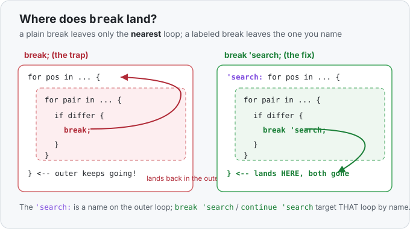

# Interlude 05b · `break`, `continue`, and labeled loops — Use it

> Interlude (single lesson) · Track: [From-Zero: Rust](../README.md)
> Sits right after [Interlude 05a — Loops and ranges](../05a-loops-and-ranges/use-it.md)

## The idea
[Loops](../05a-loops-and-ranges/use-it.md) run a block over and over. Sometimes, partway
through, you want to change that:
- **stop the loop entirely** — you found what you were looking for, no point continuing;
- **skip the rest of this one turn** — this item isn't interesting, jump to the next.

Rust spells those `break` and `continue`. You met `break` in passing with `loop { … }`; this
interlude gives them their proper lesson — and then the one rule about them that bites
*everyone* the first time they nest two loops. This one is written the way you actually hit
it: **what it looks like you know, then the thing you only learn by getting burned.**

## `break` — stop the loop now
```rust
for number in [3, 8, 5, 2] {
    if number % 2 == 0 {
        println!("first even is {number}");
        break;                 // found it — leave the loop, skip the rest
    }
}
```
Without `break`, the loop would keep checking `5` and `2` for nothing. `break` says "done
here," and execution jumps to whatever comes *after* the loop.

## `continue` — skip to the next turn
```rust
for number in [3, 8, 5, 2] {
    if number % 2 == 0 {
        continue;              // not interested in evens — go straight to the next number
    }
    println!("odd: {number}");  // only the odds reach this line
}
```
`continue` doesn't leave the loop — it abandons *just this pass* and starts the next one. Here
it prints `3` and `5` and silently skips `8` and `2`.

## The trap: they only affect the **nearest** loop
Here's the part you don't find out until you nest two loops. `break` and `continue` act on the
**innermost loop they sit inside** — the closest `for`/`while`/`loop` around them, and *only*
that one. An inner `break` does **not** stop an outer loop.

This is a real bug from the [Longest Common Prefix challenge](../../../challenges/longest-common-prefix/README.md).
The plan was: walk letter positions in the outer loop, compare words in the inner loop, and
"stop when two letters differ." It was written like this:

```rust
for character_index in 0..=9999 {        // outer: each letter position
    for index in 0..words.len() - 1 {    // inner: each neighbouring pair of words
        if letters_differ {
            break;                        // ← meant "stop searching entirely"
        }
        // ...otherwise record the matching letter...
    }
}
```

The intent was *"a mismatch means the common prefix is over — stop everything."* But that
`break` only left the **inner** loop. The **outer** loop happily moved on to the next letter
position and kept recording matches it should never have looked at. On the words `ba`, `ca`,
`ba` it printed `a` — even though the very first letters (`b`, `c`, `b`) already disagree, so
the answer should be empty:

| letter position | inner loop does | should have… |
|---|---|---|
| 0 | `b` vs `c` differ → `break` inner | stopped **everything** |
| 1 | outer moved on; `a`==`a`==`a` → records `a` ❌ | never run at all |

The letters passing the sample test (`flower/flow/flight`) hid it — a bug that passes the one
example you're given is the most dangerous kind.

## The fix: label the loop you actually want to break
Give the outer loop a **name** — a *label*, written `'name:` just before the loop — and then
`break 'name` breaks *that* loop, no matter how deep you are inside:

```rust
'search: for character_index in 0..=9999 {
    for index in 0..words.len() - 1 {
        if letters_differ {
            break 'search;      // ← leaves BOTH loops, exactly as intended
        }
    }
}
```

Read `'search:` as a sticky note naming the outer loop, and `break 'search` as "break the loop
wearing that note." `continue 'search` works the same way — it jumps to the next turn of the
*outer* loop instead of the inner one. The leading `'` is the same tick you'll later see on
[lifetimes](../README.md); here it just marks a loop label.



So the whole lesson, as the gap you actually cross:

> **What it looks like you know:** `break` stops "the loop."
> **What you learn the hard way:** `break` stops only the *nearest* loop. To stop an outer
> one from inside an inner one, name it with a label and `break 'that_label`.

(In this particular challenge there's an even cleaner route that avoids nested loops
altogether — see the [challenge write-up](../../../challenges/longest-common-prefix/README.md).
Labels are the direct fix; sometimes the *better* fix is not to nest in the first place.)

## Exercises
1. **Stop at the first match, across a grid** — [starter](exercises/1-starter.rs) · [solution](exercises/1-solution.rs).
   Given `rows = [[1, 2], [3, 4], [5, 6]]`, use a labeled outer loop to find the first number
   greater than `3` and `break` all the way out, printing `found: 4`. (Prove to yourself a plain
   `break` would keep scanning later rows.)
2. **Skip a whole outer turn with `continue`** — [starter](exercises/2-starter.rs) · [solution](exercises/2-solution.rs).
   Loop `a` over `1..=3` and `b` over `1..=3`; if `a == b`, `continue` the **outer** loop (skip
   the rest of that `a`). Print each `a,b` pair that runs.

## Where this sits
This interlude belongs right after [05a (loops and ranges)](../05a-loops-and-ranges/use-it.md):
once you can write a loop, the very next things you reach for are "stop early" and "skip this
one" — and the moment you nest two loops, the nearest-loop rule and labels become essential.
Handbook: [`break` · `continue` · labeled loops](../../../languages/rust.md#loop-control).
