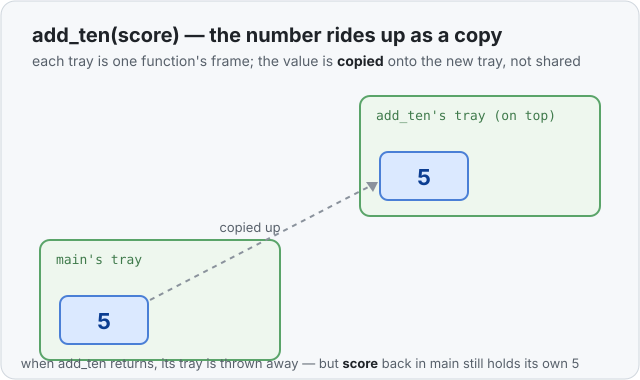

# Concept 06 · `Copy` types — Under the hood

> Pair: [Use it](use-it.md) · **Under the hood** (you are here)
> Track: [From-Zero: Rust](../README.md)

## What `let b = a` physically does
Every value so far has lived on the **stack** — the shelf of boxes each function frame
owns. A number like `5` *is* its box: the whole value is the four bytes sitting right
there (see [Concept 03](../03-types-have-sizes/use-it.md)).

So when Rust runs `let b = a`, there is nothing clever to do: it makes a new box for
`b` and copies those four bytes into it. Two boxes, two independent `5`s. That bit-for-
bit duplication is what the word **`Copy`** means.

The same thing happens across a function call — the value is copied onto the callee's
tray:



## Why it's cheap — and why not everything can do it
Copying four bytes is nothing; the computer does it in a blink. That's *only* true
because the entire value sits on the stack. Nothing else, anywhere, has to know this
number was duplicated.

Now imagine a value that doesn't fit that description — one whose box on the stack is
really a **pointer** to a big pile of data living somewhere else in memory (that's a
`String`, coming in Concept 07). Blindly copying the little stack box would make a
second pointer aimed at the *same* pile — two owners believing they each own it. When
one gets thrown away and cleans up the pile, the other is left pointing at garbage.

That danger is exactly why Rust does **not** auto-copy those types. It splits every type
into two camps:

- **`Copy` types** — small, fully on the stack. `let b = a` duplicates them, and you keep
  using both. (All of Concept 06.)
- **non-`Copy` types** — they own something elsewhere. `let b = a` **moves** ownership
  instead of copying, and `a` stops being usable. (Concept 08 — the heart of ownership.)

You already know every type in the first camp. The whole reason we nailed down `Copy`
first is so that when a value refuses to copy in Concept 08, you'll know it's not a
random rule — it's Rust protecting you from two owners of one pile.

## Predict the memory
```rust
fn main() {
    let a = 5;
    let mut b = a;
    b += 1;
    println!("{a} {b}");
}
```

1. After `let mut b = a`, how many boxes hold a `5`, and where do they live?
2. `b += 1` changes `b`. Does `a` change too?
3. What does the line print?

<details>
<summary>Show the answer</summary>
<ol>
<li><strong>Two</strong> boxes, both on <code>main</code>'s stack tray — <code>a</code> with <code>5</code>, <code>b</code> with its own copy. <code>i32</code> is a <code>Copy</code> type, so <code>= a</code> duplicated it.</li>
<li><strong>No.</strong> They are separate boxes. <code>b += 1</code> writes only into <code>b</code>'s box.</li>
<li><code>5 6</code> — <code>a</code> is still <code>5</code>, <code>b</code> is now <code>6</code>.</li>
</ol>
</details>

## Next
- [Concept 07 — The heap, and `String`](../README.md): the first value that *doesn't*
  live entirely on the stack — which is what makes copying dangerous and moves
  necessary.
