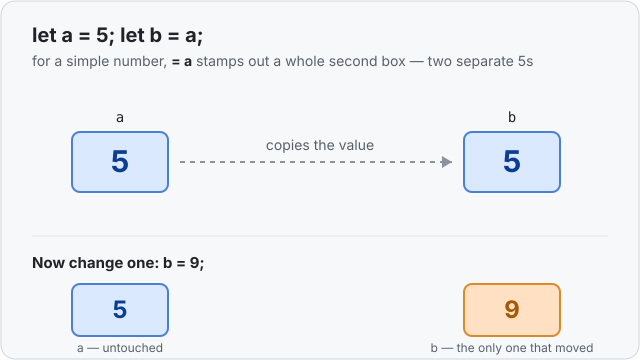

# Concept 06 · `Copy` types — Use it

> Pair: **Use it** (you are here) · [Under the hood](under-the-hood.md)
> Track: [From-Zero: Rust](../README.md) · Previous: [Concept 05](../05-expressions-statements-and-return/use-it.md)

## The idea
When you copy a simple number from one variable into another, you get **two separate
boxes**, each with its own value:

```rust
let a = 5;
let b = a;   // b gets its own copy of the 5
```

`a` and `b` are not sharing one `5` — the `= a` stamped out a whole new box for `b` and
copied the value in. So changing one never touches the other:

```rust
let mut a = 5;
let b = a;
a = 99;      // only a's box changes
// a is 99, b is still 5
```



Types that behave this way are called **`Copy` types**. The name is literal: on
`let b = a` — or on passing the value into a function — Rust just **copies it**. The
copy is cheap because these values live entirely on the stack and are only a handful of
bytes (see [Concept 03](../03-types-have-sizes/use-it.md)).

## Which types are `Copy`?
The simple, fixed-size, stack-only ones you already know:

| type | example |
|---|---|
| the number types | `i32`, `i64`, `u8`, `f64`, … |
| `bool` | `true`, `false` |
| `char` | `'A'` |

A rule of thumb: if a value is small and lives fully on the stack, it's probably
`Copy`. Values that own something bigger elsewhere in memory are **not** `Copy` — that's
exactly the story of Concept 07 (`String`) and Concept 08 (moves), and this lesson is
the setup for it.

## Passing a `Copy` value to a function
Same rule, and you saw the picture back in [Concept 04](../04-functions-and-the-call-stack/use-it.md):
the argument is **copied** onto the function's own tray.

```rust
fn add_ten(mut n: i32) -> i32 {
    n = n + 10;   // changes the function's OWN copy
    n
}

fn main() {
    let score = 5;
    let bigger = add_ten(score);
    // score is still 5 — add_ten only ever touched its copy
    // bigger is 15
}
```

`add_ten` can even mark its parameter `mut` and scribble all over it — it's writing on
its own copy on its own tray. Back in `main`, `score` is untouched.

## Exercises
1. **The copy is independent** — [starter](exercises/1-starter.rs) · [solution](exercises/1-solution.rs).
   Copy `a` into `b`, then change `a`, then print both. (Expect `99`, then `5`.)
2. **A function gets a copy** — [starter](exercises/2-starter.rs) · [solution](exercises/2-solution.rs).
   Pass a number into a function that changes its parameter, then print the original.
   (Expect `5`, then `15`.)

## Next
- Why this is called `Copy`, why it's cheap, and the one line that will *stop* compiling
  the moment a value is **not** `Copy`: [Under the hood](under-the-hood.md).
