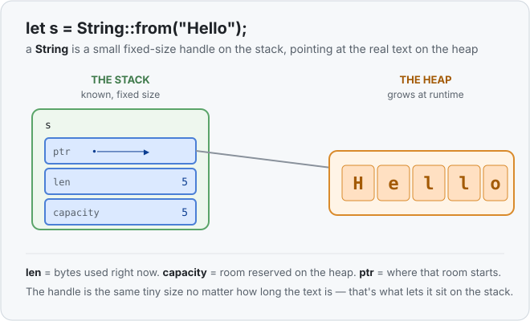
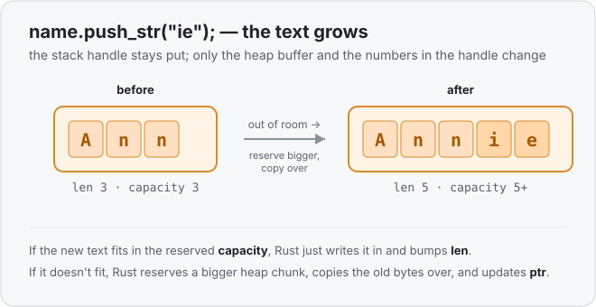

# Concept 07 · The heap, and `String` — Under the hood

> Pair: [Use it](use-it.md) · **Under the hood** (you are here)
> Track: [From-Zero: Rust](../README.md)

## Why the stack isn't enough
The stack is a tidy shelf of fixed-size boxes, and it only works *because* every box's
size is known before the program runs ([Concept 03](../03-types-have-sizes/use-it.md)).
That's perfect for an `i32`. It falls apart for text that can grow: if you reserved a
stack box big enough for `"Hello"` and then pushed on `", world"`, there'd be no room,
and everything sitting next to it on the shelf is already spoken for. You can't grow a
box on the stack without shoving its neighbours around.

So Rust splits the value in two.

## A tiny handle on the stack, the text on the heap
A `String` variable on the stack is **not** the text. It's a small, fixed-size
**handle** — always the same three fields, no matter how long the text is:

- **ptr** — *where* on the heap the characters start
- **len** — how many bytes are used right now
- **capacity** — how much heap room is currently reserved

The actual characters live on the **heap**, the open area that can grow at runtime. The
handle just points at them.



This is the key move: the handle has a *fixed* size (so it's happy on the stack), while
the thing it points at is *free to grow* (so it lives on the heap). `.len()` is just
reading that `len` field.

## What `push_str` actually does
When you push more text:

- **If it fits** in the reserved `capacity`, Rust writes the new bytes into the heap
  buffer and bumps `len`. Cheap.
- **If it doesn't fit**, Rust reserves a *bigger* chunk of heap, copies the old bytes
  across, updates `ptr` to the new location, and then writes the new bytes. A bit more
  work — the price of growing.



Either way, the little handle on the stack stays exactly where it is — only its numbers
(and maybe its `ptr`) change.

## Why this is the doorway to ownership
Remember the warning from [Concept 06](../06-copy-types/under-the-hood.md): a `String` is
**not** a `Copy` type. Now you can see *exactly* why.

If `let b = a` blindly duplicated a `String` the way it duplicates an `i32`, it would
copy only the little handle — the ptr/len/capacity. You'd get **two handles whose `ptr`
points at the same heap buffer.** Two owners, both believing they own that one pile of
characters. When one is thrown away and frees the heap buffer, the other is left pointing
at freed memory — a real bug in languages that allow it.

Rust refuses to let that happen. That refusal, and what it does instead, is
**ownership** — the very next concept.

## Predict the memory
```rust
fn main() {
    let mut s = String::from("hi");
    s.push_str("!!!");
    println!("{}", s.len());
}
```

1. Which part of `s` lives on the stack, and which part lives on the heap?
2. After the `push_str`, what does `s.len()` print?
3. Did the handle move to a different spot on the stack when the text grew?

<details>
<summary>Show the answer</summary>

1. The **handle** (ptr, len, capacity) is on the **stack**; the characters `h i ! ! !`
   are on the **heap**.
2. `5` — `"hi"` is 2 bytes, `"!!!"` adds 3, total 5.
3. **No.** The handle stays put on the stack. Only the heap buffer and the handle's
   `len`/`ptr` fields change; the handle itself never changes size or location.
</details>

## Next
- [Concept 08 — Ownership and moves](../README.md): what Rust does *instead* of copying a
  `String`, and why `let b = a` can make `a` stop working.
