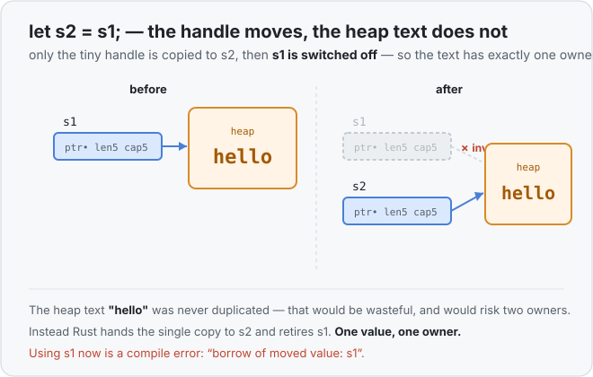

# Concept 08 · Ownership and moves — Under the hood

> Pair: [Use it](use-it.md) · **Under the hood** (you are here)
> Track: [From-Zero: Rust](../README.md)

## The bug Rust is avoiding
[Concept 07](../07-the-heap-and-string/under-the-hood.md) left us with a picture: a
`String` is a small handle on the stack — `ptr`, `len`, `capacity` — pointing at the real
characters on the heap. It also left a warning about what would happen if `let s2 = s1`
just duplicated that handle the way it duplicates an `i32`.

Play it out. You'd get **two handles whose `ptr` points at the same heap buffer**:

```
s1 ┐
   ├──▶  [ hello ]   (one buffer on the heap)
s2 ┘
```

Now recall the ownership rule: when a variable goes out of scope, its value is cleaned up
and the heap buffer is freed. At the end of the block, `s1` frees the buffer... and then
`s2` frees *the same buffer again*. Freeing memory twice is a real, dangerous bug — the
classic **double free**. And even before scope ends, writing through one handle could
move the buffer (Concept 07's growth), leaving the other handle pointing at freed memory.

## What a move actually does
Rust's fix is simple and cheap. On `let s2 = s1`:

1. Copy the **handle** (the ptr/len/capacity bytes) into `s2`. The heap text is **not**
   touched or duplicated.
2. Mark `s1` as **invalid** — it no longer owns anything, and the compiler forbids using
   it.



So there is always exactly **one** live handle to that buffer, which means it gets freed
**exactly once**, by whoever owns it at the end. No double free — and no expensive copy of
the characters. A move is just a few bytes and a switch-off.

## Why `Copy` types are exempt
An `i32` owns nothing on the heap — the value *is* its bytes on the stack. Duplicating it
can't create a second owner of some shared buffer, because there is no buffer. So there's
nothing to protect, and Rust just copies it and leaves the original valid. That's the
whole reason [Concept 06](../06-copy-types/use-it.md) split types into `Copy` (duplicate
freely) and everything else (move). Ownership is why that split exists.

## The cost this creates — and the road out
Safety came at a price you felt in [Use it](use-it.md): once you move a value away, you
can't use the old name. To keep using it after handing it to a function, the function has
to *return it back to you*. That works, but it's clumsy — you don't want to rewrite every
function to return its inputs just so the caller can keep reading them.

Two ways out, and they're the next two concepts:
- **Concept 09 — `.clone()`**: make a real second copy of the heap text, so both names own
  their own buffer. Honest, but it copies the whole buffer — the *inefficient* fix.
- **Concept 10 — borrowing with `&`**: let a function *look at* your value without taking
  ownership at all. No move, no copy — the *efficient* answer, and the other half of what
  makes Rust Rust.

## Predict the memory
```rust
fn main() {
    let a = String::from("cat");
    let b = a;
    let n = 10;
    let m = n;
    println!("{b} {n} {m}");
}
```

1. After `let b = a`, is `a` still usable? Why or why not?
2. After `let m = n`, is `n` still usable? Why or why not?
3. Does this program compile and print `cat 10 10`?

<details>
<summary>Show the answer</summary>

1. **No.** `String` owns heap text, so `let b = a` **moves** it — `a` is retired.
2. **Yes.** `i32` is a `Copy` type; `let m = n` **copies** it and `n` stays valid.
3. **Yes** — it prints `cat 10 10`. It only touches `b`, `n`, and `m`; it never uses the
   moved-away `a`, so the compiler is happy. (Add `println!("{a}")` and it would fail.)
</details>

## Next
- [Concept 09 — `.clone()` (the inefficient fix)](../README.md): when you genuinely want
  two independent owners, and what it costs.
