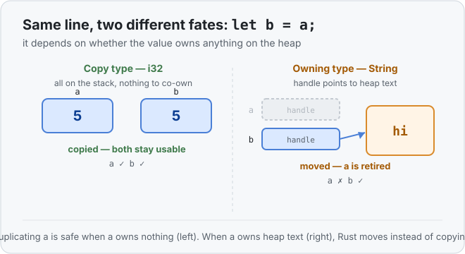

# Concept 08 · Ownership and moves — Use it

> Pair: **Use it** (you are here) · [Under the hood](under-the-hood.md)
> Track: [From-Zero: Rust](../README.md) · Previous: [Concept 07](../07-the-heap-and-string/use-it.md)

## The idea
Here is a line you've written a hundred times in other languages:

```rust
let s1 = String::from("hello");
let s2 = s1;
```

In most languages `s1` and `s2` would now both be usable names for that text. In Rust,
**`s1` is gone.** The text has *moved* to `s2`, and `s2` is its one and only owner.

If you try to use `s1` afterward, the program won't even compile:

```rust
let s1 = String::from("hello");
let s2 = s1;
println!("{s1}");   // ❌ error[E0382]: borrow of moved value: `s1`
```

That error is Rust's whole safety story in one message, and by the end of the pair it'll
feel completely reasonable. This lesson is the *what*; [Under the hood](under-the-hood.md)
is the *why*.

## Ownership, in one rule
> Every value has exactly **one owner** — the variable that holds it. When the owner
> goes out of scope, the value is cleaned up (its heap memory is freed).

`let s2 = s1` doesn't make a second owner. It **transfers** ownership from `s1` to `s2`,
and switches `s1` off so there's still exactly one owner. That transfer is called a
**move**.

## But wait — numbers didn't do this
Right. Back in [Concept 06](../06-copy-types/use-it.md) this worked fine:

```rust
let a = 5;
let b = a;
println!("{a}");   // ✅ prints 5 — a is still fine
```

The difference is exactly what Concept 06 and 07 set up:
- `i32` is a **`Copy`** type — it owns nothing on the heap, so Rust just duplicates it and
  both stay valid.
- `String` **owns** heap text, so duplicating the handle would create two owners of one
  buffer. Rust *moves* instead, and retires the original.



So the rule of thumb: **`Copy` types copy, everything that owns heap data moves.**

## Functions move their arguments too
Passing an owning value into a function **moves it in** — same as an assignment:

```rust
fn greet(name: String) {
    println!("Hi, {name}");
}

fn main() {
    let n = String::from("Sam");
    greet(n);            // n moves into greet
    // println!("{n}");  // ❌ n is gone — it was moved away
}
```

To keep using the value, the function can **hand ownership back** by returning it:

```rust
fn shout(mut s: String) -> String {
    s.push('!');
    s                 // return ownership to the caller
}

fn main() {
    let message = String::from("hi");
    let message = shout(message);   // moved in, moved back out
    println!("{message}");          // hi!
}
```

This "give it away, then get it back" dance is clearly clumsy — imagine returning a value
just so you're allowed to keep reading it. That clumsiness is the *motivation* for the
next two concepts: `.clone()` (the blunt fix) and borrowing with `&` (the real answer).

## Exercises
1. **A move happens** — [starter](exercises/1-starter.rs) · [solution](exercises/1-solution.rs).
   Move `s1` into `s2` and print `s2`. Then, for fun, add a `println!` of `s1` and watch
   the compiler stop you. (Expect `hello`.)
2. **Give it and get it back** — [starter](exercises/2-starter.rs) · [solution](exercises/2-solution.rs).
   Move a String into a function that appends `'!'` and returns it, then print the result.
   (Expect `hi!`.)

## Next
- Why a move is *safe and cheap*, and the double-free bug it prevents:
  [Under the hood](under-the-hood.md).
