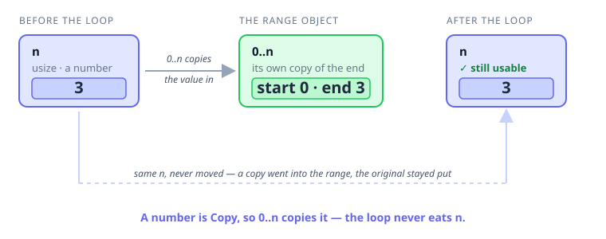

# Interlude 08a · Copy and move happen everywhere — Use it

> Interlude: a **single lesson**. You already met `Copy` and moves as *memory*
> topics ([Concept 06](../06-copy-types/use-it.md), [Concept 08](../08-ownership-and-moves/use-it.md));
> this is just the everyday habit of spotting them in the wild, so there's no separate
> "Under the hood."
> Track: [From-Zero: Rust](../README.md) · Sits after [Concept 08](../08-ownership-and-moves/use-it.md)

## The idea
You learned the copy-or-move rule in **two** spots:

```rust
let b = a;        // spot 1: assigning to another name
greet(name);      // spot 2: passing into a function
```

But a value gets **used** in far more places than those two — inside a `for 0..n`, as
the end of a range, in a bigger expression. And every time you use a value somewhere
new, the same quiet question pops up:

> Did that line **copy** the value (so my original is still fine), or **move** it (so
> my original is now gone)?

Here's the calming part: **the rule never changes — only its disguise does.** It's
always the same one line you already know:

> `Copy` types (numbers, `bool`, `char`) get **copied**; anything that owns heap data
> (`String`, and later `Vec`) gets **moved**.

So you never have to memorise a new rule per situation. You just ask "is this value
`Copy`?" and you already know the answer for every spot. Let's aim it at the spot that
makes everyone pause.

## The one everyone wonders about: a loop counter
You write a counting loop over `0..n` and then want to use `n` again afterward:

```rust
fn main() {
    let n: usize = 3;

    let mut sum = 0;
    for _ in 0..n {
        sum += 1;
    }

    println!("looped {n} times, sum = {sum}");   // ✅ n is still perfectly usable
}
```

Does the loop **eat** `n`? It *feels* like it might — `0..n` clearly reads `n`, and you
just spent a whole concept learning that using a value can move it away. So which is it?

Walk it through the rule you already have:
- `0..n` reads `n` to figure out where the range ends.
- `n` is a `usize` — a **number**, so it's a **`Copy`** type.
- `Copy` means *copied, not moved*. The range gets its **own copy** of the `3`.
- Your original `n` was never touched, so it's still sitting there after the loop.



That's the whole answer. A `for 0..n` loop does **not** consume `n`, for exactly the
same reason `let b = a` didn't consume `a` back in [Concept 06](../06-copy-types/use-it.md):
numbers copy.

### "And if it *were* a `String`?"
Good instinct — that's the right way to test your understanding. You can't literally
write `0..some_string` (a range needs *numbers* at its ends, not text), so the compiler
stops you before the move question even comes up. But the principle still holds: the
moment a value **owns heap data**, using it somewhere hands it over — precisely the move
you saw with `let s2 = s1` retiring `s1` in [Concept 08](../08-ownership-and-moves/use-it.md).
Copy values are the carefree ones you can sprinkle around; owned values are the ones to
watch.

## The ends of a range are just values — and they're copied too
A range's two ends aren't magic syntax; they're plain values, and if they're `Copy`,
using them in the range copies them — leaving the originals free to reuse:

```rust
fn main() {
    let start = 3;
    let width = 4;

    for i in start..start + width {
        println!("{i}");            // 3, 4, 5, 6
    }

    // both are still here — building the range only copied their values in
    println!("start = {start}, width = {width}");   // ✅ start = 3, width = 4
}
```

This is why you can happily reuse a counter as many times as you like: a `Copy` value is
never "used up." Reach for it in a range, print it, feed it to a function, put it in
another range — each use just takes a fresh copy.

## The habit
Whenever a value gets used in a spot that makes you pause — a loop, a range end, an
expression, and later a method call — don't reach for a new rule. Ask the one question:

| Is the value `Copy`? | What using it does | Original afterward |
|---|---|---|
| **Yes** — number, `bool`, `char` | takes a **copy** | ✅ still usable |
| **No** — owns heap data (`String`, `Vec`, …) | **moves** it | ❌ gone |

Same rule you already own, just pointed at a new place.

## Exercises
1. **The counter survives** — [starter](exercises/1-starter.rs) · [solution](exercises/1-solution.rs).
   Loop `for _ in 0..n` adding `1` to a `sum` each time, then print `n` *after* the loop
   to prove it's still usable. (Expect `looped 4 times, sum = 4`.)
2. **Ranges copy their ends** — [starter](exercises/2-starter.rs) · [solution](exercises/2-solution.rs).
   With `let start = 3; let width = 4;`, loop over `start..start + width`, then print both
   `start` and `width` afterward. (Expect `3 4 5 6`, then `start = 3, width = 4`.)

Handbook: [`for` + ranges](../../languages/rust.md#for-ranges).

## Where this sits
This interlude belongs right after [Concept 08](../08-ownership-and-moves/use-it.md):
once you know *both* how numbers copy and how owned values move, you can spot which one
is happening **anywhere** a value is used — not just in `let b = a` and function calls.
The loop counter is the classic "wait, what happens here?" moment, and now you can answer
it with the rule you already have.

> **You may have also noticed** that `(1..=100).sum()` doesn't seem to "use up" the range,
> and wondered whether summing walks the numbers twice. That's a different idea —
> *laziness* — and it's the heart of the **Iterators** concept coming later. Short version:
> the range is walked exactly **once**, so it's just as fast as a hand-written loop.
