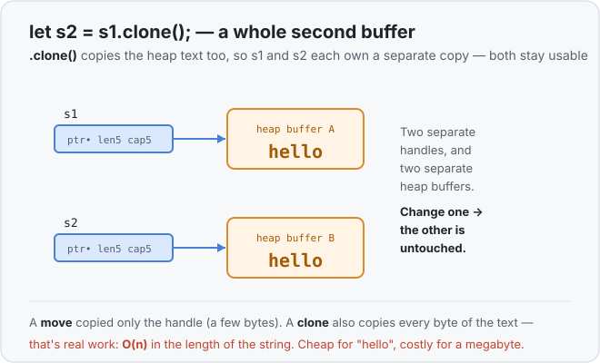
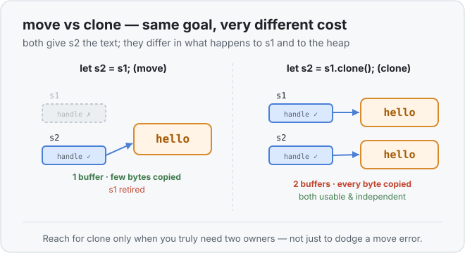

# Concept 09 · `.clone()` (the inefficient fix) — Under the hood

> Pair: [Use it](use-it.md) · **Under the hood** (you are here)
> Track: [From-Zero: Rust](../README.md)

## What clone physically does
Remember the two-part shape of a `String` from
[Concept 07](../07-the-heap-and-string/under-the-hood.md): a small handle on the stack
(ptr/len/capacity) pointing at the characters on the heap.

A **move** copied only the handle and retired the original — one buffer, still. A
**clone** does more: it asks the heap for a **brand-new buffer**, copies every byte of the
text into it, and builds a **second handle** whose `ptr` points at that new buffer.



Now there are two owners, but they don't share anything — two handles, two buffers. That's
exactly why the double-free danger from Concept 08 doesn't apply here: each buffer has its
own single owner, and each gets freed once, by its own variable.

## Why it's O(n)
Copying the handle is a fixed few bytes no matter what. Copying the *text* is not — it
walks the whole buffer, byte by byte. A string of length `n` takes work proportional to
`n` to clone. (`n` and "O(n)" just mean "the cost grows in step with the length" — a
longer string is a proportionally bigger copy.)



For small strings this is invisible. But put a `.clone()` of a big string inside a loop
that runs a million times and you've quietly asked the computer to copy that whole buffer
a million times. The compiler won't complain — cloning is perfectly *safe* — it's just
*wasteful* when you didn't need a second copy.

## How `Copy` and `Clone` relate
You've now met two words that sound alike. Here's the clean split:

- **`Clone`** is the explicit, opt-in duplicate you call by hand with `.clone()`. It's
  allowed to be expensive (like copying a whole heap buffer).
- **`Copy`** ([Concept 06](../06-copy-types/use-it.md)) is the automatic, implicit
  duplicate that happens on plain assignment — and Rust only allows it for types that are
  *cheap and safe* to bit-copy, i.e. small stack-only values.

So an `i32` is **both** `Copy` and `Clone` (its clone is trivial). A `String` is `Clone`
but **not** `Copy` — Rust refuses to duplicate it implicitly precisely *because* the copy
isn't free; if you want it, you have to say so with `.clone()`. The `.clone()` call is
Rust making the cost **visible** in your code.

## The road out
`.clone()` answers "I need two independent owners." But look back at the move problem that
started this: often you didn't want a second owner at all — you just wanted to hand a value
to a function so it could **read** it, and keep using it yourself afterward. Cloning solves
that by brute force: make a whole copy so the function can have one. Wasteful.

The next concept, **borrowing with `&`**, lets a function *look at* your value without
taking ownership and without copying a single byte of heap text. That's the efficient
answer `.clone()` is standing in for.

## Predict the memory
```rust
fn main() {
    let a = String::from("hi");
    let mut b = a.clone();
    b.push_str("!!");
    println!("{a} {b}");
}
```

1. How many heap buffers exist after `let mut b = a.clone()`?
2. When `b.push_str("!!")` runs, does `a`'s text change?
3. What does the line print?

<details>
<summary>Show the answer</summary>

1. **Two** — `a` owns one buffer holding `"hi"`, `b` owns a separate buffer that started
   as its own copy of `"hi"`.
2. **No.** `b` grows *its own* buffer; `a`'s buffer is untouched.
3. `hi hi!!` — `a` is still `"hi"`, `b` became `"hi!!"`.
</details>

## Next
- [Concept 10 — Borrowing with `&`](../README.md): read a value without owning it and
  without cloning it — the efficient answer to the whole ownership dance.
