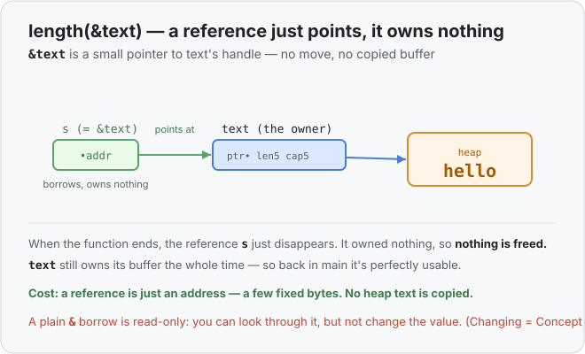
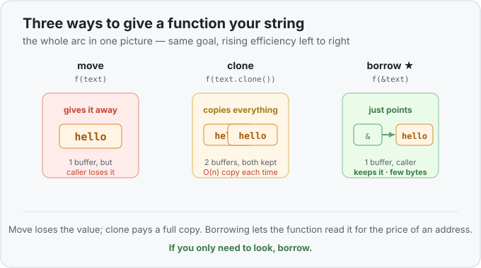

# Concept 10 · Borrowing with `&` — Under the hood

> Pair: [Use it](use-it.md) · **Under the hood** (you are here)
> Track: [From-Zero: Rust](../README.md)

## What a reference actually is
A `String` variable is a handle on the stack pointing at heap text
([Concept 07](../07-the-heap-and-string/under-the-hood.md)). A **reference** is one step
smaller than that: it's just an **address** — a note that says "the value you want lives
over there." `&text` is the address of `text`'s handle.



So when you call `length(&text)`, the function receives a tiny pointer. To read the
length, it follows that pointer to `text`'s handle and reads the `len` field. It never
owned `text`, and it never touched the heap buffer.

Crucially: **a reference owns nothing.** When the function ends and its reference goes out
of scope, the ownership rule from [Concept 08](../08-ownership-and-moves/under-the-hood.md)
has nothing to clean up — the borrower wasn't the owner, so no heap gets freed. The real
owner, `text`, held its buffer the entire time and still does. That's why the value is
usable the moment the call returns.

## Why it's the efficient answer
Line the three approaches up — this is the whole arc from Concept 08 to here in one shot:



- **Move**: copies the handle, retires the original. Cheap, but the caller loses the value.
- **Clone**: allocates a second buffer and copies every byte. Keeps both, but pays O(n).
- **Borrow**: copies nothing but an address. Keeps the original *and* skips the copy.

A reference is a fixed handful of bytes no matter how big the string is. Borrowing a
1-byte string and borrowing a 1-gigabyte string cost exactly the same. That's why "pass
`&T` to read, take ownership only when you must keep it" is everyday Rust.

## How Rust keeps a borrow safe
Handing out a raw pointer sounds dangerous — what if the owner frees the value while
someone's still holding a reference to it? Rust's answer is the rule that makes borrowing
trustworthy:

> A reference is never allowed to **outlive** the value it points at.

The compiler checks this for you. If you tried to return a reference to a `String` that's
about to be dropped, or keep a reference past the owner's scope, it simply won't compile.
So a reference is always guaranteed to point at something still alive — the safety of
owning, at the cost of just an address. (The machinery behind this check is called
*lifetimes*, a later concept; for now, trust that the compiler enforces it.)

## Why a plain `&` is read-only
You saw `s.push_str("!")` through a `&String` refuse to compile. The reason is a promise:
a shared `&` reference says *"I'm only reading."* Many parts of the program are allowed to
hold a `&` to the same value at once, and that's safe **only** because none of them can
change it — readers can never surprise each other. The moment you want to *modify* through
a borrow, you need the exclusive kind, `&mut`, and its extra rules — that's
[Concept 11](../README.md).

## Predict the memory
```rust
fn describe(s: &String) -> usize {
    s.len()
}

fn main() {
    let city = String::from("Cebu");
    let n = describe(&city);
    println!("{city} {n}");
}
```

1. Does `describe` own `city`, or just borrow it?
2. After the call, is `city` still usable? Why?
3. What does it print?

<details>
<summary>Show the answer</summary>
<ol>
<li>It <strong>borrows</strong> it — the parameter is <code>&amp;String</code>, a reference. Ownership stays with <code>main</code>'s <code>city</code>.</li>
<li><strong>Yes.</strong> The reference owned nothing, so nothing was freed when <code>describe</code> returned. <code>city</code> held its buffer the whole time.</li>
<li><code>Cebu 4</code> — <code>"Cebu"</code> is 4 bytes long.</li>
</ol>
</details>

## Next
- [Concept 11 — `&mut` and the borrow rules](../README.md): borrowing that *can* change
  the value, and the one rule that keeps it from going wrong.
