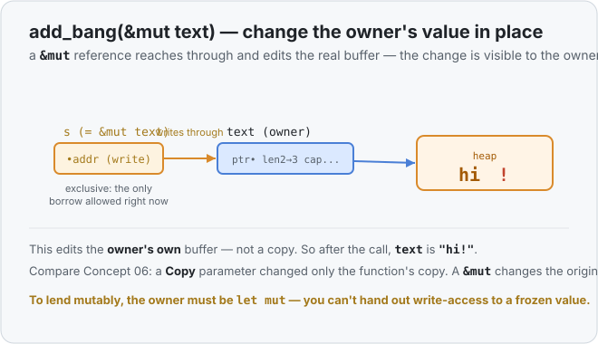
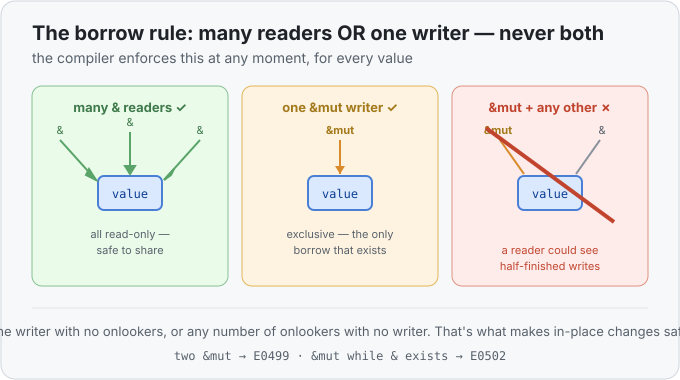

# Concept 11 · `&mut` and the borrow rules — Under the hood

> Pair: [Use it](use-it.md) · **Under the hood** (you are here)
> Track: [From-Zero: Rust](../README.md)

## What `&mut` does in memory
A `&mut` is the same shape as the shared `&` from
[Concept 10](../10-borrowing-with-ref/under-the-hood.md): a small address pointing at the
owner's value. The difference is permission — through a `&mut`, the borrower is allowed to
*write*. It reaches down the pointer to the owner's real handle and heap buffer and edits
them in place.



That's why the change survives the call: there was only ever **one** buffer — the owner's
— and the function wrote directly into it. Nothing was copied, nothing was moved.

## The rule, and the bug it prevents
Here's the rule again, stated as memory permissions:

> A value may have **many `&` readers** at once, **or one `&mut` writer**, but never both,
> and never two writers.



Why forbid a writer while readers exist? Reach back to
[Concept 07](../07-the-heap-and-string/under-the-hood.md): pushing onto a `String` can run
out of capacity, so Rust reserves a **bigger heap buffer, copies the bytes over, and
updates `ptr`** to the new location. Now imagine someone was holding a plain `&` into the
*old* buffer while that happened. Their reference would still point at the old, freed
location — a **dangling pointer** reading garbage.

The one-writer rule makes that impossible *by construction*: while a `&mut` is out and
possibly reallocating, the compiler guarantees **no other reference to that value exists**
to be left dangling. And forbidding two `&mut` writers stops two pieces of code from
scribbling over each other's changes. This is the same guarantee that makes data races
impossible when you get to threads much later — one rule, enforced at compile time, no
runtime cost.

## Two things that trip everyone up

The one-writer rule sounds simple, but two honest questions come up almost immediately.
Both come from reading "one writer" too literally, so let's settle them.

### "Isn't the owner a writer *and* the borrowed `&mut` a second writer?"

It looks like cheating: `main` owns `text` and can write to it, and now `add_bang` also
gets to write to it through `&mut` — surely that's two writers?

The missing piece: **the owner writing and a `&mut` are the same kind of thing — a
write-permission — and there is only ever one of them.** Picture write-access as a single
**pen**, and the value as a page only that pen can write on.

- While `main` owns `text`, `main` holds the pen.
- Calling `add_bang(&mut text)` **hands the pen to the function.** For the length of that
  call, `main` does *not* have the pen and cannot write to `text`.
- When the function returns, the pen comes **back** to `main`.

There are never two writers — there's **one pen, passed back and forth**, never copied.
"One `&mut` writer" means *one at any single instant*, not one forever.

```rust
fn add_bang(s: &mut String) { s.push('!'); }

fn main() {
    let mut text = String::from("hi");
    add_bang(&mut text);   // pen lent to add_bang, returned when it ends
    text.push('?');        // main has the pen back, so this is fine
    println!("{text}");    // hi!?
}
```

And the owner really *is* bound by the same rule — it isn't a privileged extra writer
sitting outside it. Try to make the owner write while a borrow is still alive and the
compiler counts the owner's own write as a *second* mutable borrow:

```rust
let mut text = String::from("hi");
let writer = &mut text;   // pen handed to `writer`
text.push('!');           // ❌ error[E0499]: cannot borrow `text` as mutable more than once
println!("{writer}");     // writer still holds the pen here — so the two overlap
```

> `text.push('!')` is reported as the *second* mutable borrow. The owner needs the pen to
> write, but `writer` still has it. Two hands, one pen.

Why does the normal function call escape this? Because there's **no overlap in time**. The
borrow is born at `&mut text` and dies the instant the call returns:

```
main holds pen ──▶ &mut text: pen handed to add_bang ──▶ it writes ──▶ returns, pen back to main
                   └────────── borrow alive ONLY here ─────────┘
```

Two writes, yes — but never at the same moment.

### "You can't borrow mutably twice — so how do two functions both do it?"

The rule is **not** "you can't borrow mutably twice." It's "you can't have two mutable
borrows alive *at the same time*." Sequentially, borrow mutably as often as you like:

```rust
fn add_bang(s: &mut String) { s.push('!'); }
fn add_domain(s: &mut String) { s.push_str("@x.com"); }

fn main() {
    let mut text = String::from("sam");
    add_bang(&mut text);     // borrow 1 — starts and ENDS on this line
    add_domain(&mut text);   // borrow 2 — a brand-new borrow; borrow 1 is long gone
    text.push('.');          // main writes too — also fine, nothing is borrowed now
    println!("{text}");      // sam!@x.com.
}
```

Each `&mut text` is a fresh loan of the pen, fully returned before the next line runs, so
no two ever coexist. Your worry — "two functions that both need to borrow the same value"
— has nothing to solve: just call them one after another.

The *only* forbidden case is keeping two loans live **simultaneously**, e.g. by parking
both in variables:

```rust
let a = &mut text;
let b = &mut text;   // ❌ a is still used below, so now two pens exist at once
println!("{a} {b}");
```

If you ever feel you genuinely *need* two live `&mut`s to one value, that's usually the
compiler flagging a design where two things fight over one value — the fix is to arrange
for one to hold it at a time, not to dodge the rule.

> **One question we're parking on purpose:** what if the function is `async`? The
> one-writer rule still holds there — you never get two live `&mut`s at once. But an
> `.await` can *pause* a function mid-call while a borrow is still alive, so a `&mut`
> can survive across the pause instead of returning right away. That longer lifetime is
> a whole story of its own (futures, `Send`, `Pin`), so we come back to it in the async
> track — not here.

## `mut` in two places — don't mix them up
You've now seen `mut` in two different roles, and it's worth separating them cleanly:

- **`let mut x`** — the *binding* is changeable; you can reassign `x` or call methods that
  mutate it ([Concept 02](../02-frozen-by-default-and-mut/use-it.md)).
- **`&mut x`** — a *reference through which you may mutate* the value it points at.

They cooperate: to hand out `&mut x`, the value `x` must itself be `let mut` — you can't
lend write-access to something frozen. But they're distinct ideas: one is about a
variable's own changeability, the other about the permission a borrow carries.

## Phase 2, complete
Step back and look at what these six concepts built, each one answering the last:

| you learned | it raised the question | answered by |
|---|---|---|
| `Copy` types (06) | what about values too big to copy cheaply? | the heap & `String` (07) |
| heap & `String` (07) | who frees the heap buffer, and when? | ownership & moves (08) |
| moves (08) | how do I keep a value I gave away? | `.clone()` (09) |
| `.clone()` (09) | isn't a full copy wasteful just to read? | borrowing `&` (10) |
| borrowing `&` (10) | how do I *change* a value I only borrowed? | `&mut` (11) |

That chain — from "a number in a box" all the way to safe, zero-cost mutable borrowing —
*is* Rust's memory model. Everything after this (structs, collections, traits, lifetimes,
concurrency) is built on top of it.

## Predict the memory
```rust
fn twice(s: &mut String) {
    let copy = s.clone();
    s.push_str(&copy);
}

fn main() {
    let mut word = String::from("ab");
    twice(&mut word);
    println!("{word}");
}
```

1. Does `twice` own `word`, or borrow it mutably?
2. Is `word` still usable in `main` after the call?
3. What does it print?

<details>
<summary>Show the answer</summary>
<ol>
<li>It <strong>borrows it mutably</strong> — the parameter is <code>&amp;mut String</code>. Ownership stays in <code>main</code>.</li>
<li><strong>Yes.</strong> A borrow (even a mutable one) never takes ownership, so <code>word</code> is <code>main</code>'s the whole time.</li>
<li><code>abab</code> — <code>twice</code> clones <code>"ab"</code>, then appends that copy onto the owner's buffer in place, giving <code>"ab" + "ab"</code>.</li>
</ol>
</details>

## Next
- [Concept 12 — Slices](../README.md): a reference to just *part* of a value — the last
  borrowing idea before Phase 2 wraps and we start building compound types.
