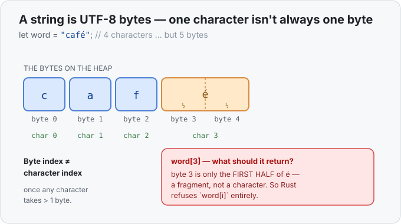

# Interlude 12a · Why you can't index a string by position — Use it

> Interlude: a **single lesson**. It leans on one memory picture (how text sits in
> memory as bytes), so that picture lives right here in the lesson rather than in a
> separate "Under the hood."
> Track: [From-Zero: Rust](../README.md)

In [Concept 12](../12-slices/use-it.md) you sliced a string by a **byte range** —
`&s[0..5]` hands back `"hello"`. So the obvious next move, coming from almost any other
language, is to grab a *single* character by position:

```rust
let name = "Kai";
let first = name[0];   // ❌ won't compile
```

In JavaScript `"Kai"[0]` is `"K"`; in Python it's `'K'`. In Rust this is a hard compile
error: *"the type `str` cannot be indexed by `{integer}`."* That refusal is deliberate,
and once you see how a string sits in memory, it's obviously the right call.

## The memory picture: a string is bytes, not characters
Back in [Concept 07](../07-the-heap-and-string/use-it.md) a `String` was "text on the
heap." Here's the part we skipped: that text is stored as **UTF-8 bytes**. Most letters
you type are **one byte** — but many characters are **more**. `é` is 2 bytes, `你` is 3,
an emoji is 4. So "the character at position 2" and "the byte at position 2" are **not
the same question**.

Look at `"café"` — four characters, but **five** bytes, because `é` takes two:



Now the trap is clear. If Rust let you write `cafe_word[3]`, what should it hand back?
Byte 3 is only the **first half of `é`** — a fragment that isn't a character at all.
Returning it would hand you a broken, meaningless value. So instead of guessing, Rust
**forbids the operation entirely**: there is no "index a string by position." (A plain
`"Kai"` is all one-byte characters, so it *feels* like it should work — but Rust can't
offer the shortcut for `"Kai"` and forbid it for `"café"`; the rule has to be the same
for every string.)

## What to do instead
### The first character — walk the characters
To get a real character, go through `.chars()`, which decodes the bytes into whole
characters, and take the one you want:

```rust
let name = "Kai";
let first = name.chars().next().unwrap();   // 'K'
```

Read that as three small steps:
- `name.chars()` → a stream that yields each **`char`** in turn (`é` arrives as one
  `char`, never as half a byte).
- `.next()` → the first one, as an [`Option`](../15-option/use-it.md): `Some('K')`, or
  `None` if the string was empty.
- `.unwrap()` → "I'm sure there's a character — hand it over" (panics if it was empty).

For the *n*-th character, `.chars().nth(n)` — also an `Option`.

### A single byte, if you truly want the byte
If you genuinely want raw bytes (not characters), say so explicitly with `.as_bytes()`,
and you get a `u8`:

```rust
let byte = "Kai".as_bytes()[0];   // 75  (the number for 'K')
```

Now *you* chose bytes, with eyes open — nothing is broken by surprise.

### A range slice still works — with a catch
The range slicing from Concept 12 is still fine, because you're asking for a *span* of
bytes, not one position:

```rust
let s = String::from("Kai");
let k = &s[0..1];   // "K"
```

But the catch: if a byte range **splits a character in half**, it doesn't silently
corrupt — it **panics** at runtime. `&"café"[0..4]` would cut `é` down the middle and
crash. Rust protects you either way: it won't let a bad *index* compile, and it won't let
a bad *slice* run.

## Length is bytes, too
The same idea catches people on `.len()`: it counts **bytes**, not characters.

```rust
let word = "café";
println!("{}", word.len());            // 5  (bytes)
println!("{}", word.chars().count());  // 4  (characters)
```

If you mean "how many characters," it's `.chars().count()`. `.len()` is how many bytes of
memory the text occupies.

## Exercises
1. **First initial** — [starter](exercises/1-starter.rs) · [solution](exercises/1-solution.rs).
   Given `let name = "kai";`, print its first character in uppercase using
   `.chars().next().unwrap()` and `.to_uppercase()`. (Expect `K`.)
2. **Bytes vs characters** — [starter](exercises/2-starter.rs) · [solution](exercises/2-solution.rs).
   Given `let word = "café";`, print `word.len()` and `word.chars().count()` on two lines,
   and see for yourself why "position" is ambiguous. (Expect `5` then `4`.)

## Next
- Back to the main line: [Concept 13 — Structs](../13-structs/use-it.md), where you start
  designing your own types. (For the terse reference on all of this, see
  [`.chars()`](../../../languages/rust.md#chars) and
  [string indexing](../../../languages/rust.md#string-indexing) in the handbook.)
