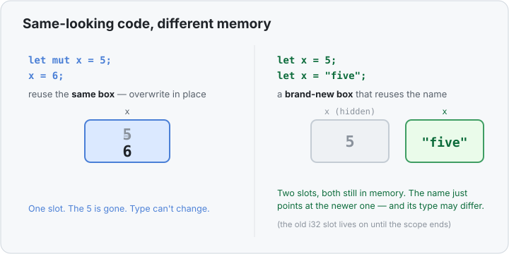

# Interlude 12b · Why `.trim()` doesn't move your `String` — its return type is `&str`

> Interlude: a **single lesson**. It leans on one memory picture (a method can hand back
> a *view* into data it doesn't own), so that picture lives right here rather than in a
> separate "Under the hood."
> Track: [From-Zero: Rust](../README.md)

You were reading real input-handling code and stopped on one line:

```rust
use std::io;

fn main() {
    let mut message = String::new();
    io::stdin().read_line(&mut message).unwrap();
    let message = message.trim();   // ← this line
    // ...
}
```

…and asked exactly the right question: **`.trim()` returns `&str` — is *that* why the
value isn't moved?** Yes. That one observation is the whole lesson, and it rests on a
habit worth building now: **you can read a method's signature to know, before running
anything, whether your value gets moved, copied, or just borrowed.**

## Every method call raises one question

When you write `something.method()`, the quiet question is: *does this method take my
value away, or just look at it?* In a language with a garbage collector you never have
to ask — here you do, and the good news is you never have to *guess*. The answer is
written in the method's signature.

## `.trim()`'s signature says "borrow" — twice

```rust
pub fn trim(&self) -> &str
```

Two clues, both pointing the same way:

- **`&self`** — it takes your string *by reference*. Recall the three ways a method can
  receive its value: `self` **moves** it (takes ownership),
  [`Copy`](../06-copy-types/use-it.md) types get **copied**, and `&self`
  ([Concept 10](../10-borrowing-with-ref/use-it.md)) just **borrows** — reads without
  taking. `.trim()` is the third: your `String` is never consumed.
- **`-> &str`** — what comes *back* is a **reference type**: a
  [slice](../12-slices/use-it.md), a pointer + length pointing **into your String's own
  buffer**, at the text with the outer whitespace skipped. No new text is allocated —
  it's a window, not a copy.

So `let message = message.trim();` **reads** `message` and hands back a *view* into it.
The `String` is untouched: not moved, not copied. Here is that exact line in memory:


Trace the borrow:

1. `message.trim()` **borrows** the `String` (that's the `&self`) and returns a `&str`
   aimed at the `"hi"` inside its buffer. The `String` is not moved and not copied.
2. That `&str` is *just* a pointer + a length — **no text was allocated**. It reuses the
   `String`'s bytes.
3. Because it's only borrowing, the `String` stays the owner, and the slice is valid
   *only as long as the `String` lives*. (More on that in a moment — it's why the next
   part matters.)

## The reflex: read the return type

Build this habit and a whole class of "wait, why did my value disappear?" errors never
happens to you. Glance at what a method **returns**:

| Return type | What you got back | Did your value move? |
|---|---|---|
| `&str`, `&T`, `&[T]` | a **borrow** — a view into data someone else still owns | **No.** The owner keeps owning. |
| `String`, `T`, `Vec<T>` … (owned) | your **own** value — a fresh one, or the receiver moved out | Depends on `self` (below) |
| method takes `self` (by value) | — | **Yes** — the receiver is eaten by the call |

Reading real methods through this lens:

- `.trim()`, `.get()`, `.as_str()` → return `&…` — **borrows**. Cheap views, nothing
  moves.
- `.to_string()`, `.clone()`, `.to_uppercase()` → return an **owned** `String` — a
  brand-new allocation that's yours. Your original is still fine, because these take
  `&self` (they read the original to build the copy).
- `.into_bytes()` → takes **`self`** — it *eats* the `String` and hands back its raw
  bytes. After this call the `String` is gone.

The `into_` prefix is even a naming convention for "this consumes `self`." Once you
notice these signals, the compiler's move errors stop being surprises.

## The other half of that line: shadowing

There's a smaller second puzzle in `let message = message.trim();`, and it's worth a
name. `message` started as a `String` and is now a `&str` — but
[Concept 02](../02-frozen-by-default-and-mut/use-it.md) said variables are *frozen*, and
even `mut` can't change a variable's **type**. So how do both lines say `message`?

Because the second `let` doesn't change the old variable — it makes a **brand-new one
that reuses the name**. This is **shadowing** (the new variable casts a *shadow* over the
old). The old box isn't touched; a second box is built beside it, and the name points at
the newer one from that line on. A fresh box can hold a **different type**, which is how
`String` becomes `&str`.



| | `mut` (Concept 02 / 11) | Shadowing (here) |
|---|---|---|
| `x = ...` vs `let x = ...` | overwrites the **same box** | makes a **new box**, reuses the name |
| Can the type change? | **No** — same box | **Yes** — new box, any type |
| Old value | gone, overwritten | still in memory, hidden by the name |

**Here's why shadowing matters to the borrow above.** The new `&str` is pointing *into*
the old `String`'s buffer. Shadowing does **not** drop the old `String` — it stays alive
in its own slot until the end of the scope. That's exactly what the slice needs: an
owner that's still there to point into. The two ideas hold hands — `.trim()` borrows,
and shadowing keeps the borrowed-from `String` alive.

> One consequence: because that `&str` borrows a *local* `String`, you can't `return` it
> out of the function — the `String` would die at the closing `}` and leave the slice
> dangling. The borrow checker stops you. Inside the same function (like the stdin
> example) it's perfect.

## Predict the memory

```rust
fn main() {
    let s = String::from("  hi  ");
    let s = s.trim();
    println!("{}", s.len());
}
```

Before running it, answer:
1. What does it print?
2. On the last line, is `s` a `String` or a `&str`?
3. How many things sit in memory here — one, or two? Is the original `String` dropped
   the moment we shadow it?

<details>
<summary>Reveal</summary>
<ol>
<li><strong><code>2</code></strong> — <code>s</code> is now the <code>&amp;str</code> <code>"hi"</code>, which is 2 bytes long.</li>
<li><strong><code>&amp;str</code>.</strong> <code>.trim()</code> returns <code>&amp;str</code>, so that's what the name means after the second <code>let</code>. The type changed precisely <em>because</em> shadowing made a new box.</li>
<li><strong>Two.</strong> The original <code>String</code> (owning <code>"  hi  "</code> on the heap) is <strong>still alive</strong> — it is <em>not</em> dropped at the shadow. It has to stay, because the <code>&amp;str</code> is borrowing into its buffer. Both live until the end of <code>main</code>; the buffer is freed only then.</li>
</ol>
</details>

## Exercises

1. **Trim borrows — watch the String survive** — [starter](exercises/1-starter.rs) · [solution](exercises/1-solution.rs).
   Given `let raw = String::from("   hello   ");`, shadow `raw` with `raw.trim()` (a
   `&str` borrow — nothing moved) and print it inside `[` `]` so the trimming shows.
   (Expect `[hello]`.)
2. **Return type decides the type of your binding** — [starter](exercises/2-starter.rs) · [solution](exercises/2-solution.rs).
   Given `let word = "hello";`, shadow `word` with `word.len()` — whose return type is a
   number — so the name goes from a `&str` to a `usize`, then print it. (Expect `5`.)
   You could *never* do this with `mut`; a `mut` box keeps its type.

## Next

- Back to the main line: [Concept 13 — Structs](../13-structs/use-it.md).
- The exact inverse of the borrow you saw here: [Interlude 10a — Dereferencing with `*`](../10a-dereferencing-with-star/use-it.md).
- Terse reference: [`.trim()`](../../../languages/rust.md#trim),
  [`&T` borrowing](../../../languages/rust.md#borrow), and
  [shadowing](../../../languages/rust.md#shadowing) in the handbook.
