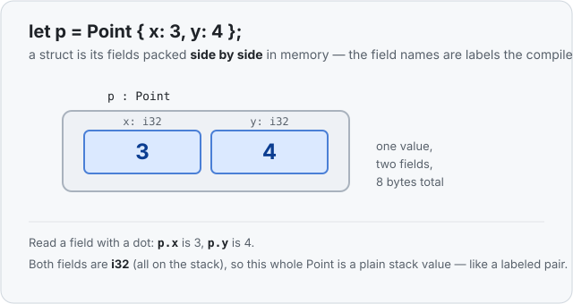
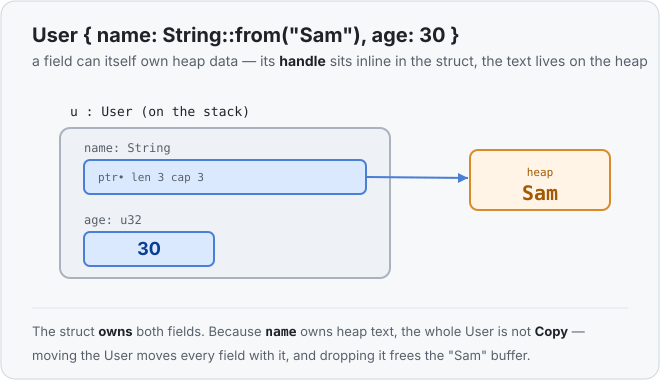

# Concept 13 · Structs — Under the hood

> Pair: [Use it](use-it.md) · **Under the hood** (you are here)
> Track: [From-Zero: Rust](../README.md)

## A struct is just its fields, side by side
There's no magic to a struct in memory. A `Point { x: 3, y: 4 }` is simply its two
fields **packed next to each other** — a 4-byte `i32` for `x`, then a 4-byte `i32` for
`y`, 8 bytes in a row. The field *names* aren't stored at runtime; they're labels the
compiler uses to know that "the `y` field is the 4 bytes right after `x`."



So a struct whose fields are all stack values is itself a plain stack value — a labeled
bundle, nothing more. `p.x` compiles down to "read the first 4 bytes of `p`"; `p.y` to
"read the next 4." That's why field access is free.

## A field that owns the heap
Now the interesting case, and it's just Phase 2 applied one level in. Give a struct a
`String` field:

```rust
struct User { name: String, age: u32 }
let u = User { name: String::from("Sam"), age: 30 };
```

The `String` field is a **handle** ([Concept 07](../07-the-heap-and-string/under-the-hood.md)) —
ptr, len, capacity — and that handle sits **inline** in the struct, right alongside the
`age`. The actual text `"Sam"` lives on the heap, where the handle points.



So the struct straddles both worlds: the fixed-size part (the handle and the `age`) lives
wherever the struct lives, and the growable text lives on the heap. Exactly the split from
Concept 07 — a struct just carries it inside.

## Ownership carries over, unchanged
Because the struct *contains* its fields, it **owns** them, and every Phase 2 rule follows
automatically:

- **Not `Copy` if any field isn't.** `age` alone would be `Copy`, but `name` owns heap
  text, so the whole `User` is a move type — `let u2 = u;` **moves** it and retires `u`.
- **Move moves everything.** Moving the struct moves all its fields together; the single
  `"Sam"` buffer now belongs to the new owner. No copy of the text.
- **Drop frees everything.** When the owner of a `User` goes out of scope, its `String`
  field is dropped and the `"Sam"` buffer is freed — once, by the one owner.
- **Borrowing works at both levels.** `&u` borrows the whole struct; `&u.name` borrows
  just that field. The [borrow rules](../11-mut-references-and-borrow-rules/use-it.md) apply
  as always.

This is the real payoff of doing Phase 2 first: structs introduce **zero** new memory
rules. They're a grouping mechanism, and the values inside behave exactly as they did on
their own.

## Predict the memory
```rust
struct Label {
    text: String,
    priority: u8,
}

fn main() {
    let a = Label { text: String::from("urgent"), priority: 1 };
    let b = a;
    println!("{} {}", b.text, b.priority);
}
```

1. Is `a` still usable after `let b = a`? Why?
2. How many heap buffers exist for the text `"urgent"` after that line?
3. Does it compile and print `urgent 1`?

<details>
<summary>Show the answer</summary>
<ol>
<li><strong>No.</strong> <code>Label</code> has a <code>String</code> field (<code>text</code>), so the struct is <strong>not <code>Copy</code></strong> — <code>let b = a</code> <strong>moves</strong> it and retires <code>a</code>.</li>
<li><strong>One.</strong> A move doesn't copy the heap text; the single <code>"urgent"</code> buffer just belongs to <code>b</code> now.</li>
<li><strong>Yes</strong> — it prints <code>urgent 1</code>. It only uses <code>b</code>, never the moved-away <code>a</code>. (Add <code>println!("{}", a.text)</code> and it would fail with "borrow of moved value: <code>a</code>".)</li>
</ol>
</details>

## Next
- **Concept 14 — Enums**: a type that is *one of several* shapes (not all fields at once,
  like a struct, but a choice between alternatives) — the other half of building your own
  types, and the road to `Option` and pattern matching.
