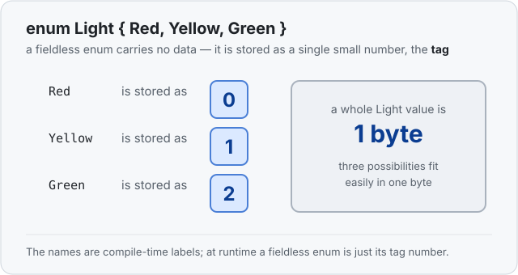
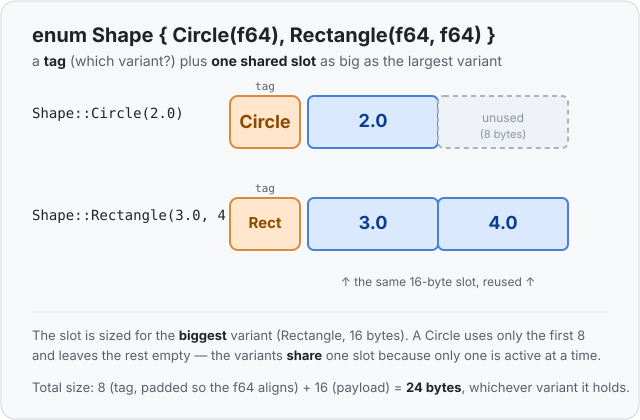

# Concept 14 · Enums — Under the hood

> Pair: [Use it](use-it.md) · **Under the hood** (you are here)
> Track: [From-Zero: Rust](../README.md)

## A plain enum is just a small number
Start with the fieldless kind. A `Light` has three variants and carries no data, so at
runtime Rust stores it as **one tiny number** — a **tag** — where `Red` is 0, `Yellow` is
1, `Green` is 2. That's the whole value.



The names `Red`/`Yellow`/`Green` don't exist at runtime any more than a struct's field
names do — they're labels the compiler turns into numbers. So `Light` is **1 byte**. Three
possibilities fit in a single byte with room to spare, and Rust uses the smallest number
type that holds every variant.

```rust
use std::mem::size_of;
enum Light { Red, Yellow, Green }
println!("{}", size_of::<Light>());   // 1
```

## Add data, and it becomes a tag + a shared slot
Now the interesting case. Give the variants data:

```rust
enum Shape {
    Circle(f64),          // needs room for 1 f64  = 8 bytes
    Rectangle(f64, f64),  // needs room for 2 f64  = 16 bytes
}
```

A `Shape` value is two parts glued together:

1. the **tag** — which variant is this, `Circle` or `Rectangle`?
2. the **payload** — one shared slot, reused by whichever variant is active.

Here's the key idea: **there is only one payload slot, and it must be big enough for the
largest variant.** A `Circle` needs 8 bytes, a `Rectangle` needs 16. The slot is sized for
the bigger one — 16 bytes — and a `Circle` simply uses the first 8 and leaves the rest
unused. The variants don't each get their own space; they **share** the one slot, because
the value can only ever be one of them at a time.



```rust
enum Shape { Circle(f64), Rectangle(f64, f64) }
println!("{}", size_of::<Shape>());   // 24
```

Why 24 and not 8 + 16 = 24 exactly? This time it does land on 24, but not for the obvious
reason: the tag only needs 1 byte, yet an `f64` must sit at an 8-byte boundary, so the tag
is **padded** out to 8 bytes before the 16-byte payload begins. 8 (padded tag) + 16
(payload) = 24. The takeaway isn't the arithmetic — it's the shape of the thing: **tag +
one slot as big as the biggest variant.**

## Struct vs enum, in one line
This is a clean symmetry worth holding onto:

- A **struct** takes as much room as the **sum** of its fields — it holds them *all at
  once*, so it needs space for every one.
- An **enum** takes as much room as its **biggest** variant (plus a tag) — it holds *one
  at a time*, so it only needs space for the largest, reused.

"All of them, added up" versus "one of them, the biggest." That difference *is* the
difference between "and" and "or," made out of bytes.

## Ownership carries over, unchanged
Just like structs, enums add **no** new memory rules — the [Phase 2](../README.md) rules
apply to whatever a variant carries:

- **Not `Copy` if a variant owns the heap.** An `enum Msg { Ping, Text(String) }` owns a
  `String` in one of its variants, so the whole enum is a **move type**
  ([Concept 08](../08-ownership-and-moves/use-it.md)) — `let b = a;` moves it and retires
  `a`. A fieldless enum like `Light`, made only of a tiny tag, *is* `Copy`.
- **Move moves the payload.** Moving the enum moves whatever the active variant holds; if
  that's a `String`, the single heap buffer changes owner, no copy.
- **Drop frees the payload.** When the owner goes out of scope, the active variant's data
  is dropped — the `String`'s buffer freed once, by the one owner.

The value inside a variant behaves exactly as it did on its own. The enum is just a labeled
container that picks one shape at a time.

## Predict the memory
```rust
use std::mem::size_of;

enum Packet {
    Empty,
    Byte(u8),
    Block([u8; 100]),   // an array of 100 bytes
}

fn main() {
    println!("{}", size_of::<Packet>());
}
```

1. Which variant decides the size of `Packet`?
2. Roughly how big is a `Packet` — closer to 1 byte, or closer to 100?
3. When a `Packet` is holding `Byte(7)`, how much of its space is actually in use?

<details>
<summary>Show the answer</summary>
<ol>
<li><strong><code>Block</code></strong> — the largest variant, at 100 bytes. The payload slot must fit the biggest.</li>
<li><strong>Closer to 100</strong> (it's 101: a 1-byte tag + the 100-byte payload; no padding is needed because <code>u8</code> aligns to 1). Every <code>Packet</code> is this size, even an <code>Empty</code> one — the slot is always sized for <code>Block</code>.</li>
<li><strong>Just the tag + 1 byte.</strong> A <code>Byte(7)</code> uses 1 byte of the 100-byte slot and leaves the other 99 unused. That wasted room is the price of "one type, many shapes" — the value must be ready to become the biggest variant at any moment.</li>
</ol>
</details>

## Next
- **Concept 15 — `Option`**: Rust has no `null`. Instead, "a value that might be missing"
  is just an enum — `Some(value)` **or** `None` — built from exactly what you learned here.
  Enums are how Rust makes "maybe nothing" a thing the compiler can *check*.
