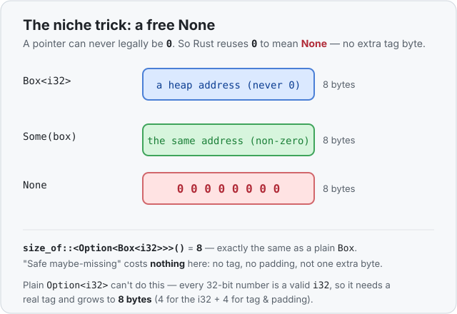

# Concept 15 · `Option` (no more null) — Under the hood

> Pair: [Use it](use-it.md) · **Under the hood** (you are here)
> Track: [From-Zero: Rust](../README.md)

## It's the enum picture, again
`Option` is not special in memory — it's a plain [enum](../14-enums/under-the-hood.md), so it
has the exact shape you already know: a **tag** (which variant?) plus **one shared slot**
sized for the biggest variant. Here the variants are `Some(T)` and `None`:

- `Some(T)` needs room for a `T`.
- `None` carries nothing, so it needs room for... nothing.

So the biggest variant is `Some`, and the slot is sized for `T`. An `Option<i32>` is
therefore "a tag, plus a slot big enough for one `i32`":

```rust
use std::mem::size_of;
println!("{}", size_of::<i32>());            // 4
println!("{}", size_of::<Option<i32>>());    // 8
```

An `i32` is 4 bytes; the `Option<i32>` is 8. The tag only needs 1 byte to tell `Some` from
`None`, but an `i32` must sit on a 4-byte boundary, so the tag is **padded** out to 4 bytes
before the 4-byte number — 4 + 4 = 8. Same "tag + slot" arithmetic as any enum.

## The surprise: sometimes the tag is free
Now the beautiful part, and the reason `Option` is cheap enough to use *everywhere* in Rust.

Think about a [`Box`](../../../languages/rust.md#box) or a `&` reference. It holds a **memory
address** — a number pointing at where a value lives. But there's one address it can *never*
legally hold: **0**. A valid pointer always points at something real, so `0` is a wasted,
impossible value — a "hole" in the set of things a pointer can be.

Rust spots that hole and moves in. For an `Option<Box<T>>` it doesn't add a tag at all.
Instead:
- `Some(pointer)` → store the real, non-zero address.
- `None` → store `0`.

The pointer itself *is* the tag. Any non-zero value means `Some`; `0` means `None`. This is
called a **niche optimization** — Rust hides the tag inside an unused value the type already
had lying around.



```rust
use std::mem::size_of;
println!("{}", size_of::<Box<i32>>());            // 8
println!("{}", size_of::<Option<Box<i32>>>());    // 8  ← same!
```

Wrapping a `Box` in an `Option` costs **zero** extra bytes. "This pointer might be missing"
is expressed for free, using space that was already unusable. The same holds for `&`
references (`Option<&i32>` is 8 bytes, same as `&i32`) — this is exactly why Rust can afford
to make "maybe missing" the safe default instead of the dangerous null it replaces.

## Why `Option<i32>` *can't* do that
It's worth seeing why the free trick only works sometimes. A pointer had a spare value (`0`)
because not every bit-pattern is a legal pointer. But an `i32`? **Every** 32-bit pattern is a
valid `i32` — `0`, `-1`, `2000000000`, all real numbers. There's no leftover pattern to
steal for `None`. So `Option<i32>` has no choice but to store a **separate tag byte** (padded
to keep the number aligned), which is why it grew to 8 bytes while a bare `i32` is 4.

The rule of thumb: **if the inner type has an impossible value, `Option` is free; if it uses
every value, `Option` pays for a tag.**

## Ownership carries over, unchanged
`Option` is an enum, so [Phase 2](../README.md)'s rules apply to whatever `Some` carries —
nothing new to learn:

- **`Copy` when the inside is `Copy`.** `Option<i32>` is `Copy` (a tiny tag + number).
  `Option<String>` is a **move type** ([Concept 08](../08-ownership-and-moves/use-it.md)),
  because a `String` owns the heap — `let b = a;` moves it and retires `a`.
- **Move moves the payload.** Moving an `Option<String>` hands the single heap buffer to the
  new owner; no copy.
- **Drop frees the payload.** When a `Some(String)` goes out of scope, the buffer is freed
  once, by the one owner. A `None` has nothing to free.

An `Option` is just a labeled box around a value you already understand.

## Predict the memory
```rust
use std::mem::size_of;

fn main() {
    println!("{}", size_of::<bool>());            // ?
    println!("{}", size_of::<Option<bool>>());    // ?
    println!("{}", size_of::<u8>());              // ?
    println!("{}", size_of::<Option<u8>>());      // ?
}
```

1. A `bool` is 1 byte but only ever holds `true` or `false` — 2 of its 256 possible
   patterns. Does `Option<bool>` need an extra tag byte, or is there a spare pattern to
   reuse for `None`?
2. A `u8` is a 1-byte number that uses **all** 256 patterns (0–255). Does `Option<u8>` have
   a spare value to steal?
3. So which is bigger, `Option<bool>` or `Option<u8>`, and why?

<details>
<summary>Show the answer</summary>
<ol>
<li><strong>No extra byte — <code>Option&lt;bool&gt;</code> is 1 byte.</strong> A <code>bool</code> uses only 2 of its 256 patterns, so 254 are spare. Rust grabs one of them (it uses <code>2</code>) to mean <code>None</code>. Niche optimization, just like the pointer's <code>0</code>.</li>
<li><strong>No spare value.</strong> Every one of the 256 patterns is a real <code>u8</code>, so there's nothing left over to mean <code>None</code>.</li>
<li><strong><code>Option&lt;u8&gt;</code> is bigger — 2 bytes vs 1.</strong> With no niche to reuse, <code>Option&lt;u8&gt;</code> must add a separate tag byte (1 for the number + 1 for the tag = 2). <code>Option&lt;bool&gt;</code> stays 1 byte because it had a hole to hide the tag in. Same idea as <code>Option&lt;i32&gt;</code> (tag byte) vs <code>Option&lt;Box&gt;</code> (free) — it all comes down to whether the inner type has a spare pattern.</li>
</ol>
</details>

## Next
- **Concept 16 — `match`**: you've been opening enums and `Option`s with `match` on faith.
  Next it gets its own lesson — every pattern it can match, why the compiler forces you to
  cover every case, and how that "you can't forget a case" guarantee is what makes `Option`
  actually safe rather than just tidy.
