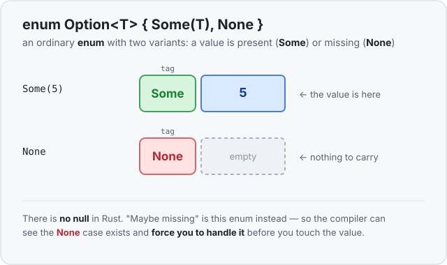

# Concept 15 · `Option` (no more null) — Use it

> Pair: **Use it** (you are here) · [Under the hood](under-the-hood.md)
> Track: [From-Zero: Rust](../README.md) · Previous: [Concept 14](../14-enums/use-it.md)

## The idea
Sometimes a value just **isn't there**. You look up a name and there's no match. You ask
for the first item of an empty list. You read a setting that was never set. Every language
needs a way to say "nothing here" — and most of them reach for the same tool: **null**.

Null is a special "this points at nothing" value you can put anywhere. It sounds handy, and
it has caused an astonishing amount of damage — its own inventor later called it his
"[billion-dollar mistake](../../../glossary/null-and-the-billion-dollar-mistake.md)." The
problem: null hides. A value *looks* like a normal name or number, but at runtime it's
secretly nothing, and the moment you use it the program crashes. Nothing warned you.

**Rust has no null.** Instead, a value that might be missing gets a type that *says so out
loud*: `Option<T>`. And it's not a special language feature — it's just an
[enum](../14-enums/use-it.md), the exact thing you learned last lesson:

```rust
enum Option<T> {
    Some(T),   // present: here is the value
    None,      // absent: nothing here
}
```

Read it as: "an `Option` is **either** `Some(a value)` **or** `None`." That's the whole
trick. "Maybe missing" stops being an invisible trapdoor under every value and becomes one
honest enum with two shapes.



## The `<T>` — it holds any type
The `<T>` is a placeholder for "whatever type is inside." An `Option<i32>` is a maybe-there
`i32`; an `Option<String>` is a maybe-there `String`. You'll meet this `<T>` machinery
properly later (it's called a *generic*); for now just read `Option<i32>` as "maybe an
`i32`." `Some` and `None` come built in — you never have to define `Option` yourself.

## Creating one
```rust
let present: Option<i32> = Some(5);
let missing: Option<i32> = None;
```

`Some(5)` wraps the `5` up as "present." `None` is the empty one. Both have the **same
type**, `Option<i32>` — which is exactly why a function can promise to return one or the
other and the caller has to be ready for both.

## You can't use the value without opening it
This is the safety, and it's worth feeling directly. You cannot add `1` to an `Option<i32>`:

```rust
let maybe = Some(5);
let bigger = maybe + 1;   // ❌ compile error: Option<i32> is not a number
```

The `5` is *inside* the `Some`, and the compiler won't let you reach in until you've said
what happens when it's `None`. There's no way to "accidentally use nothing" — the missing
case can't be skipped. Compare that to null, where `maybe + 1` would compile fine and then
blow up at runtime.

So how do you open it? The same way you open any enum: by asking which variant it is.

### Opening it with `match`
`match` ([its own lesson is Concept 16](../README.md)) handles both variants, and the
compiler checks you covered both:

```rust
fn describe(maybe: Option<i32>) {
    match maybe {
        Some(value) => println!("got {value}"),
        None => println!("got nothing"),
    }
}
```

If it's `Some`, the number inside is bound to `value`. If it's `None`, the other arm runs.
You **cannot** forget the `None` case — leave it out and the program won't compile.

### Opening it with `if let`
Often you only care about the `Some` case. [`if let`](../../../languages/rust.md#if-let) is
the short form for exactly that:

```rust
if let Some(value) = maybe {
    println!("got {value}");   // runs only when there IS a value
}
```

Read `if let Some(value) = maybe` as: "*if* `maybe` is a `Some`, pull its contents out into
`value` and run the block." If it's `None`, the block is skipped. Add an `else` for the
missing case when you need one.

## Where it shows up: a function that might find nothing
This is `Option`'s day job. A search can fail to find anything, so it says so in its
**return type** — no sentinel value, no null, no lying:

```rust
fn first_even(numbers: &[i32]) -> Option<i32> {
    for &number in numbers {
        if number % 2 == 0 {
            return Some(number);   // found one
        }
    }
    None                            // walked the whole list, nothing
}
```

The return type `Option<i32>` tells every caller, up front: *this might come back empty, and
you have to deal with it.* Before `Option`, people faked this by returning a magic number
like `-1` for "not found" — but `-1` is a perfectly good `i32`, so nothing stopped you from
using it as if it were a real answer. `Option` makes "nothing" a *different shape* the
compiler can see, so it can force the check.

## Exercises
1. **Greet, or don't** — [starter](exercises/1-starter.rs) · [solution](exercises/1-solution.rs).
   Write `fn greet(name: Option<&str>)` that `match`es the name: `Some(actual_name)` prints
   `Hello, {actual_name}!`, `None` prints `Hello, stranger!`. Call it with `Some("Ada")` and
   `None`.
2. **Find the first even number** — [starter](exercises/2-starter.rs) · [solution](exercises/2-solution.rs).
   Write `fn first_even(numbers: &[i32]) -> Option<i32>` returning the first even number, or
   `None` if there isn't one. Handle the result with `if let`. (Expect `first even: 8`, then
   `no even number`.)

## Next
- What an `Option` actually *is* in memory — it's the [enum](../14-enums/under-the-hood.md)'s
  "tag + shared slot" again, and the surprising part: for a `Box` or a reference, `Option`
  costs **zero** extra bytes: [Under the hood](under-the-hood.md).
