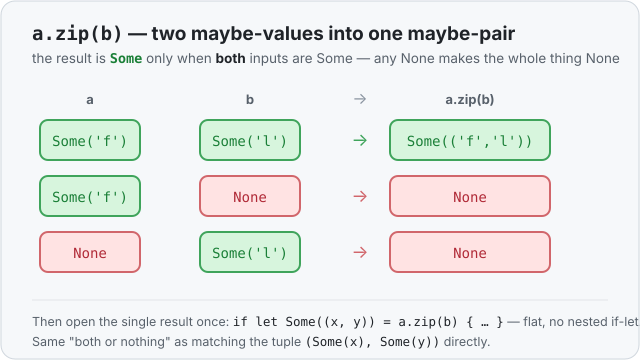

# Interlude 15a · Opening an Option safely (`.unwrap()`, tuple-match, `.zip()`) — Use it

> Interlude (single lesson) · Track: [From-Zero: Rust](../README.md)
> Sits right after [Concept 15 — `Option`](../15-option/use-it.md)

## The idea
[Concept 15](../15-option/use-it.md) taught the safe openers for an [`Option`](../15-option/use-it.md):
`match` handles both `Some` and `None`, and `if let Some(x)` handles just the `Some`. Those are
still the backbone. This interlude fills in the two things you actually hit *after* that —
straight from the [Longest Common Prefix challenge](../../../challenges/longest-common-prefix/README.md),
written as **the gap between what looked right and what I found after researching**:

1. `.unwrap()` — the quick opener that "removes the `Option`" — and the catch nobody warns you
   about until it bites.
2. Opening **two** Options at once without the ugly nested `if let` staircase.

## `.unwrap()` — the opener that's really a bet
The fastest way to get the value out of a `Some` is [`.unwrap()`](../../../languages/rust.md#unwrap):

```rust
let first: Option<char> = "hi".chars().next();  // Some('h')
let c = first.unwrap();                          // c is 'h'
```

> **What it looks like it does:** "takes the value out of the `Option`."
> **What it actually does:** takes the value out *if it's `Some`* — and **crashes the whole
> program** if it's `None`.

```rust
let none: Option<char> = "".chars().next();   // None — empty string has no first char
let c = none.unwrap();                         // 💥 panic: 'called Option::unwrap() on a None value'
```

So `.unwrap()` isn't a safe open — it's you *promising* the value is there, and Rust holding
you to it at runtime. That's fine in three places: a throwaway script, a test, or a spot where
you can *prove* it's `Some`. On real input — a file, stdin, a lookup that might miss — it's a
landmine. (`.expect("why I'm sure")` is the same thing with a message printed on the crash,
which at least tells you *which* `unwrap` blew up.) For real input, reach for `match`, `if let`,
or the two-at-once tools below.

## The trap: opening two Options at once
The challenge needed the current letter of *two* words, and each `.chars().nth(i)` gives an
`Option<char>` — a letter, or nothing if that word is shorter. So there are two Options to open,
and only the case where **both** are `Some` is interesting. The first working version nested one
`if let` inside the other:

```rust
if let Some(char1) = character1 {
    if let Some(char2) = character2 {
        // ...both letters exist, finally compare them...
    }
}
```

It works, but every extra Option pushes the real code one indent deeper — a staircase. The
natural wish is to combine them on one line:

```rust
if let Some(char1) = character1 && let Some(char2) = character2 {   // the "let chain" idea
```

That feature is real — it's called **let-chains** — but on a normal build it fails with
*"let chains are only allowed in Rust 2024 or later."* It only switches on in the
[2024 edition](../../../languages/rust.md#loop-control), which is why it looked broken. Good news:
there are two clean ways that work on **any** edition.

## Shortcut 1 — match both as a tuple
Put both Options in a `()` tuple and match the pair in one pattern:

```rust
if let (Some(char1), Some(char2)) = (character1, character2) {
    // runs only when BOTH are Some — char1 and char2 are the letters
}
```

Read `(Some(char1), Some(char2))` as "a pair where the first is `Some` **and** the second is
`Some`." Any `None` on either side fails the whole pattern and skips the block — exactly the
"both or nothing" you wanted, flat instead of nested.

## Shortcut 2 — `Option::zip`
`Option` has a method built for this precise moment. `a.zip(b)` welds two Options into one:

```rust
let combined = character1.zip(character2);   // Option<(char, char)>
if let Some((char1, char2)) = combined {
    // both were Some -> we get the pair
}
```

- `Some(x).zip(Some(y))` → `Some((x, y))`
- anything with a `None` → `None`

So `.zip()` turns "two maybe-values" into "one maybe-pair," and you open that single Option the
normal way. It reads as a sentence: *zip the two letters together; if that gave a pair, use it.*



> **The gap, in one line:** I knew `.unwrap()` and nested `if let`. What I found is that
> `.unwrap()` is a *crash-on-None bet*, and two Options open cleanly with a tuple-match or
> `.zip()` — no staircase, and no waiting for the 2024 edition's let-chains.

## Exercises
1. **Both, or neither** — [starter](exercises/1-starter.rs) · [solution](exercises/1-solution.rs).
   Given two `Option<i32>` values, use a **tuple-match** to print `sum: {a+b}` only when both are
   `Some`, and `missing` otherwise. Try `(Some(2), Some(3))` then `(Some(2), None)`.
2. **Same thing with `.zip()`** — [starter](exercises/2-starter.rs) · [solution](exercises/2-solution.rs).
   Solve exercise 1 again using `a.zip(b)` and a single `if let Some((x, y))`. (Same output.)

## Where this sits
This interlude belongs right after [Concept 15 (`Option`)](../15-option/use-it.md): once you
know what an `Option` *is*, the very next questions are "how do I get the value out in real
code?" and "what if I have two of them?" Handbook: [`.unwrap()`](../../../languages/rust.md#unwrap)
· [`Option`](../../../languages/rust.md#option). The full challenge that surfaced all of this:
[Longest Common Prefix](../../../challenges/longest-common-prefix/README.md).
