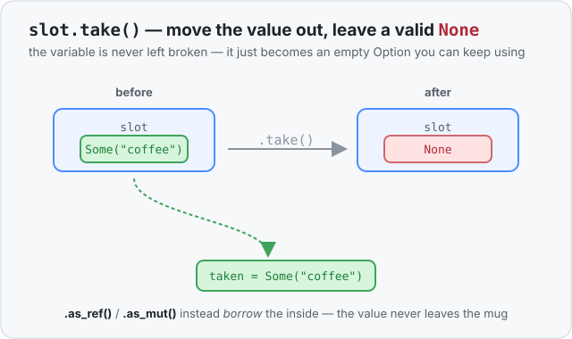

# Interlude 15b · Reaching inside an Option — `.take()`, `.as_ref()`, `.as_mut()` — Use it

> Interlude (single lesson) · Track: [From-Zero: Rust](../README.md)
> Sits right after [Interlude 15a — Opening an Option safely](../15a-opening-options-safely/use-it.md)

## The idea
So far every way you've opened an [`Option`](../15-option/use-it.md) — `match`, `if let`,
`.unwrap()`, the tuple-match and `.zip()` from [15a](../15a-opening-options-safely/use-it.md) —
**moves the value out**. That's fine when you own the `Option` and are done with it. But a lot of
real code holds an `Option` it must *keep using*: a struct field, or a loop variable it re-checks
every pass. Move the value out and the variable is spent — the next line that touches it won't
compile.

This interlude is the set of tools for exactly that spot: **get at what's inside an `Option`
without destroying the `Option` itself.** There are three, and they line up perfectly with the
three things you already know you can do with any value — *take it*, *borrow it to read*, or
*borrow it to change*:

| You want to… | Tool | Turns | Into |
|---|---|---|---|
| move the inside **out**, leave nothing | `.take()` | `&mut Option<T>` | `Option<T>` (and the original is now `None`) |
| **read** the inside without moving it | `.as_ref()` | `&Option<T>` | `Option<&T>` |
| **change** the inside in place | `.as_mut()` | `&mut Option<T>` | `Option<&mut T>` |

The pattern to memorize: `.as_ref()` and `.as_mut()` **push the `&` inward** — the borrow moves
from *outside* the Option to *inside* it, so you match on `Some(&value)` instead of `&Some(value)`.
`.take()` is the odd one out: it's not a borrow at all, it's a *move that heals itself*, leaving a
valid `None` behind.

## `.take()` — move the value out, leave `None`
Picture a mug. `.take()` lifts the contents out and hands them to you, and — this is the whole
trick — it puts the **empty mug back** where it was. The variable is never left broken; it's just
empty now.

```rust
let mut slot: Option<String> = Some(String::from("coffee"));

let taken = slot.take();        // taken is Some("coffee")
                                // slot is now None — but still a perfectly valid Option

println!("{taken:?}");          // Some("coffee")
println!("{slot:?}");           // None
```



Why this matters: without `.take()`, pulling the `String` out of `slot` would **move `slot`
itself**, and Rust would then refuse to let you use `slot` again. `.take()` gives you the inside
*and* keeps `slot` alive (now holding `None`). If the `Option` was already `None`, `.take()`
simply returns `None` and leaves it `None` — no crash, nothing to special-case.

> **Watch out — a name collision.** You met `.take(n)` on *iterators* back in
> [Interlude 28b](../28b-zip-take-takewhile-count/use-it.md): `some_iter.take(3)` keeps the first
> three items. That is a **different method that happens to share the name**. `Option::take()`
> takes **no argument** and empties the Option. Same word, unrelated jobs — the type it's called
> on tells them apart.

## `.as_ref()` — borrow the inside to *read* it
Sometimes you only want to *look* at what's inside without moving or changing anything — and
crucially, without consuming the Option. `.as_ref()` turns a `&Option<T>` into an `Option<&T>`:
the `Some` now holds a **reference** to the value, which you can read while the original stays put.

```rust
let label: Option<String> = Some(String::from("ready"));

// Peek at the length without moving the String out:
if let Some(text) = label.as_ref() {   // text is &String, borrowed from label
    println!("{} chars", text.len());  // 5
}

println!("{label:?}");                 // Some("ready") — still here, untouched
```

Without `.as_ref()`, `if let Some(text) = label` would **move** the `String` into `text`, and the
final `println!` would fail to compile because `label` was consumed. `.as_ref()` is how you say
"lend me the inside, I'm only reading."

## `.as_mut()` — borrow the inside to *change* it
The read-write twin. `.as_mut()` turns a `&mut Option<T>` into an `Option<&mut T>`, so you can
reach a [`&mut`](../11-mut-references-and-borrow-rules/use-it.md) to the value inside and edit it
**in place** — the value never leaves the Option:

```rust
let mut score: Option<i32> = Some(10);

if let Some(n) = score.as_mut() {   // n is &mut i32, pointing into score
    *n += 5;                        // change the value through the borrow
}

println!("{score:?}");              // Some(15) — same Option, new inside
```

`*n += 5` follows the [mutable reference](../10a-dereferencing-with-star/use-it.md) back to the
number *inside* `score` and adds to it directly. Compare the three: `.take()` would have *removed*
the `10`; `.as_ref()` would only let you *read* it; `.as_mut()` lets you *rewrite* it while it
stays home.

## The one-line rule
- **`.take()`** — "I want the value **out**, and I want the variable left empty-but-valid."
- **`.as_ref()`** — "I want to **read** the inside; leave everything where it is."
- **`.as_mut()`** — "I want to **change** the inside in place; leave it where it is."

> **Where you'll feel this hardest:** walking a **linked list**. A traversal holds an
> `Option<Box<Node>>` and, every loop, must read the current node, step to the next, *and keep the
> variable usable for the following pass*. That's `.take()` to step forward and `.as_mut()` to
> grow the list — the exact tools above. That's the payoff lesson: [Interlude 29a — Walking and
> building a linked list](../29a-walking-a-linked-list/use-it.md), after you've met
> [`Box`](../29-box/use-it.md).

## Exercises
1. **Empty the mug** — [starter](exercises/1-starter.rs) · [solution](exercises/1-solution.rs).
   Start with `let mut slot: Option<String> = Some(String::from("hi"));`. Use `.take()` to move the
   value into a new variable, then print **both** `slot` and the taken value — proving `slot` is
   now `None` yet still usable. Then call `.take()` a *second* time and print the result (`None`).
2. **Read, then bump** — [starter](exercises/2-starter.rs) · [solution](exercises/2-solution.rs).
   Given `let mut count: Option<i32> = Some(41);`, first use `.as_ref()` in an `if let` to *print*
   the value without moving it, then use `.as_mut()` in an `if let` to add `1` to it in place.
   Print `count` at the end (`Some(42)`), showing the same Option was read and then edited.

## Where this sits
This interlude belongs right after [15a](../15a-opening-options-safely/use-it.md): once you can
open an `Option` you own, the next real-world snag is an `Option` you must *keep* — a field or a
loop variable. `.take()`, `.as_ref()`, and `.as_mut()` are the three ways in that leave the
`Option` intact. They're the quiet workhorses behind the [Add Two Numbers](../../../problems/0002-add-two-numbers/README.md)
linked-list solution. Handbook: [`Option::take`](../../../languages/rust.md#option-take) ·
[`Option::as_mut`](../../../languages/rust.md#option-as-mut) · [`Option`](../../../languages/rust.md#option).
