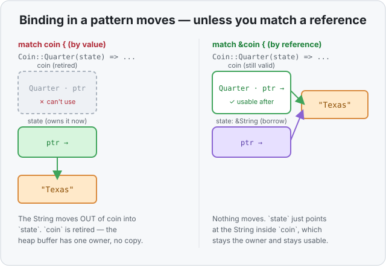

# Concept 16 · Pattern matching with `match` — Under the hood

> Pair: [Use it](use-it.md) · **Under the hood** (you are here)
> Track: [From-Zero: Rust](../README.md)

## Matching an enum is just reading the tag
Remember what an enum *is* in memory ([Concept 14](../14-enums/under-the-hood.md)): a **tag**
saying which variant it is, plus a shared slot for the data. `match` is built directly on that
tag. When you write:

```rust
match coin {
    Coin::Penny   => 1,
    Coin::Nickel  => 5,
    Coin::Dime    => 10,
    Coin::Quarter(state) => 25,
}
```

the compiler reads the one tag number and uses it to pick the arm. It doesn't have to
re-examine the value over and over — for a set of variants it can build a **jump table**: tag
`0` jumps to the Penny arm, `1` to Nickel, `2` to Dime, and so on. One read, one jump. So a
big `match` on an enum isn't "check, check, check" down a long list; it's closer to looking up
a row in a table and going straight there. (For ranges and mixed patterns it builds a small
*decision tree* instead — still just comparisons, no magic.)

And when an arm binds data — `Coin::Quarter(state)` — the compiler already knows the tag says
`Quarter`, so it knows the shared slot holds a `String`, and it reads it straight out of that
slot into `state`. The tag is what makes reaching into the payload safe: you only ever read it
*as* the variant the tag says it is.

## Exhaustiveness is a compile-time check — it costs nothing at runtime
The "you must cover every case" rule is proven while the code **compiles**. The compiler lists
every variant the type can be and checks your arms account for all of them; if one's missing,
it's a compile error. By the time the program runs, that reasoning is over — there's no
runtime "did we handle it?" check slowing things down. You pay for the safety once, at build
time, and never again.

## The ownership catch: binding in a pattern *moves*
This is the part that trips people up, and it's pure [Phase 2](../README.md) — no new rule,
just the old ones applied to patterns. When a variant owns heap data and you match **by
value**, binding that data in the pattern **moves it out**:

```rust
let coin = Coin::Quarter(String::from("Texas"));
match coin {                              // matches BY VALUE
    Coin::Quarter(state) => { /* state now OWNS the String */ }
    _ => {}
}
// coin is retired here — the String moved out of it into `state`
```

The `String`'s single heap buffer changed owner, no copy — and because it left `coin`, `coin`
is [retired](../08-ownership-and-moves/use-it.md), exactly as if you'd moved it with `let`.
Use `coin` after this and it won't compile.

Often that's not what you want — you want to *look* at the coin and keep it. The fix is to
match on a **reference** with `&`, so the binding [borrows](../10-borrowing-with-ref/use-it.md)
instead of taking ownership:

```rust
match &coin {                            // matches BY REFERENCE
    Coin::Quarter(state) => { /* state is &String — a borrow */ }
    _ => {}
}
// coin is untouched and still usable
```

Now `state` is a `&String` pointing at the string still living inside `coin`. Nothing moved;
`coin` stays the owner and stays valid after the `match`.



The rule to carry: **`match value` can move pieces out of `value`; `match &value` borrows
them.** For `Copy` types (an `i32` in a variant) it never matters — they're copied, not moved
— so you only feel this when a variant owns something heap-backed like a `String`.

## Predict the memory
```rust
enum Msg {
    Quit,
    Say(String),
}

fn main() {
    let m = Msg::Say(String::from("hi"));

    match m {
        Msg::Say(text) => println!("{text}"),
        Msg::Quit => {}
    }

    // Question: is `m` usable on this line?
}
```

1. When the `Say` arm runs, where does the `String`'s heap buffer live — is it copied, or does
   `text` take it over?
2. Is `m` still usable after the `match`? Why?
3. What one change would let you print the text *and* keep `m` usable afterward?

<details>
<summary>Show the answer</summary>
<ol>
<li><strong><code>text</code> takes it over — no copy.</strong> The match is by value, so binding <code>Msg::Say(text)</code> <em>moves</em> the <code>String</code> out of <code>m</code> into <code>text</code>. The one heap buffer just changes owner.</li>
<li><strong>No.</strong> Because the <code>String</code> moved out, <code>m</code> is retired — using it after the <code>match</code> won't compile. (Even the <code>Quit</code> variant carries nothing, but the <em>type</em> <code>Msg</code> was partially moved out of, so the whole binding is gone.)</li>
<li><strong>Match on <code>&amp;m</code> instead of <code>m</code>.</strong> Then <code>text</code> is a <code>&amp;String</code> borrow, nothing moves, and <code>m</code> stays valid — you just print through the borrow.</li>
</ol>
</details>

## Next
- **Phase 4 begins — collections.** You can now build your own types (`struct`, `enum`,
  `Option`) and take them apart (`match`). Next you meet Rust's workhorse container,
  **`Vec<T>`** — a growable list on the heap — and see the three little numbers that make its
  growth work.
