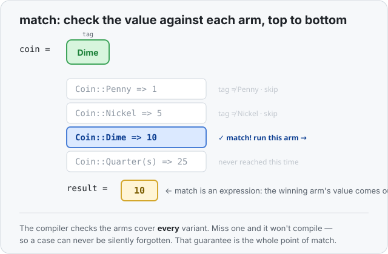

# Concept 16 · Pattern matching with `match` — Use it

> Pair: **Use it** (you are here) · [Under the hood](under-the-hood.md)
> Track: [From-Zero: Rust](../README.md) · Previous: [Concept 15](../15-option/use-it.md)

## The idea
You've been using `match` on faith for two lessons — to open [enums](../14-enums/use-it.md)
and [`Option`](../15-option/use-it.md). Now it gets its own lesson, because `match` is one of
Rust's sharpest tools.

`match` takes a value and checks it against a list of **patterns**, top to bottom. The first
pattern that fits wins, and its arm runs. Think of a mail sorter holding one letter and
moving it down a row of labelled slots — "is it this? is it this?" — dropping it in the first
slot that fits:

```rust
match coin {
    Coin::Penny   => 1,
    Coin::Nickel  => 5,
    Coin::Dime    => 10,
    Coin::Quarter => 25,
}
```

Each line is an **arm**: a pattern on the left of `=>`, and what to do on the right.



## It's an expression — it hands back a value
This is the part that makes `match` more than a switch statement: the whole `match` **is a
value** — the value of whichever arm won. So you can hand it straight back or store it:

```rust
fn value_in_cents(coin: Coin) -> u32 {
    match coin {          // no `return` needed — the match IS the return value
        Coin::Penny   => 1,
        Coin::Nickel  => 5,
        Coin::Dime    => 10,
        Coin::Quarter => 25,
    }
}
```

(That "the last expression is the value" rule is [Concept 05](../05-expressions-statements-and-return/use-it.md)
at work.) Every arm must produce the **same type** — here every arm is a `u32`.

## Patterns can pull data out
When a variant carries data, the pattern **names** that data and hands it to you inside the
arm — the same unpacking you saw with enums, now seen properly:

```rust
enum Coin {
    Penny,
    Quarter(String),   // a quarter carries which state it's from
}

match coin {
    Coin::Penny            => println!("just a penny"),
    Coin::Quarter(state)   => println!("a quarter from {state}!"),
}
```

If `coin` is a `Quarter`, `state` is bound to the `String` inside it, ready to use in that
arm. This is *destructuring* — the pattern mirrors the shape of the value and lifts the
pieces out into names.

## The kinds of pattern you'll use most
- **A literal** — match an exact value: `1 => ...`, `'q' => ...`.
- **A range** — `90..=100 => 'A'` matches any number from 90 to 100 (inclusive).
- **Or (`|`)** — one arm, several patterns: `'a' | 'e' | 'i' | 'o' | 'u' => "vowel"`.
- **A binding name** — a plain name like `state` or `n` matches *anything* and captures it
  into that name.
- **The wildcard `_`** — matches anything and *ignores* it. It's the catch-all "everything
  else" arm.

```rust
match score {
    100          => "perfect",
    90..=99      => "great",
    60..=89      => "passing",
    _            => "keep trying",   // every other number lands here
}
```

## Exhaustiveness: you can't forget a case
Here's the guarantee that makes `match` special. **The compiler forces you to cover every
possibility.** Leave a variant unhandled and your program *won't compile*:

```rust
match light {
    Light::Red    => "stop",
    Light::Green  => "go",
    // forgot Yellow → compile error: pattern `Yellow` not covered
}
```

No silently-missed case, ever — the kind of bug that slips through in most languages is
turned into a compile error you have to fix. (This is also why `_` is handy: it's how you say
"and everything else does this" on purpose.) That exhaustiveness is exactly what makes
[`Option`](../15-option/use-it.md) safe — the compiler won't let you handle `Some` and forget
`None`.

## Exercises
1. **Score to letter grade** — [starter](exercises/1-starter.rs) · [solution](exercises/1-solution.rs).
   Write `fn grade(score: u32) -> char` using a `match` with **ranges** and a `_` catch-all
   (90–100 → `A`, … , below 60 → `F`). (Expect `A`, `B`, `F`.)
2. **Coins** — [starter](exercises/2-starter.rs) · [solution](exercises/2-solution.rs).
   Given `enum Coin { Penny, Nickel, Dime, Quarter(String) }`, write
   `fn value_in_cents(coin: Coin) -> u32`. For a `Quarter`, bind the state out and print
   `a quarter from {state}!` before returning 25. (Expect `1`, `5`, `10`, then the print and
   `25`.)

## Next
- What `match` does in memory — how it reads an enum's [tag](../14-enums/under-the-hood.md) to
  jump straight to the right arm, and the ownership catch: binding a variant's data in a
  pattern **moves** it out, unless you match on a `&reference` and borrow instead:
  [Under the hood](under-the-hood.md).
