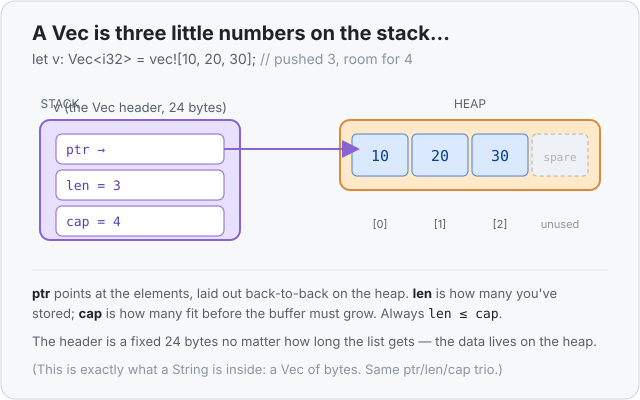
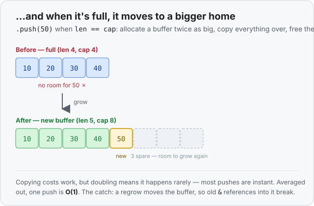

# Concept 17 · `Vec<T>` (a growable list) — Under the hood

> Pair: [Use it](use-it.md) · **Under the hood** (you are here)
> Track: [From-Zero: Rust](../README.md)

## A Vec is three numbers pointing at the heap
A `Vec` looks like it "contains" a list, but the value you hold on the **stack** is tiny and
fixed-size — just **three numbers** (a *header*):

1. **ptr** — the address of a buffer on the [heap](../07-the-heap-and-string/under-the-hood.md)
   where the actual elements live, packed back-to-back.
2. **len** — how many elements you've actually stored.
3. **cap** (capacity) — how many fit in the current buffer before it must grow.



```rust
use std::mem::size_of;
println!("{}", size_of::<Vec<i32>>());   // 24  (three 8-byte numbers on a 64-bit machine)
```

The header is **always 24 bytes**, whether the Vec holds 3 items or 3 million — because the
items themselves aren't in the header, they're out on the heap. This is the exact same shape
as a [`String`](../07-the-heap-and-string/under-the-hood.md): a `String` *is* a `Vec<u8>`
underneath — a pointer, a length, and a capacity, pointing at a heap buffer of bytes. Learn
the Vec header and you already understood the String.

The rule that always holds: **`len ≤ cap`**. You've stored `len` items; there's room for
`cap` before the buffer is full.

## `.push` when there's room: just drop it in
If `len < cap`, pushing is trivial: write the new value into the next free slot and bump `len`
by one. Nothing moves, nothing is allocated. Fast.

## `.push` when it's full: move to a bigger home
When `len == cap`, there's no free slot. So `.push` does something bigger under the covers:

1. **Allocate a new, larger buffer** on the heap — typically **twice** the old capacity.
2. **Copy** every existing element from the old buffer into the new one.
3. **Free** the old buffer.
4. Update the header's `ptr` to the new buffer and `cap` to the new size, then store the new
   element.



You can watch the capacity jump as it doubles:

```rust
let mut v = Vec::new();
// cap goes: 0 → 4 → 8 → 16 → 32 …  as it fills and regrows
for i in 0..10 { v.push(i); }
```

## Why doubling? Amortized O(1)
Copying the whole buffer sounds slow — and a single regrow *is* work proportional to `len`.
But because the capacity **doubles** each time, regrows get rarer and rarer as the Vec gets
bigger: you copy 4, then 8, then 16… but you got *many* free pushes in between. Spread across
all the pushes, the cost averages out to a constant per push. That's called
**amortized O(1)** ([Big-O](../../../glossary/big-o-notation.md)): any one push might be
expensive, but a long run of pushes is cheap *on average*. Doubling (rather than adding a
fixed amount) is exactly what buys that.

## The catch: regrowing moves the buffer
Step 3 above frees the old buffer — so any [reference](../10-borrowing-with-ref/use-it.md) that
pointed *into* it is now pointing at freed memory. That would be a
[dangling pointer](../../../glossary/double-free.md), and it's the kind of bug that wrecks
other languages. Rust simply won't let it compile:

```rust
let mut v = vec![1, 2, 3];
let first = &v[0];   // a borrow pointing into the buffer
v.push(4);           // ❌ needs &mut v, but `first` still borrows v — won't compile
println!("{first}");
```

This is the [borrow rule](../11-mut-references-and-borrow-rules/use-it.md) from Phase 2 doing
real work: you can't hold a shared `&` into the Vec *and* `.push` (which needs `&mut`) at the
same time. The rule that felt abstract back then exists precisely to stop `.push` from pulling
the buffer out from under a live reference.

## Ownership: the Vec owns its elements
A `Vec` **owns** everything in it. That means:

- **Move the Vec, move the whole list.** `let b = a;` moves the 24-byte header; the heap buffer
  isn't copied — `b` is now its one owner and `a` is [retired](../08-ownership-and-moves/use-it.md).
- **Drop the Vec, drop it all.** When the owner goes out of scope, every element is dropped
  first (so a `Vec<String>` frees each string's buffer), then the Vec's own buffer is freed.
  One clean-up, no leaks.

## Predict the memory
```rust
use std::mem::size_of;

fn main() {
    let mut v: Vec<i32> = Vec::with_capacity(4);   // start with room for 4
    v.push(1);
    v.push(2);

    println!("{}", size_of::<Vec<i32>>());
    println!("len={} cap={}", v.len(), v.capacity());
}
```

1. What does the second line print for `len` and `cap`?
2. Did pushing `1` and `2` allocate anything new on the heap, or use room that was already
   there?
3. What does `size_of::<Vec<i32>>()` print — and would it change if the Vec held 1,000 items?

<details>
<summary>Show the answer</summary>
<ol>
<li><strong><code>len=2 cap=4</code>.</strong> Two items are stored; the buffer still has room for 4.</li>
<li><strong>No new allocation.</strong> <code>with_capacity(4)</code> reserved a 4-slot buffer up front, so both pushes just dropped into existing free slots — no regrow. (Reserving capacity ahead of time is how you avoid repeated regrows when you know roughly how many items are coming.)</li>
<li><strong><code>24</code>, and no — it stays 24.</strong> The header is always three numbers (ptr, len, cap). The items live on the heap, so the stack-side size never changes with the item count.</li>
</ol>
</details>

## Next
- **Concept 18 — `HashMap<K, V>`**: from a list you index by *position* to a table you index by
  *key* — "look up the score *for Alice*," not "the score at slot 2." You've already met the
  idea in the [hash-map glossary](../../../glossary/hash-map.md); next you build one and see why
  its lookups are near-instant.
