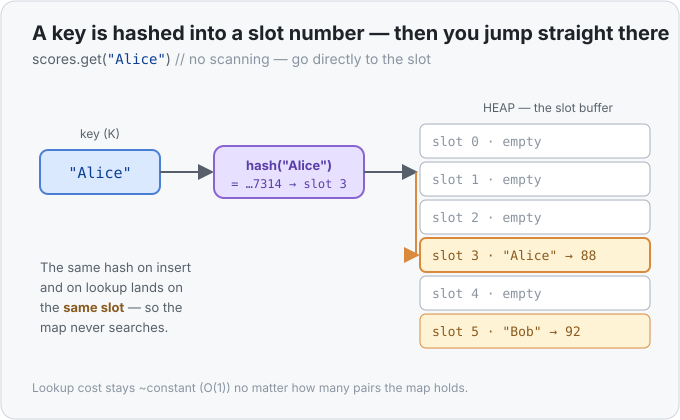

# Concept 18 · `HashMap<K, V>` (look up by key) — Under the hood

> Pair: [Use it](use-it.md) · **Under the hood** (you are here)
> Track: [From-Zero: Rust](../README.md)

## The problem a HashMap solves
Say you kept your name→score pairs in a plain [`Vec`](../17-vec/under-the-hood.md) of tuples.
To find Alice's score you'd have to walk the list — check pair 0, check pair 1, … — until you hit
"Alice". With 10 pairs that's fine; with 10 million it's 10 million comparisons on a bad day.
That's **O(n)** ([Big-O](../../../glossary/big-o-notation.md)): the more you store, the slower each
lookup. A `HashMap` exists to make that lookup *not get slower as the map grows*.

## The trick: hash the key into a slot number
A `HashMap` owns a buffer of **slots** on the heap (much like a Vec's buffer). The magic is a
**hash function**: feed it a key and it spits out a big scrambled number. Take that number *modulo*
the number of slots and you get a **slot index** — a specific place to look. So:

- **To insert `"Alice" → 88`:** hash `"Alice"` → say slot 3 → drop the pair into slot 3.
- **To look up `"Alice"`:** hash `"Alice"` again → same slot 3 → the pair is right there.

You go *straight* to the slot. You never scan the other slots. That's why a lookup costs about the
same whether the map holds 10 pairs or 10 million — it's **~O(1)**, constant time.



The load-bearing claim here is exactly that: the speed comes from *computing where to look* instead
of *searching for where it is*. Take the hashing away and you're back to scanning a list.

## Collisions: when two keys want the same slot
Different keys can hash to the *same* slot — `"Alice"` and `"Bob"` might both land on slot 3. That's
a **collision**, and it's unavoidable (there are more possible keys than slots). The map handles it
by letting a slot hold **more than one pair** and checking the few that share a slot. As long as
collisions are rare — which a good hash function and enough slots keep them — each lookup still only
compares a tiny handful of pairs, so it stays ~O(1) *on average*.

That "on average" is the fine print: in a pathological case where everything collides into one slot,
a lookup degrades toward O(n). For everyday use you treat it as instant, but that's why the guarantee
is *average* O(1), not *guaranteed* O(1).

## Why the order comes out scrambled
Pairs live wherever their **hash** sends them, not in the order you inserted them and not sorted. Hash
values are deliberately jumbled, so iterating the map visits slots in what looks like random order.
That's not a bug — it's the direct consequence of placing items by hash. If you need a predictable
order, reach for a [`BTreeMap`](../../../languages/rust.md#btreemap), which keeps keys **sorted** by
storing them in a tree instead of by hash (you trade the ~O(1) lookup for O(log n), the cost of
keeping order).

## Growing, just like a Vec
The map keeps collisions rare by not letting itself get too full. When the slots get crowded past a
threshold (its *load factor*), the map **allocates a bigger slot buffer and re-hashes every pair into
it** — the same "move to a bigger home" story as [Vec's regrow](../17-vec/under-the-hood.md), except
every pair also gets a fresh slot from the new size. So inserts are amortized ~O(1): usually instant,
occasionally the map pauses to grow and re-place everything.

## Ownership: the map owns its keys and its values
A `HashMap` **owns** every key and every value inside it, out on the heap:

- **Move the map, move the whole table.** `let b = a;` moves the map; `a` is
  [retired](../08-ownership-and-moves/use-it.md), `b` is the one owner.
- **Drop the map, drop it all.** When the owner goes out of scope, every key and every value is
  dropped (so a `HashMap<String, String>` frees each string's buffer), then the slot buffer itself is
  freed. One clean-up, no leaks.

This is also why `.get(&key)` takes the key by **reference** and returns `Some(&value)` — a
[borrow](../10-borrowing-with-ref/use-it.md) *into* the map. You're looking at the map's own value in
place; the map keeps owning it.

## What can even be a key?
Not every type can be a key. To be a `K`, a type must be **hashable** (you can feed it to the hash
function) and **comparable for equality** (to settle collisions — "is *this* the Alice I want?").
Numbers, `bool`, `String`/`&str`, and tuples of those all qualify. A type that can't answer "are we
equal?" — like a bare `f64`, where `NaN != NaN` breaks the rules — can't be a key. (In Rust terms
that's the `Eq + Hash` requirement; you'll meet those as *traits* in the next phase.)

## Predict the memory
```rust
use std::collections::HashMap;

fn main() {
    let mut counts = HashMap::new();
    counts.insert("sun", 1);
    counts.insert("sea", 1);
    *counts.entry("sun").or_insert(0) += 1;

    println!("sun  = {:?}", counts.get("sun"));
    println!("moon = {:?}", counts.get("moon"));
    println!("len  = {}", counts.len());
}
```

1. What does `counts.get("sun")` print — and why *`Some(...)`* rather than a bare number?
2. What does `counts.get("moon")` print, and what did that lookup have to do to decide?
3. What's `len`, and did the `entry("sun")` line add a new pair or change an existing one?

<details>
<summary>Show the answer</summary>

1. **`Some(2)`.** `"sun"` was inserted as `1`, then `entry("sun").or_insert(0) += 1` found the
   existing slot and bumped it to `2`. `.get` returns an [`Option`](../15-option/use-it.md) —
   `Some(&2)`, printed as `Some(2)` — because the key *might* have been missing; the type makes you
   acknowledge that.
2. **`None`.** `"moon"` was never inserted. The map hashed `"moon"` to a slot, looked there, found no
   matching key, and reported the miss as `None` — no scan of the whole map, and no crash.
3. **`len = 2`, and it changed an existing pair.** There are two keys, `"sun"` and `"sea"`. The
   `entry("sun")` call found `"sun"` already present, so `or_insert` did *not* add anything — it just
   handed back the existing slot to be incremented.
</details>

## Next
- **Concept 19 — Generics `<T>`**: you've now seen `<T>` on [`Option`](../15-option/use-it.md),
  [`Vec<T>`](../17-vec/use-it.md), and `HashMap<K, V>` — three different containers that work with
  *any* type you put in them. Next you write your *own* code with that `<T>` — one definition that
  works for every type — and see the surprising trick the compiler uses to make it cost nothing at
  runtime.
