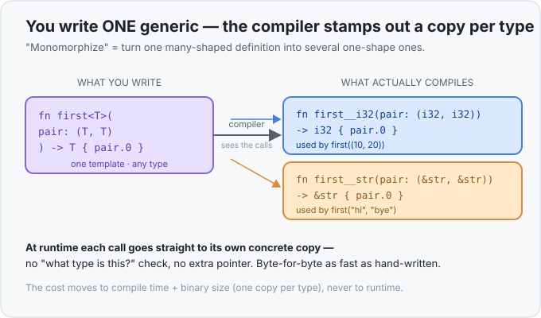

# Concept 19 · Generics `<T>` (one definition, any type) — Under the hood

> Pair: [Use it](use-it.md) · **Under the hood** (you are here)
> Track: [From-Zero: Rust](../README.md)

## The question: doesn't "any type" cost something at runtime?
In a lot of languages, "works for any type" is paid for at **runtime**: the value gets boxed up
behind a pointer, and every use goes through an extra lookup to figure out what it really is. That
costs memory and speed. So the natural worry is that Rust's `<T>` does the same — that `first<T>`
is slower than a hand-written `first_i32`.

It isn't. And the reason is a compile-time trick called **monomorphization**.

## Monomorphization: the compiler stamps out a copy per type
"Mono-morph" means *one shape*. When you write one generic definition but call it with several
concrete types, the compiler doesn't keep a single mysterious "any-type" version around. Instead,
for **each type you actually use**, it **stamps out a separate, concrete copy** of the code with `T`
replaced by that real type — as if you'd written each one by hand.

So this generic source:

```rust
fn first<T>(pair: (T, T)) -> T { pair.0 }

first((10, 20));        // used with i32
first(("hi", "bye"));   // used with &str
```

becomes, inside the compiled program, effectively **two real functions**:

```rust
fn first__i32(pair: (i32, i32)) -> i32 { pair.0 }
fn first__str(pair: (&str, &str)) -> &str { pair.0 }
```



Each call goes to its own fully-concrete function. There's no "what type is this really?" check at
runtime, no extra pointer hop — the `i32` version is *byte-for-byte* what you'd have written by hand.
That's what people mean when they call Rust generics **zero-cost**: you write it once, but you pay
exactly what the hand-copied versions would have cost, and not a cent more.

## The trade: you pay at compile time and in binary size, not at runtime
Nothing is truly free — the cost just moves somewhere you don't feel at runtime:

- **Compile time.** The compiler does more work, because it's generating and optimizing a fresh copy
  per type. A heavily-generic crate compiles slower.
- **Binary size.** Ten different types flowing through one generic function means up to ten concrete
  copies baked into the final program. This is called *code bloat*, and it's the price of the speed.

The deal Rust makes: spend more at build time and on disk, so that at **runtime** — the thing your
users feel — a generic is indistinguishable from hand-written type-specific code.

## Why a `T` needs a known size
Monomorphization is also *why* the compiler needs to know each `T`'s size. Look back at
[Concept 03](../03-types-have-sizes/under-the-hood.md): to lay a value out on the
[stack](../04-functions-and-the-call-stack/under-the-hood.md), the compiler must know how many bytes
it takes. A bare `T` has no fixed size — but by the time monomorphization runs, `T` has been replaced
by a *concrete* type (`i32` is 4 bytes, a `Point<i32>` is 8), so every stamped-out copy has real,
known sizes for all its values. The generic version is a **template**; only the concrete stamped
copies actually get laid out in memory.

(This is why, by default, a generic `T` must be a type with a known size at compile time. Rust writes
that requirement as `T: Sized`, and adds it silently for you — you'll only notice it the day you
deliberately want to opt out.)

## This is the same machinery behind `Vec<T>` and `Option<T>`
The `Vec<T>` and `Option<T>` you've been using all along are monomorphized exactly like your `first`.
A `Vec<i32>` and a `Vec<String>` are two *different concrete types* the compiler generated from one
generic `Vec` definition — each with its element size baked in, each with its own machine code. You
were relying on monomorphization before you had a name for it.

## Predict the memory
```rust
fn wrap<T>(value: T) -> (T,) {
    (value,)
}

fn main() {
    let a = wrap(7_i32);
    let b = wrap(7_u8);
    let c = wrap("hi");
    println!("{:?} {:?} {:?}", a, b, c);
}
```

1. How many concrete versions of `wrap` does the compiler actually generate for this program?
2. The `i32` version and the `u8` version do the *same thing*. Why are they still separate functions,
   and does calling either cost a runtime type-check?
3. Could the compiler compile the body of `wrap` *before* seeing how it's called — that is, before it
   knows what `T` is?

<details>
<summary>Show the answer</summary>

1. **Three.** One for `i32`, one for `u8`, one for `&str` — one concrete copy per distinct type the
   generic is actually used with. (Call `wrap(9_i32)` again and it reuses the `i32` copy — it's *per
   type*, not per call.)
2. **Because they're laid out differently** — an `i32` is 4 bytes, a `u8` is 1, so the two copies
   move different amounts of memory and can't share one body. And **no runtime check**: each copy is
   fully concrete, so calling it is just an ordinary function call, exactly like a hand-written
   `wrap_i32` would be.
3. **Not into final machine code.** The generic body is kept as a *template*; the compiler can
   check it for correctness, but it can't lay out `value` or finish compiling until monomorphization
   fills `T` with a concrete, known-size type. The real code for `wrap` only exists once a concrete
   type flows in.
</details>

## Next
- **Traits** — the missing half of generics. Right now a bare `T` can only be shuffled around,
  because Rust knows *nothing* about it. A **trait** is how you say "`T` is a type that can be
  compared / printed / added," which unlocks generics that actually *operate* on their values —
  turning `larger<T>` from a compile error into real, reusable code.
