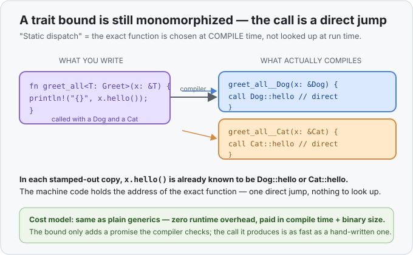

# Concept 20 · Traits (what a type can do) — Under the hood

> Pair: [Use it](use-it.md) · **Under the hood** (you are here)
> Track: [From-Zero: Rust](../README.md)

## The question: does a trait bound cost anything at runtime?
When you write `fn greet_all<T: Greet>(x: &T)` and call `x.hello()`, a fair worry is that Rust now has
to *figure out at runtime* which `hello()` to run — is it the `Dog` one or the `Cat` one? In many
languages that decision **is** made at runtime: the program carries a hidden table of methods around
with each object and looks up the right function every time you call one. That lookup costs a pointer
hop and blocks other speedups.

With a trait **bound**, Rust doesn't do that. The answer is decided entirely at **compile time**, and
it reuses machinery you already met: [monomorphization](../19-generics/under-the-hood.md).

## A bound is just "generics + a checked promise"
Recall the deal from Concept 19: a generic function is a *template*, and for each concrete type you
call it with, the compiler **stamps out a separate copy** with `T` replaced by that real type. A
trait bound rides along on exactly that. `greet_all::<Dog>` and `greet_all::<Cat>` are two different
stamped-out functions:

```rust
fn greet_all<T: Greet>(x: &T) {
    println!("{}", x.hello());
}

greet_all(&Dog);   // stamps greet_all__Dog
greet_all(&Cat);   // stamps greet_all__Cat
```

Inside `greet_all__Dog`, the type of `x` is *known* to be `&Dog`. So `x.hello()` isn't a mystery —
the compiler resolves it, right there, to `Dog::hello`, and bakes the address of that exact function
into the machine code. Same for the `Cat` copy. Each call becomes **one direct jump** to a known
function, identical to what you'd get from a hand-written `greet_dog`.



This is called **static dispatch** — *dispatch* meaning "pick which function to run," *static* meaning
"at compile time, once, for good." The bound's only job is to let the compiler **check** that every
type you pass really does have `hello()`; once checked, it compiles away entirely. The runtime cost of
a trait bound is **nothing** — same zero-cost bargain as plain generics, paid for in compile time and
binary size (one stamped copy per type), never at runtime.

## So what is the trait, physically?
Nothing, at runtime — and that's the point. A trait with bounds is a **compile-time-only** idea: a
label the compiler uses to verify your code and to route each generic call to the right concrete
function. By the time the program runs, there is no "trait" left in memory. `Dog` values are still
just plain `Dog` values — no hidden method table stapled on, no extra bytes. The trait existed only
to convince the compiler, and to tell it which direct call to emit.

That's the whole reason Rust splits the world this way: you get the *expressiveness* of "any type that
can greet" while paying the *runtime price* of hand-written, type-specific code.

## The one exception, coming next: choosing at run time
Static dispatch has a hard limit. Because every version is stamped per concrete type, a
`greet_all<T: Greet>` only ever handles **one** type per call — one copy is all-`Dog`, another is
all-`Cat`. What it *cannot* do is hold a **mixed** pile: a single list containing a `Dog` **and** a
`Cat` together, iterated with one loop that calls `.hello()` on each.

For that you have to give up compile-time resolution and let the program carry the method table and
look the function up *at run time* — the very thing static dispatch avoided. That's **dynamic
dispatch** with a **trait object** (`dyn Greet`), and it's [Concept 21](../21-trait-objects/use-it.md).
The trade it makes — a pointer hop and a lookup, in exchange for heterogeneous collections — is the
mirror image of the bargain here.

## Predict the memory
```rust
trait Greet {
    fn hello(&self) -> String;
}

struct Dog;
struct Cat;
impl Greet for Dog { fn hello(&self) -> String { String::from("Woof!") } }
impl Greet for Cat { fn hello(&self) -> String { String::from("Meow!") } }

fn greet_all<T: Greet>(x: &T) {
    println!("{}", x.hello());
}

fn main() {
    greet_all(&Dog);
    greet_all(&Cat);
    greet_all(&Dog);
}
```

1. How many concrete versions of `greet_all` does the compiler stamp out for this program?
2. When `greet_all__Dog` runs `x.hello()`, does the program look up *which* `hello()` to call at run
   time, or was that already decided?
3. Does a `Dog` value carry any extra bytes at runtime to remember that it implements `Greet`?

<details>
<summary>Show the answer</summary>
<ol>
<li><strong>Two</strong> — one for <code>Dog</code>, one for <code>Cat</code>. The third call <code>greet_all(&amp;Dog)</code> reuses the <code>Dog</code> copy; it's one copy <em>per type</em>, not per call (same rule as generics in Concept 19).</li>
<li><strong>Already decided, at compile time.</strong> Inside the <code>Dog</code> copy, <code>x</code> is known to be a <code>&amp;Dog</code>, so <code>x.hello()</code> was resolved to <code>Dog::hello</code> and baked in as a direct jump. Nothing is looked up while the program runs.</li>
<li><strong>No.</strong> With static dispatch the trait leaves no trace in the value — a <code>Dog</code> is just a <code>Dog</code>. The "it implements <code>Greet</code>" fact lived only at compile time and is gone by runtime. (This is exactly what changes with a <code>dyn</code> trait object next concept, where a method table <em>does</em> get carried around.)</li>
</ol>
</details>

## Next
- **Trait objects (`dyn Trait`)** — the escape hatch for when you need *many different types in one
  collection* behind a shared trait. You'll see the **fat pointer**: a trait object is two pointers —
  one to the data, one to a **vtable** (the method table) — and calling a method means following the
  vtable to the right function *at run time*. It's the direct, visible cost that static dispatch spent
  all of this lesson avoiding: [Concept 21](../21-trait-objects/use-it.md).
