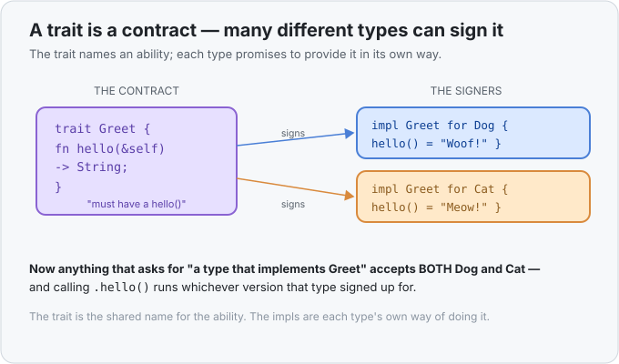

# Concept 20 · Traits (what a type can do) — Use it

> Pair: **Use it** (you are here) · [Under the hood](under-the-hood.md)
> Track: [From-Zero: Rust](../README.md) · Previous: [Concept 19](../19-generics/use-it.md)

## The idea
[Concept 19](../19-generics/use-it.md) ended on a wall. This function refused to compile:

```rust
fn larger<T>(a: T, b: T) -> T {
    if a > b { a } else { b }   // ❌ can't compare two T with `>`
}
```

Rust knew *nothing* about `T`, so it wouldn't let you compare, print, or add it — only shuffle it
around. A bare `T` is powerless.

A **trait** is how you hand `T` some power. A trait is a **named set of abilities** — a contract that
says "a type with this trait can do *these things*." You define the contract once, and then each type
**signs** it by providing those abilities. Two everyday examples you've already been using without
knowing: `>` works on numbers because numbers implement a trait called `PartialOrd` ("can be
ordered"); `{:?}` prints a value because it implements `Debug` ("can be shown for debugging"). Traits
have been under everything all along.



## Defining a trait
Write `trait`, a name, and the method **signatures** the contract requires — signatures with no body,
just a name and shape:

```rust
trait Greet {
    fn hello(&self) -> String;
}
```

Read it as: *"any type that is `Greet` must have a `hello(&self) -> String` method."* The `&self`
means the method is called on a value of that type (`thing.hello()`), borrowing it — exactly the
`&self` you met with [struct methods](../13-structs/use-it.md). The trait itself provides no code; it
only states what's required.

## Implementing a trait for a type
A type signs the contract with an `impl Trait for Type` block, filling in every required method:

```rust
struct Dog;
struct Cat;

impl Greet for Dog {
    fn hello(&self) -> String {
        String::from("Woof!")
    }
}

impl Greet for Cat {
    fn hello(&self) -> String {
        String::from("Meow!")
    }
}

fn main() {
    let d = Dog;
    let c = Cat;
    println!("{}", d.hello());   // Woof!
    println!("{}", c.hello());   // Meow!
}
```

`Dog` and `Cat` are unrelated types, but both now have a `hello()` — each in its own way. This is the
difference between a trait and a plain method: a plain `impl Dog` block gives *only* `Dog` a method;
an `impl Greet for Dog` block declares that `Dog` **fulfils the `Greet` contract**, so `Dog` can now
be used anywhere a `Greet` is asked for. That last part is the whole point, and it's next.

## Default methods (the trait can bring its own code)
A trait method *may* include a body — a **default** every implementer gets for free unless it
overrides it:

```rust
trait Greet {
    fn hello(&self) -> String;

    fn greet_twice(&self) -> String {
        format!("{} {}", self.hello(), self.hello())   // uses hello() — whatever the type filled in
    }
}
```

Now every `Greet` type automatically has `greet_twice()`, built on top of the `hello()` it provided.
`Dog.greet_twice()` gives `"Woof! Woof!"` without `Dog` writing a line for it. Defaults let a trait
ship shared behaviour while each type supplies only the piece that differs.

## Trait bounds: unlocking generics that *do* things
Here's what traits buy you back in generic-land. Remember `larger<T>` failing? You fix it by putting
a **trait bound** on `T` — a promise that `T` signs a particular contract:

```rust
fn larger<T: PartialOrd>(a: T, b: T) -> T {
    if a > b { a } else { b }   // ✅ now allowed
}
```

Read `<T: PartialOrd>` as *"for any type `T` that can be ordered."* That bound changes everything:
Rust now knows `T` has the `>` ability, so the comparison is allowed — but only for types that
actually implement `PartialOrd`. Call `larger(3, 9)` and it works; try it on a type with no ordering
and the compiler stops you at the call. The bound is a two-way promise: *inside* the function you may
use the ability; *at the call site* you may only pass types that have it.

This is the missing half of [Concept 19](../19-generics/use-it.md). Generics let you write logic once
for any type; **trait bounds** let that logic actually operate on the values, by naming exactly which
abilities the type must bring. `<T>` alone can shuffle; `<T: SomeTrait>` can *work*.

A generic can require several abilities at once with `+`: `fn show<T: PartialOrd + Debug>(...)` means
"`T` can be ordered **and** printed with `{:?}`."

## You've been standing on traits the whole time
Two callbacks make this click:

- **`>` and `<`** are the `PartialOrd` trait. `3 > 2` compiles because `i32` implements it.
- **`{:?}`** is the `Debug` trait. `println!("{:?}", v)` compiles because the type implements it —
  which is exactly what `#[derive(Debug)]` on your [structs](../13-structs/use-it.md) and
  [enums](../14-enums/use-it.md) was doing: *auto-signing the `Debug` contract for you.* `derive` is
  the compiler writing a routine `impl` on your behalf for the common traits (`Debug`, `Clone`,
  `PartialEq`, …), so you don't hand-write the obvious version.

So you already used traits every time you compared numbers or printed with `{:?}`. Concept 20 just
gives the mechanism its name and hands you the pen to write your own contracts.

## Exercises
1. **Define and implement a trait** — [starter](exercises/1-starter.rs) · [solution](exercises/1-solution.rs).
   Define `trait Greet { fn hello(&self) -> String; }`, then `impl` it for both `Dog` and `Cat` so
   each returns its own greeting. (Expect `Woof!` then `Meow!`.)
2. **Fix `larger` with a trait bound** — [starter](exercises/2-starter.rs) · [solution](exercises/2-solution.rs).
   Add the `T: PartialOrd` bound that makes the Concept 19 cliffhanger compile, and return the bigger
   of the two values. (Expect `9`, `2.5`, `pear`.)

Handbook: [`trait` — defining and implementing](../../languages/rust.md#trait).

## Next
- A trait bound like `<T: Greet>` is still [monomorphized](../19-generics/under-the-hood.md): the
  call `x.hello()` compiles down to a **direct jump** to the right function, chosen at compile time,
  with zero runtime cost. See *why* a bound adds no overhead — and where the one exception, choosing
  the function at **run time**, will come from: [Under the hood](under-the-hood.md).
