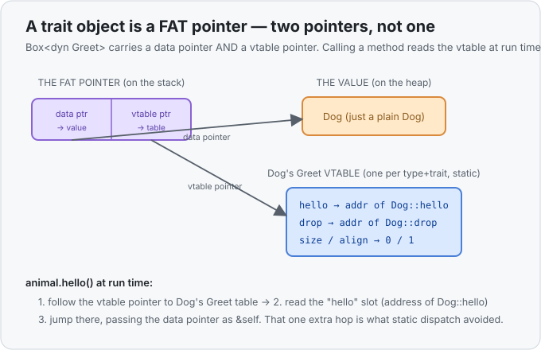

# Concept 21 · Trait objects (`dyn Trait`) — Under the hood

> Pair: [Use it](use-it.md) · **Under the hood** (you are here)
> Track: [From-Zero: Rust](../README.md)

## The question: how does `animal.hello()` find the right function?
With a trait **bound**, [Concept 20](../20-traits/under-the-hood.md) showed the compiler already knew
`x` was a `&Dog`, so `x.hello()` compiled to a **direct jump** to `Dog::hello` — decided once, at
compile time. But now look at the mixed pile:

```rust
for animal in &animals {   // animal: &Box<dyn Greet>
    println!("{}", animal.hello());
}
```

Inside this loop the compiler genuinely **does not know** whether `animal` is a `Dog` or a `Cat` — the
`Vec` mixes them, and which one comes next is only known as the program runs. So the direct jump is
impossible. The program has to **look up** the right `hello()` *while running*. To make that lookup
possible, a trait object carries extra machinery — and that machinery is the whole story.

## A trait object is a **fat pointer** (two pointers, not one)
A normal `&Dog` is a single pointer: the address of a `Dog`. A `&dyn Greet` (or the pointer inside a
`Box<dyn Greet>`) is **two** pointers glued together — a **fat pointer**:

1. a **data pointer** → the actual value (the `Dog` on the heap), and
2. a **vtable pointer** → a small static table of function addresses for *this type's* `Greet` impl.

**vtable** = "virtual method table": a fixed little array the compiler builds **once per (type, trait)
pair**, listing the address of each trait method for that type. `Dog`'s `Greet` vtable holds the
address of `Dog::hello`; `Cat`'s holds `Cat::hello`. The values on the heap stay plain — a `Dog` is
still just a `Dog`, no extra bytes stapled on. The "which type am I" knowledge lives in the **fat
pointer**, in that second half.



## Watch one call happen
`animal.hello()` on a trait object is **not** one instruction — it's a two-step hop:

| step | what the program does |
|---|---|
| 1 | follow the **vtable pointer** to this value's method table |
| 2 | read the slot for `hello` → gives the address of, say, `Dog::hello` |
| 3 | **jump** to that address, passing the **data pointer** as `&self` |

That is **dynamic dispatch**: *dispatch* = "pick which function," *dynamic* = "at run time, per call,
by reading a table." Compare the two worlds directly:

- **Static dispatch (a bound):** the function address is baked into the code. Zero hops. Free.
- **Dynamic dispatch (`dyn`):** the address is fetched from the vtable first. One extra pointer hop
  per call, and the compiler can't inline across it. Small — but not nothing.

That single hop is precisely the cost [Concept 20](../20-traits/under-the-hood.md) spent the whole
lesson *avoiding*. You pay it here on purpose, and you get something a bound could never give: the
mixed `Vec`.

## The trade, stated plainly
| | Static dispatch (`<T: Greet>`) | Dynamic dispatch (`dyn Greet`) |
|---|---|---|
| Method address known | at compile time | fetched from a vtable at run time |
| Cost per call | none (often inlined) | one pointer hop, no inlining |
| Binary size | one stamped copy **per type** | **one** shared function, no stamping |
| Can hold a mixed collection | no | **yes** |
| Value carries a vtable pointer | no | yes (in the fat pointer) |

Notice the size column flips: monomorphization makes *many* copies to stay fast; `dyn` keeps *one*
copy and pays a hop instead. Neither is "better" — they're opposite ends of the same trade, and Rust
lets you pick per situation.

## Why the pointer is mandatory
Now the earlier snag makes sense. A bare `dyn Greet` has **no fixed size** — behind it could be a
1-byte `Dog` or a 200-byte struct, unknown until run time — and Rust must know every value's size to
lay it out. Putting it behind a pointer (`Box<dyn Greet>`, `&dyn Greet`) fixes the size at "one fat
pointer," which *is* known. That's also why a `Vec<Box<dyn Greet>>` works: every slot is one uniform
fat pointer, no matter how big or small the real value behind it is.

## Predict the memory
```rust
trait Greet {
    fn hello(&self) -> String;
}

struct Dog;
struct Cat;
impl Greet for Dog { fn hello(&self) -> String { String::from("Woof!") } }
impl Greet for Cat { fn hello(&self) -> String { String::from("Meow!") } }

fn main() {
    let animals: Vec<Box<dyn Greet>> = vec![Box::new(Dog), Box::new(Cat)];
    for animal in &animals {
        println!("{}", animal.hello());
    }
}
```

1. Each element of `animals` is a `Box<dyn Greet>`. How many pointers does one such element carry, and
   what does each point at?
2. When the loop reaches the `Cat`, how does the program know to run `Cat::hello` and not `Dog::hello`?
3. How many `Greet` vtables exist for this program, and does the number of *animals* change that?

<details>
<summary>Show the answer</summary>
<ol>
<li><strong>Two</strong> — it's a fat pointer. One <strong>data pointer</strong> to the boxed value on the heap (the <code>Dog</code> or <code>Cat</code>), and one <strong>vtable pointer</strong> to that type's <code>Greet</code> method table.</li>
<li>It <strong>follows the <code>Cat</code>'s vtable pointer</strong> to the <code>Cat</code> <code>Greet</code> vtable, reads the <code>hello</code> slot (the address of <code>Cat::hello</code>), and jumps there — passing the data pointer as <code>&amp;self</code>. The choice is made <em>at run time</em> by reading the table, not baked in at compile time.</li>
<li><strong>Two</strong> vtables — one for <code>Dog</code>, one for <code>Cat</code>. A vtable is built <strong>per (type, trait) pair</strong>, not per value, so a <code>Vec</code> of a thousand dogs and cats still shares just those two tables; each element only <em>points at</em> the right one.</li>
</ol>
</details>

## Next
- **Lifetimes (`<'a>`)** and the rest of the borrow story return once we've built more with these
  pieces; the immediate roadmap keeps filling out the everyday toolbox — more collections, then error
  handling with `Result` and `?`. Check the [track roadmap](../README.md) for the current "up next".
