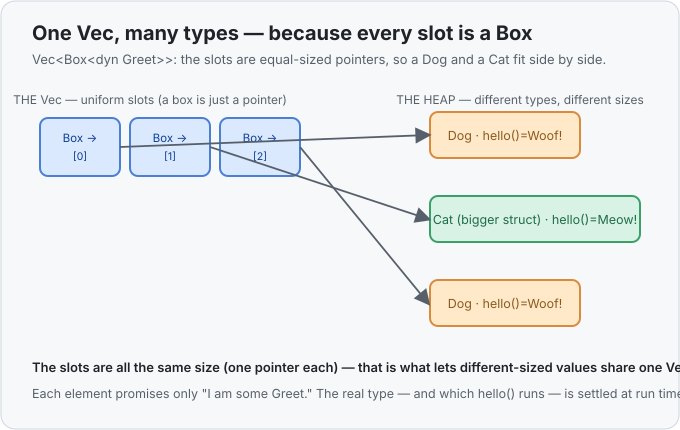

# Concept 21 · Trait objects (`dyn Trait`) — Use it

> Pair: **Use it** (you are here) · [Under the hood](under-the-hood.md)
> Track: [From-Zero: Rust](../README.md) · Previous: [Concept 20](../20-traits/use-it.md)

## The wall we hit last time
[Concept 20](../20-traits/use-it.md) gave every type the same ability through a trait — `Dog` and
`Cat` both learned `hello()`. But a trait **bound** (`fn greet_all<T: Greet>`) has a hard limit: each
stamped-out copy handles exactly **one** type. One copy is all-`Dog`, another is all-`Cat`. What you
*cannot* write is the obvious thing you'd actually want:

```rust
let animals = vec![Dog, Cat, Dog];   // ❌ a Vec holds ONE type — Dog and Cat aren't the same type
```

A `Vec<T>` is a row of same-sized, same-typed slots ([Concept 17](../17-vec/use-it.md)). `Dog` and
`Cat` are different types with possibly different sizes, so they can't share one `Vec`. Yet "a mixed
pile of things that can all `hello()`" is a completely reasonable idea. We need a way to say *"any
type, as long as it's a `Greet`"* — and store several **different** ones together.

## The tool: `dyn Trait`, a trait object
`dyn Greet` means **"some type that implements `Greet` — decided at run time, not compile time."** It
is a genuine value you can store, but with a catch: because the real type could be anything, its size
isn't known up front. So a trait object always lives **behind a pointer**. The everyday one is
`Box<dyn Greet>` — a `Box` ([Concept from the handbook](../../languages/rust.md#box)) puts the value on
the heap and hands you a fixed-size handle to it.

```rust
let animals: Vec<Box<dyn Greet>> = vec![Box::new(Dog), Box::new(Cat), Box::new(Dog)];

for animal in &animals {
    println!("{}", animal.hello());   // Woof!  Meow!  Woof!
}
```

Read `Vec<Box<dyn Greet>>` right to left: *a vector of boxes, each holding some `Greet`.* Every slot
is the **same size** now — a box is just a pointer — so the `Dog` and the `Cat` sit happily side by
side. The loop calls `.hello()` on each, and each answers **as its own type**: the `Dog` woofs, the
`Cat` meows. One loop, many types. That is the thing a trait bound could never do.



## `dyn` vs a bound — the same trait, two jobs
You now have two ways to spend a trait, and they answer different questions:

| | Trait **bound** `<T: Greet>` | Trait **object** `dyn Greet` |
|---|---|---|
| How many types per use | **one** per stamped copy | **many**, mixed together |
| Which method to run is decided | at **compile time** | at **run time** |
| Store a mixed `Vec` of them? | no | **yes** — `Vec<Box<dyn Greet>>` |
| Runtime cost | none | a small lookup per call |

The rule of thumb: reach for a **bound** by default (it's free), and reach for `dyn` the moment you
need a **heterogeneous collection** — a list, a plugin registry, a set of UI widgets — where the exact
types aren't known until the program runs.

## It's not just for printing — the method can compute
The trait method can return a real value, not just a string. A classic use is a pile of shapes that
each know their own area:

```rust
trait Shape {
    fn area(&self) -> f64;
}

fn total_area(shapes: &[Box<dyn Shape>]) -> f64 {
    let mut sum = 0.0;
    for shape in shapes {
        sum += shape.area();   // Circle::area on circles, Rectangle::area on rectangles
    }
    sum
}
```

`total_area` doesn't know or care what shapes it's handed — only that each one *is a `Shape`* and so
can answer `.area()`. Add a `Triangle` type tomorrow, `impl Shape for Triangle`, and this function
works on it **unchanged**. That open-endedness is the payoff: code that operates on a trait, not on a
fixed list of types.

## Two small snags you'll meet
- **You need the pointer.** `Vec<dyn Greet>` alone won't compile — the compiler says the size isn't
  known (`the size for values of type dyn Greet cannot be known at compile time`). Wrap it:
  `Box<dyn Greet>` (owned, on the heap) or `&dyn Greet` (a borrowed one you don't own). The `Box` form
  is what you store in a collection.
- **`Box::new` on each element.** Every value going into the `Vec` is individually boxed —
  `Box::new(Dog)`, `Box::new(Cat)` — because each is moved to the heap so the row can hold uniform
  pointer-sized slots.

## Exercises
1. **One loop over a mixed pile** — [starter](exercises/1-starter.rs) · [solution](exercises/1-solution.rs).
   Build a `Vec<Box<dyn Greet>>` holding a `Dog`, a `Cat`, and a `Dog`, then greet all three with a
   single loop. (Expect `Woof!` / `Meow!` / `Woof!`.)
2. **A function over any mix of shapes** — [starter](exercises/2-starter.rs) · [solution](exercises/2-solution.rs).
   Finish `total_area(shapes: &[Box<dyn Shape>]) -> f64` so it sums the area of a `Circle` and a
   `Rectangle` in one slice. (Expect `24.57`.)

Handbook: [`dyn Trait` — trait objects](../../languages/rust.md#dyn) · [`Box<T>`](../../languages/rust.md#box).

## Next
- That "decided at run time" is doing real work. When `animal.hello()` runs, how does the program
  *find* the right `hello()` if it only learns the true type at run time? The answer is a **fat
  pointer**: a trait object is secretly **two** pointers — one to the data, one to a **vtable** (a
  little table of function addresses). Following that table is the exact cost static dispatch spent
  Concept 20 avoiding. See it in memory: [Under the hood](under-the-hood.md).
