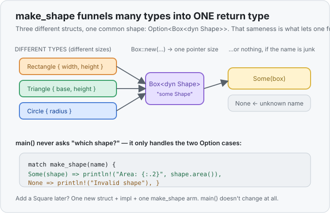

# Interlude 21a · Building with trait objects (the Area Calculator) — Use it

> Interlude: a **single lesson**. It doesn't teach a new concept — it *puts together*
> ones you've already met ([structs](../13-structs/use-it.md) · [traits](../20-traits/use-it.md) ·
> [trait objects](../21-trait-objects/use-it.md) · [`Option`](../15-option/use-it.md) ·
> [`match`](../16-match/use-it.md)) on one real task.
> Track: [From-Zero: Rust](../README.md)

## Why this interlude exists
You hit an "Area Calculator" exercise and a solution using `trait`, `Box<dyn Shape>`, and
`Option<Box<dyn Shape>>` — and it felt impossible. That reaction was **correct**: that one file
secretly stacks *five* concepts at once, plus reading input. Nobody reads that cold.

So we're going to build it the honest way — start with the version you can already read top to bottom,
then add each "coat" only when we feel why we want it. Every step compiles and gives the same answer.
The heavy version isn't smarter; it's the simple version dressed for a job with many shapes.

Throughout, take this helper as **given** — it reads one number from input; we're not studying it here:

```rust
fn read_number() -> f64 { /* reads a line, trims it, parses an f64 */ }
```

## Step 0 — the whole thing, in plain words
Strip away all syntax and the program is one sentence: **read a shape name, read its measurements,
print the area.** Hold onto that. Everything below is just that sentence, written to be easy to grow.

## Step 1 — the version you already own
No structs, no traits. Just [`match`](../16-match/use-it.md) on the name, doing the arithmetic inline:

```rust
let area = match name.trim() {
    "rectangle" => read_number() * read_number(),
    "triangle"  => read_number() * read_number() / 2.0,
    "circle"    => { let r = read_number(); std::f64::consts::PI * r * r }
    _ => { println!("Invalid shape"); return; }
};
println!("Area: {:.2}", area);
```

This is **completely fine**. It's the real logic, and for three shapes it's arguably the *best*
answer. If someone handed you only this, you'd understand every line. Keep that feeling — the next
steps don't make it "more correct," they make it **easier to extend**.

## Step 2 — give each shape a box for its own data (structs)
Right now a shape's measurements are loose numbers. A [struct](../13-structs/use-it.md) bundles the
measurements that belong together under a name:

```rust
struct Rectangle { width: f64, height: f64 }
struct Triangle  { base: f64,  height: f64 }
struct Circle    { radius: f64 }
```

Now "a rectangle" is one thing you can hold, pass around, and store — not two stray floats you have to
keep side by side. That's the only idea in this step: **data that belongs together travels together.**

## Step 3 — give them a shared ability (a trait)
Every shape can do one same thing: *tell you its area*. A [trait](../20-traits/use-it.md) is exactly
that — a named shared ability. Define the contract once, then each struct fills it in its own way:

```rust
trait Shape {
    fn area(&self) -> f64;              // the contract: "a Shape can give an area"
}

impl Shape for Rectangle { fn area(&self) -> f64 { self.width * self.height } }
impl Shape for Triangle  { fn area(&self) -> f64 { self.base * self.height / 2.0 } }
impl Shape for Circle    { fn area(&self) -> f64 { std::f64::consts::PI * self.radius * self.radius } }
```

Notice the formulas didn't change — they just **moved**, out of the big `match` and next to the data
they act on. Each shape now owns its own area rule. `rectangle.area()` asks the rectangle; the answer
lives with the thing.

## Step 4 — the itch: hold *any* shape in one place
Here's the moment that earns everything. You want a function that reads a name and hands back **a
shape** — but which type? A `Rectangle`? A `Circle`? You don't know until the program runs. A function
can only name **one** return type, and `Rectangle` and `Circle` are different types.

This is the exact wall from [Concept 21](../21-trait-objects/use-it.md), and the exact tool:
**`Box<dyn Shape>`** — "some value that is a `Shape`, decided at run time." Wrap it in
[`Option`](../15-option/use-it.md) to allow "the name was junk → nothing":

```rust
fn make_shape(name: &str) -> Option<Box<dyn Shape>> {
    match name {
        "rectangle" => Some(Box::new(Rectangle { width: read_number(), height: read_number() })),
        "triangle"  => Some(Box::new(Triangle  { base:  read_number(), height: read_number() })),
        "circle"    => Some(Box::new(Circle    { radius: read_number() })),
        _ => None,
    }
}
```

Read the return type right to left: *maybe (`Option`) a boxed (`Box`) shape (`dyn Shape`).* Every arm
returns the **same** type — a `Box<dyn Shape>` — even though a rectangle and a circle sit differently
in memory, because a box is just a pointer of fixed size. That sameness is what lets one function
return any of them.



## Step 5 — land it
`main` now doesn't care which shape it got. It only knows: *maybe a shape; if so, it can `.area()`.*

```rust
fn main() {
    let mut name = String::new();
    io::stdin().read_line(&mut name).unwrap();

    match make_shape(name.trim()) {
        Some(shape) => println!("Area: {:.2}", shape.area()),
        None => println!("Invalid shape"),
    }
}
```

That's the whole "scary" program — but now each line is a step you added on purpose. The
[full file](exercises/1-solution.rs) is in the exercises.

## Was the coat worth it? Only sometimes
Be honest about the trade. Count what it takes to **add a `Square`**:

| | Step 1 (`match`) | Step 4 (`dyn`) |
|---|---|---|
| lines to change | one new `match` arm | one struct + one `impl` + one `make_shape` arm |
| logic stays with the shape? | no — piled in `main` | yes — each shape owns its `area` |
| shapes in a mixed list / passed around? | awkward | natural (`Vec<Box<dyn Shape>>`) |

For **three shapes and one calculation**, Step 1 wins — less to read. The `dyn` design starts paying
off when there are *many* shapes, when each carries *more* behaviour than one formula, or when you
need to **store a mix of them together**. That's the real lesson: reach for the trait-object coat when
the problem is big enough to need it — not by default.

## Exercises
1. **Add a shape to the pile** — [starter](exercises/1-starter.rs) · [solution](exercises/1-solution.rs).
   A working `trait Shape` with `Rectangle` and `Circle` is given, mixed in a `Vec<Box<dyn Shape>>`.
   Add a `Triangle` and drop one in. (Expect `15.00`, `12.57`, `6.00`.)
2. **The shape factory** — [starter](exercises/2-starter.rs) · [solution](exercises/2-solution.rs).
   Write `make_shape(name: &str) -> Option<Box<dyn Shape>>` — the exact piece that froze you — returning
   `Some(Box::new(...))` for known names and `None` otherwise. (Expect `rectangle: 15.00`,
   `circle: 12.57`, `hexagon: unknown shape`.)

## Next
- Back to the roadmap: **Concept 23 — error handling with `Result` and `?`.** It's the sibling of the
  `Option` you used here: where `Option` says *present or missing*, `Result` says *worked, or failed
  with a reason* — which is exactly what `read_number`'s hidden `.parse()` was quietly deciding all
  along. See the [track roadmap](../README.md).
