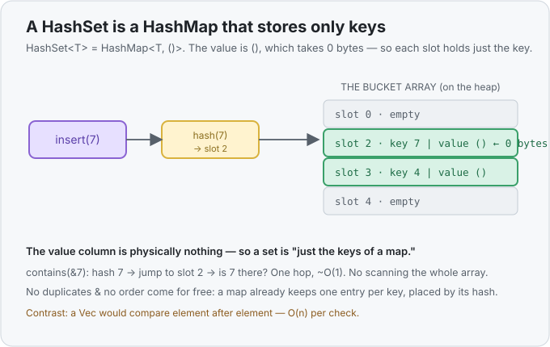

# Concept 22 · `HashSet<T>` (membership, no duplicates) — Under the hood

> Pair: [Use it](use-it.md) · **Under the hood** (you are here)
> Track: [From-Zero: Rust](../README.md)

## The question: what *is* a set, physically?
A `HashSet` gives ~O(1) membership and forbids duplicates — the exact two things a
[`HashMap`](../18-hashmap/under-the-hood.md) already does for its **keys**. That's not a coincidence.
A `HashSet<T>` is not a new data structure at all. In Rust's standard library it is *literally* a thin
wrapper around a map:

```rust
HashSet<T>   is really   HashMap<T, ()>
```

The values are the **unit type `()`** — the "nothing" value. So a set is a map where every key points
at nothing. All the set's behaviour falls straight out of that.

## `()` — a value that takes **zero bytes**
`()` (say "unit") is Rust's empty value: it carries no information, and it occupies **0 bytes** of
memory. So `HashMap<T, ()>` stores the full key `T` in each occupied slot and a value of size **zero**
beside it — meaning, in practice, it stores **only the key**. There's no wasted space for a value you
never wanted; the "value" column is physically nothing.



## Everything reuses the map's machinery
Because the storage *is* a `HashMap`, every set operation is a map operation you already understand
from [Concept 18](../18-hashmap/under-the-hood.md):

| set operation | what actually happens on the underlying map |
|---|---|
| `set.insert(x)` | hash `x` → jump to its slot → if the slot is empty, store `x → ()` and return `true`; if `x` is already there, change nothing and return `false` |
| `set.contains(&x)` | hash `x` → jump to its slot → is `x` sitting there? |
| no duplicates | a map already keeps **one** entry per key — a set inherits that for free |
| ~O(1) speed | the same **hash-to-slot jump**, not a scan |

That last row is the whole payoff, and it's borrowed wholesale. The map doesn't *search* for a key —
it hashes the key into a slot number and looks **only** there ([the trick from Concept 18](../18-hashmap/under-the-hood.md)). A set checking membership does the identical jump. Take the
hashing away and both collapse back to scanning a list, O(n) per check.

## Why a set has no order
Same reason a `HashMap` has no order: entries live **wherever their hash sends them**, not where you
put them and not sorted. Printing a `HashSet` can list values in any order, and that order may even
change between runs. If you need the values sorted, that's a **`BTreeSet`** (the set built on
[`BTreeMap`](../../languages/rust.md#btreemap) instead), which trades the O(1) jump for kept-in-order
storage — exactly the map-vs-map trade one level down.

## Predict the memory
```rust
use std::collections::HashSet;

fn main() {
    let mut seen: HashSet<i32> = HashSet::new();
    let a = seen.insert(7);
    let b = seen.insert(7);
    let c = seen.contains(&7);
    println!("{} {} {}", a, b, c);
}
```

1. What are `a`, `b`, and `c`?
2. Under the hood this is a `HashMap<i32, ?>`. What type are the *values*, and how many bytes does one
   value occupy?
3. To answer `contains(&7)`, does the set walk through its stored values comparing each one, or do
   something faster? What would a `Vec<i32>`'s `.contains(&7)` do instead?

<details>
<summary>Show the answer</summary>

1. `a = true` (7 was new), `b = false` (7 was already there — insert changed nothing), `c = true`
   (7 is a member). Prints `true false true`.
2. The values are the **unit type `()`**, and each takes **0 bytes**. A `HashSet<i32>` is a
   `HashMap<i32, ()>`, so only the keys really occupy space.
3. It **hashes `7` to its slot and checks only that slot** — ~O(1), no walking. A `Vec<i32>` has no
   hashing, so `.contains(&7)` **scans** from the front comparing every element until it finds 7 or
   reaches the end — O(n). That gap is the entire reason to pick a set for membership.
</details>

## Next
- The toolbox keeps filling out from here — more collections, then **error handling** with `Result`
  and the `?` operator, where a function can return "it worked → here's the value" or "it failed →
  here's why," much like [`Option`](../15-option/use-it.md) but carrying a reason. See the
  [track roadmap](../README.md) for the current "up next".
