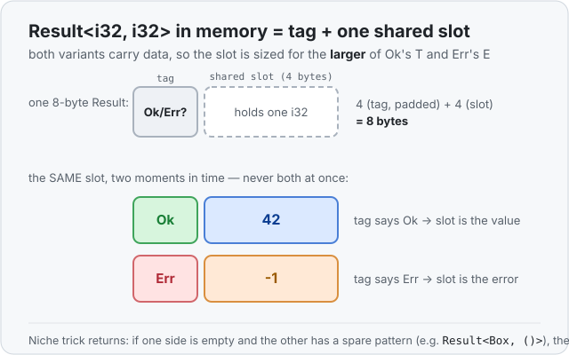

# Concept 23 · `Result` (when things can fail) — Under the hood

> Pair: [Use it](use-it.md) · **Under the hood** (you are here)
> Track: [From-Zero: Rust](../README.md)

## It's the enum picture, again
`Result` is not special in memory — it's a plain [enum](../14-enums/under-the-hood.md), so it
has the shape you already know: a **tag** (which variant?) plus **one shared slot** sized for
the biggest variant. `Option` had it easy — one of its variants (`None`) was empty, so the
slot only had to fit `Some`'s payload. `Result` is different in one honest way:

- `Ok(T)` needs room for a `T`.
- `Err(E)` needs room for an `E`.

**Both** variants carry data now, so the shared slot has to be big enough for **whichever of
`T` and `E` is larger**. The tag then says which one is actually living in that slot right now.



Watch the arithmetic on a `Result<i32, i32>`:

```rust
use std::mem::size_of;
println!("{}", size_of::<i32>());                 // 4
println!("{}", size_of::<Result<i32, i32>>());    // 8
```

Both variants hold a 4-byte `i32`, so the slot is 4 bytes. The tag needs only 1 byte to tell
`Ok` from `Err`, but an `i32` must sit on a 4-byte boundary, so the tag is **padded** out to 4
before the number — 4 + 4 = 8. The slot is *shared*: a value is only ever `Ok` **or** `Err`,
never both, so it would be wasteful to reserve room for both at once. Same "tag + slot"
arithmetic as any enum.

The slot is sized for the **larger** side even when the two differ:

```rust
println!("{}", size_of::<Result<i32, u8>>());     // 8  — slot sized for the i32, not the u8
```

`u8` is only 1 byte, but the slot must still fit the 4-byte `i32`, so the `Result` is the same
size whether the live value is the big one or the small one.

## The surprise from `Option` comes back: sometimes the tag is free
Remember the [niche trick](../15-option/under-the-hood.md): if a type has a **spare,
impossible bit-pattern**, Rust hides the tag inside it instead of adding a separate byte. A
pointer can never legally be `0`, so `Option<Box<T>>` stores `None` as the all-zero address and
costs zero extra bytes.

The same thing happens to `Result` whenever it can. Take a success type with a niche and an
error type that carries **nothing**:

```rust
use std::mem::size_of;
println!("{}", size_of::<Box<i32>>());                 // 8
println!("{}", size_of::<Result<Box<i32>, ()>>());     // 8  ← same!
```

`()` is the "empty type" — it holds no data at all, like `None` did. So `Err(())` needs no
storage; only `Ok(Box<i32>)` carries anything. Rust uses the pointer's impossible `0` as the
tag: any non-zero address means `Ok`, and `0` means `Err`. The `Result` is the same 8 bytes as
the bare `Box` — "this pointer, or a failure" for free.

## Why `Result<i32, i32>` *can't* do that
It's worth seeing why the free trick only works sometimes — the reason is exactly the one from
`Option`. The niche worked above because `()` was empty *and* the `Box` had a spare pattern.
But `Result<i32, i32>`? **Every** 32-bit pattern is a valid `i32` on both sides — there's no
impossible value lying around to steal for the tag. So the compiler has no choice but to store
a **separate tag** (padded to keep the number aligned), which is why it's 8 bytes instead of 4.

The rule of thumb is the same as `Option`'s, just with two sides to check: **if one variant is
empty and the other has a spare pattern, the tag can hide for free; if both sides use every
value they can, `Result` pays for a tag.**

## Ownership carries over, unchanged
`Result` is an enum, so [Phase 2](../README.md)'s rules apply to whatever `Ok` and `Err` carry
— nothing new to learn:

- **`Copy` when both sides are `Copy`.** `Result<i32, u8>` is `Copy` (a tag plus small
  numbers). `Result<String, String>` is a **move type**
  ([Concept 08](../08-ownership-and-moves/use-it.md)), because a `String` owns the heap — `let
  b = a;` moves it and retires `a`.
- **Move moves the live payload.** Moving a `Result<String, String>` hands whichever `String`
  is currently inside (the `Ok` one or the `Err` one) to the new owner; no copy of the heap
  buffer.
- **Drop frees the live payload.** When a `Result` goes out of scope, only the variant that's
  actually present gets dropped — an `Ok(String)` frees its buffer, an `Err(String)` frees
  *its* buffer, and a `Result<i32, i32>` has nothing on the heap to free at all.

A `Result` is just a labeled box around one of two values you already understand.

## Predict the memory
```rust
use std::mem::size_of;

fn main() {
    println!("{}", size_of::<Result<i32, i32>>());    // ?
    println!("{}", size_of::<Result<u8, ()>>());      // ?
    println!("{}", size_of::<Result<bool, ()>>());    // ?
}
```

1. Both sides of `Result<i32, i32>` are 4-byte numbers that use every pattern. How big, and
   why?
2. A `u8` is a 1-byte number that uses **all** 256 patterns; `Err(())` carries nothing. Is
   there a spare value to hide the tag in, or must Rust add a tag byte?
3. A `bool` is 1 byte but only ever holds `true` or `false` — 2 of its 256 patterns. Does
   `Result<bool, ()>` need an extra tag byte, or is there a spare pattern to reuse for `Err`?

<details>
<summary>Show the answer</summary>

1. **`Result<i32, i32>` is 8 bytes.** The shared slot fits one 4-byte `i32`, and since every
   32-bit pattern is a real `i32` there's no niche — so a separate tag is needed, padded out to
   4 bytes to keep the number aligned. 4 (tag) + 4 (slot) = 8.
2. **`Result<u8, ()>` is 2 bytes.** `Err(())` needs no storage, so only the `u8` takes room —
   but a `u8` uses all 256 patterns, so there's no spare value to mean `Err`. Rust adds a
   1-byte tag: 1 (number) + 1 (tag) = 2.
3. **`Result<bool, ()>` is 1 byte.** A `bool` uses only 2 of its 256 patterns, so 254 are
   spare. Rust grabs one of them to mean `Err(())` — niche optimization, exactly like
   `Option<bool>`. No separate tag, so it stays a single byte. Same idea as `Result<Box, ()>`
   being free: whenever one variant is empty and the other has a hole, the tag hides in the
   hole.
</details>

## Next
- **[Concept 24 — the `?` operator](../24-question-mark/use-it.md):** you can now open a
  `Result` with `match`, but chaining several fallible steps that way turns into a staircase of
  nested matches. `?` collapses each of those into a single character — and under the hood it's
  just a `match` that returns early. Next lesson.
