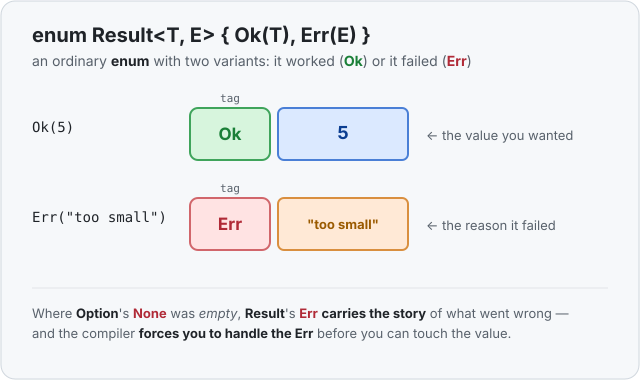

# Concept 23 · `Result` (when things can fail) — Use it

> Pair: **Use it** (you are here) · [Under the hood](under-the-hood.md)
> Track: [From-Zero: Rust](../README.md) · Previous: [Concept 22](../22-hashset/use-it.md)

## The idea
Last phase you met [`Option`](../15-option/use-it.md): a value that might be **missing**.
`Some(value)` or `None`. That's perfect for "the list had no even number" — but it can't
tell you *why* nothing came back. `None` is silent.

Lots of operations don't just come back empty — they **fail, for a reason**. You try to turn
the text `"abc"` into a number and it isn't one. You open a file that doesn't exist. You
divide by zero. In each case there's a value you wanted *and* a story about what went wrong,
and the caller usually needs that story.

Most languages tell that story with **exceptions**: something deep inside "throws," and the
error flies invisibly up through your code until someone catches it — or nobody does and the
program dies. Like null, the danger is that it's *invisible*: nothing in a function's
signature warns you it can explode, so you forget to handle it.

**Rust has no exceptions for this.** A function that can fail says so *in its return type*,
using another plain [enum](../14-enums/use-it.md) — the sibling of `Option`:

```rust
enum Result<T, E> {
    Ok(T),    // success: here is the value you wanted
    Err(E),   // failure: here is what went wrong
}
```

Read it as: "a `Result` is **either** `Ok(a value)` **or** `Err(an error)`." Where `Option`
had an *empty* `None`, `Result` has an `Err` that **carries the reason**. That's the whole
difference: `Option` answers *"is it there?"*, `Result` answers *"did it work, and if not,
what happened?"*



## Two placeholders: `<T, E>`
`Option` had one `<T>` — the type of the value inside. `Result` has **two**: `T` is the type
of the success value, `E` is the type of the error. A `Result<i32, String>` is "an `i32` if
it worked, or a `String` message if it didn't." You'll meet this `<T, E>` machinery properly
under *generics* ([Concept 19](../19-generics/use-it.md)); for now just read the two slots as
"success type, error type." `Ok` and `Err` come built in — you never define `Result`
yourself.

## Creating one
```rust
let good: Result<i32, String> = Ok(5);
let bad:  Result<i32, String> = Err(String::from("too small"));
```

`Ok(5)` wraps the success value; `Err(...)` wraps the reason it failed. Both have the **same
type**, `Result<i32, String>` — which is exactly why a function can promise to return one or
the other and the caller has to be ready for both.

## You can't use the value without opening it
Just like `Option`, the safety is that you **can't touch the success value until you've said
what happens on failure**. The `5` is *inside* the `Ok`, and the compiler won't let you reach
in:

```rust
let good = Ok(5);
let bigger = good + 1;   // ❌ compile error: Result<i32, _> is not a number
```

There is no way to "accidentally use the value from a failed operation." The `Err` case can't
be skipped. Compare that to exceptions, where you can simply *forget* the failure exists until
it takes the program down at runtime.

So how do you open it? The same way you open any enum: by asking which variant it is.

### Opening it with `match`
[`match`](../16-match/use-it.md) handles both variants, and the compiler checks you covered
both:

```rust
fn describe(outcome: Result<i32, String>) {
    match outcome {
        Ok(value) => println!("worked: {value}"),
        Err(reason) => println!("failed: {reason}"),
    }
}
```

If it's `Ok`, the value is bound to `value`. If it's `Err`, the reason is bound to `reason`.
You **cannot** forget the `Err` case — leave it out and the program won't compile.

### Opening it with `if let`
When you only care about the success case, [`if let`](../../../languages/rust.md#if-let) is
the short form:

```rust
if let Ok(value) = "42".parse::<i32>() {
    println!("parsed {value}");   // runs only when parsing SUCCEEDED
}
```

Read it as: "*if* the parse came back `Ok`, pull the number out into `value` and run the
block." An `Err` skips it. Add an `else` for the failure case when you need one.

## Where it shows up: the standard library is full of it
You don't have to build `Result`-returning functions to meet `Result` — the standard library
hands you them constantly. The classic is turning text into a number:

```rust
let parsed = "42".parse::<i32>();    // Result<i32, ParseIntError>
let broken = "abc".parse::<i32>();   // also Result<i32, ParseIntError> — but this one is Err
```

`.parse()` **can't promise** it'll succeed — you might feed it `"abc"` — so its return type
says so out loud: `Result<i32, ParseIntError>`. The `ParseIntError` is the error type the
standard library uses to describe *why* the text wasn't a number. The caller is forced to deal
with both outcomes.

Here's a function of your own that can fail, saying so in its signature:

```rust
fn half(number: i32) -> Result<i32, String> {
    if number % 2 != 0 {
        return Err(format!("{number} is odd, can't halve it evenly"));
    }
    Ok(number / 2)
}
```

The return type `Result<i32, String>` tells every caller, up front: *this might fail, and when
it does you'll get a reason, not a value.* Before `Result`, people faked this by returning a
magic number like `-1` for "error" (but `-1` is a real `i32`, so nothing stopped you using it),
or by throwing an exception nobody could see coming. `Result` makes failure a **different
shape** the compiler can see — so it can force the check *and* carry the explanation.

## The escape hatch: `.unwrap()` (and why to avoid it)
Sometimes — in a quick script, a test, or a spot you're *certain* can't fail — you don't want
to write the `match`. [`.unwrap()`](../../../languages/rust.md#unwrap) gives you the inside of
an `Ok` directly:

```rust
let value = "42".parse::<i32>().unwrap();   // 42
```

The catch: if it's actually an `Err`, `.unwrap()` **crashes the whole program** on the spot.
It's the one way to turn a handled error back into an unhandled one, so treat it as a "I
promise this can't fail" — never as the normal way to open a `Result`. Real code uses `match`,
`if let`, or the [`?` operator you'll meet next](../24-question-mark/use-it.md).

## Exercises
1. **Halve it, or say why not** — [starter](exercises/1-starter.rs) · [solution](exercises/1-solution.rs).
   Write `fn half(number: i32) -> Result<i32, String>` that returns `Ok(number / 2)` for even
   numbers and `Err(...)` with a message for odd ones. `match` the result of calling it with
   `8` and with `7`, printing the value or the reason.
2. **Parse and add** — [starter](exercises/2-starter.rs) · [solution](exercises/2-solution.rs).
   Use the standard library's `"...".parse::<i32>()`. Try to parse `"20"` and `"nope"`, and in
   each case `match` on the `Result` to print either `parsed: 20` or `not a number`.

## Next
- What a `Result` actually *is* in memory — it's the [enum](../14-enums/under-the-hood.md)'s
  "tag + shared slot" once more, but now **both** variants carry data, so the slot is sized for
  the bigger of the two. Plus the niche trick from `Option` shows up again:
  [Under the hood](under-the-hood.md).
- Then [Concept 24 — the `?` operator](../24-question-mark/use-it.md): the two-character way to
  say "unwrap this if it worked, otherwise bail out of the whole function with the error."
