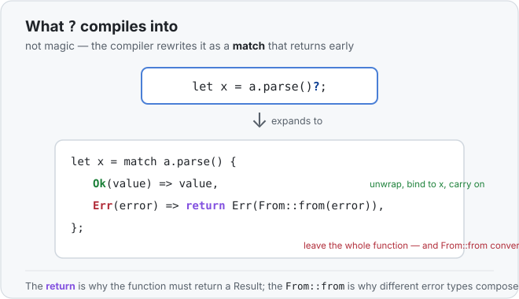

# Concept 24 · The `?` operator (propagate errors) — Under the hood

> Pair: [Use it](use-it.md) · **Under the hood** (you are here)
> Track: [From-Zero: Rust](../README.md)

## `?` is not magic — it's a `match` you don't have to type
Most of this course draws a *memory* picture, because that's Rust's whole point. `?` is
different: it's a piece of **control flow**, so the picture to draw is *what the compiler
rewrites your line into*. And the rewrite is short. This:

```rust
let x = a.parse::<i32>()?;
```

is almost exactly shorthand for this:

```rust
let x = match a.parse::<i32>() {
    Ok(value) => value,                       // success: unwrap, bind to x, carry on
    Err(error) => return Err(From::from(error)),  // failure: leave the function now
};
```



Read the two arms and every rule about `?` falls out of them:

- **The `Ok` arm is why `x` ends up a plain value.** After the line, `x` is an `i32`, not a
  `Result<i32, _>` — because the desugared `match` already pulled the value out of the `Ok`.
- **The `Err` arm has a `return`, and that's why the function must return a `Result`.** The
  `return Err(...)` leaves *the whole enclosing function*, not just the `match`. There's only
  somewhere for it to go if the function's own return type is a `Result` (or `Option`). That's
  the entire "the function must return a `Result`" rule — it's not a special restriction, it's
  just that `return Err(...)` has to be a legal thing to write there.

## The `From::from` is where the error conversion happens
Notice the `Err` arm didn't write `return Err(error)` — it wrote `return
Err(From::from(error))`. That one call is the automatic error conversion from the
[Use it](use-it.md) lesson.

`From::from(error)` means "**build the function's declared error type out of this error.**"
- If the step's error type already **is** the function's error type, `From::from` is the
  identity — it hands the error straight back, no real work.
- If they **differ** — a `ParseIntError` coming out inside a function that returns `Box<dyn
  Error>` — `From::from` converts the specific error into the common one, because the standard
  library provides a `From<ParseIntError>` for `Box<dyn Error>` (and for many other pairs).

So `?` quietly leans on the `From` [trait](../20-traits/use-it.md) ("this type can be built
from that one"). The reason a function can `?` several *different* error types into one return
type is simply that each `?` inserts a `From::from` to translate on the way out. No conversion
exists? Then it won't compile — which is Rust telling you it doesn't know how to turn that error
into your declared one.

## What happens to the values, in memory
There's still a small ownership story, and it's the one you already know:

- **On `Ok`, the inner value is moved out and bound.** `let x = ...?;` takes the value that was
  inside the `Ok` and binds it to `x` — a [move](../08-ownership-and-moves/use-it.md) for an
  owning type like `String`, a cheap [copy](../06-copy-types/use-it.md) for an `i32`. The
  `Result` wrapper is done; only the inner value lives on.
- **On `Err`, the error value is moved into the return value.** `From::from(error)` takes
  ownership of the error and produces the function's error type, which is then handed back to
  the caller. Nothing is copied that doesn't need to be — the error travels *up* by move.
- **The early return still runs drops.** Bailing out with `?` is a normal `return`, so every
  local that was already created gets [dropped](../08-ownership-and-moves/under-the-hood.md) on
  the way out, exactly as if you'd written the `return` by hand. And any locals *after* the
  `?` line simply never come into existence, because you left before reaching them.

`?` adds no hidden cost: it's the same `match` and the same move you'd have written yourself,
just spelled with one character.

## Predict the desugaring
```rust
fn first_char(text: &str) -> Result<char, String> {
    let c = text.chars().next().ok_or("empty string".to_string())?;
    Ok(c.to_ascii_uppercase())
}
```

(`.ok_or(...)` turns an `Option` into a `Result`: `Some(x)` becomes `Ok(x)`, `None` becomes
`Err(the message)`.)

1. The expression before the `?` has type `Result<char, String>`. After the `?`, what is the
   type of `c`?
2. If `text` is `""`, the expression is `Err("empty string".to_string())`. Line by line, what
   does the `?` cause the function to do?
3. Why is it fine for this `?` to sit here — what about `first_char` makes it legal?

<details>
<summary>Show the answer</summary>
<ol>
<li><strong><code>c</code> is a <code>char</code>.</strong> The <code>?</code> unwraps the <code>Ok</code>, so the value bound to <code>c</code> is the plain value inside, not the <code>Result</code> around it.</li>
<li><strong>The function returns early with the error.</strong> <code>?</code> desugars to <code>match ... { Ok(v) =&gt; v, Err(e) =&gt; return Err(From::from(e)) }</code>. The value is <code>Err(...)</code>, so the <code>Err</code> arm runs: <code>From::from</code> leaves the <code>String</code> error unchanged (the function already returns <code>String</code> errors), and <code>return Err("empty string".to_string())</code> exits <code>first_char</code> immediately — the <code>Ok(c.to_ascii_uppercase())</code> line is never reached.</li>
<li><strong><code>first_char</code> returns <code>Result&lt;char, String&gt;</code>.</strong> The <code>?</code>'s hidden <code>return Err(...)</code> needs a <code>Result</code> return type to be legal, and the error type matches (<code>String</code>), so <code>From::from</code> needs no real conversion. Both conditions are satisfied, so the <code>?</code> compiles.</li>
</ol>
</details>

## Next
- That closes error handling. Peek at the [roadmap](../README.md) for what's next — lifetimes
  and smart pointers (`Box` · `Rc` · `RefCell`) — where the memory picture comes back to the
  front.
