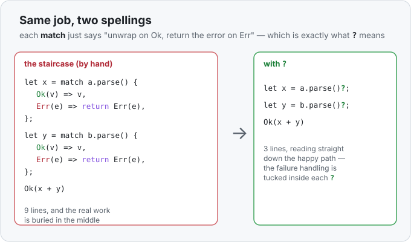

# Concept 24 · The `?` operator (propagate errors) — Use it

> Pair: **Use it** (you are here) · [Under the hood](under-the-hood.md)
> Track: [From-Zero: Rust](../README.md) · Previous: [Concept 23](../23-result/use-it.md)

## The idea
You just learned to open a [`Result`](../23-result/use-it.md) with `match`: check `Ok`, check
`Err`, deal with both. That's great for **one** fallible step. But real functions chain
*several* of them — parse this, then parse that, then add — and each one hands you a `Result`
you'd have to `match`. Do that a few times and your code turns into a staircase:

```rust
fn add_two(a: &str, b: &str) -> Result<i32, std::num::ParseIntError> {
    let x = match a.parse::<i32>() {
        Ok(value) => value,
        Err(error) => return Err(error),   // give up, hand the error to our caller
    };
    let y = match b.parse::<i32>() {
        Ok(value) => value,
        Err(error) => return Err(error),   // ...again
    };
    Ok(x + y)
}
```

Look at what those two `match`es actually *do*: **"if it worked, keep the value and carry on;
if it failed, stop and return that same error to whoever called us."** That exact move —
*unwrap on success, return-early on failure* — happens so constantly that Rust gives it a
one-character name.

## The `?` operator
Put a `?` after any expression that produces a `Result`. It does precisely the staircase move:

```rust
fn add_two(a: &str, b: &str) -> Result<i32, std::num::ParseIntError> {
    let x = a.parse::<i32>()?;   // Ok? unwrap to x.  Err? return it from add_two now.
    let y = b.parse::<i32>()?;   // same again
    Ok(x + y)
}
```

Read `a.parse::<i32>()?` as: *"try to parse. If it's `Ok`, hand me the number and keep going.
If it's `Err`, bail out of `add_two` right here and return that error."* Six lines of ceremony
become two characters — and the happy path (`x`, then `y`, then `Ok(x + y)`) reads straight
down, with the failure handling tucked into the `?`.



## The one rule: the function itself must return a `Result`
`?` works by **returning from the function you're in**. So that function has to *have* a
`Result` to return — otherwise there'd be nowhere for the error to go. This won't compile:

```rust
fn add_two(a: &str, b: &str) -> i32 {   // ❌ returns a plain i32, not a Result
    let x = a.parse::<i32>()?;           // error: `?` needs the function to return Result
    x + 1
}
```

The fix is the version above: make the return type `Result<i32, E>`. `?` is a shortcut for
"return early on error," so it can only live in a function that's allowed to return an error.
(It also works inside functions returning [`Option`](../15-option/use-it.md) — there a `None`
triggers the early return instead.)

## `main` can return a `Result` too
That rule sounds like it stops you from using `?` at the top level — but `main` is allowed to
return a `Result`, precisely so you can use `?` there:

```rust
fn main() -> Result<(), std::num::ParseIntError> {
    let total = add_two("20", "22")?;   // Ok → unwrap to 42;  Err → main returns it
    println!("total: {total}");
    Ok(())
}
```

The `Ok(())` at the end means "finished, nothing to report" — `()` is the empty value. If any
`?` hits an `Err`, `main` returns it and the program exits with an error message and a non-zero
status. This is the normal shape of a small Rust program that can fail.

## Different error types? `?` converts them for you
Here's the quietly powerful part. Suppose one step fails with a `ParseIntError` and another
with some *other* error type. You can't return two different error types from one function — so
you declare **one** error type the function returns, and `?` **automatically converts** each
step's error into it on the way out:

```rust
fn run() -> Result<(), Box<dyn std::error::Error>> {
    let n = "42".parse::<i32>()?;     // ParseIntError, converted into Box<dyn Error>
    let text = std::fs::read_to_string("count.txt")?;  // io::Error, also converted
    println!("{n} and {}", text.len());
    Ok(())
}
```

`Box<dyn std::error::Error>` is a catch-all "some error" type (it's a
[trait object](../21-trait-objects/use-it.md) — "any value that can act as an error"). Each
`?` turns whatever specific error it got into that common type for you, so a function doing
several different fallible things can still declare a single, tidy error type. *How* that
conversion happens — the `From` trait — is the [under the hood](under-the-hood.md) story.

## Exercises
1. **Parse and add with `?`** — [starter](exercises/1-starter.rs) · [solution](exercises/1-solution.rs).
   Write `fn add_two(a: &str, b: &str) -> Result<i32, std::num::ParseIntError>` that parses
   both strings with `?` and returns `Ok(x + y)`. In `main`, `match` on `add_two("20", "22")`
   and on `add_two("20", "oops")`, printing the total or `couldn't parse`.
2. **`?` all the way up to `main`** — [starter](exercises/2-starter.rs) · [solution](exercises/2-solution.rs).
   Give `main` the return type `Result<(), std::num::ParseIntError>`. Reuse `add_two`, call it
   with `?` on good input, print the total, and end with `Ok(())`. (Run it — a clean run prints
   the total and exits 0.)

## Next
- What `?` *actually compiles into* — it's not magic, it's a `match` that returns early and
  calls `From::from` on the error to convert it. Seeing the desugaring makes the "must return a
  `Result`" rule and the automatic conversion both obvious: [Under the hood](under-the-hood.md).
