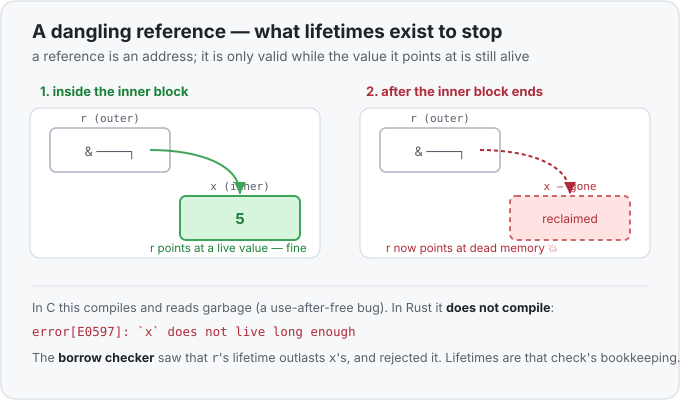

# Concept 25 · Lifetimes (`&'a`) — Under the hood

> Pair: [Use it](use-it.md) · **Under the hood** (you are here)
> Track: [From-Zero: Rust](../README.md)

## A reference is an address — valid only while its value lives
Recall from [Concept 10a](../10a-dereferencing-with-star/use-it.md): a reference *is* a memory
address, a small fixed-size number pointing at where a value sits. That value lives somewhere —
usually a slot on the [stack](../07-the-heap-and-string/under-the-hood.md), inside some scope.
When that scope ends, the slot is **reclaimed**: its space is handed back and will be reused by
the next thing that needs it.

Here's the whole problem in four lines:

```rust
let r;
{
    let x = 5;      // x lives in this inner block's stack space
    r = &x;         // r borrows x — points at that slot
}                   // block ends: x's slot is reclaimed
println!("{r}");    // r now points at dead memory
```

## The danger, in a picture
While the inner block runs, `r` points at a live `x`. The instant the block ends, `x`'s slot is
gone — but `r` still holds its address. Any read through `r` now hits memory that no longer
belongs to `x`.



In C, that code compiles and prints whatever garbage now sits in that slot — a *use-after-free*,
one of the most exploited bug classes in software. In Rust, it simply **won't build**:

```
error[E0597]: `x` does not live long enough
```

## Lifetimes are the names in that check
The tool doing this is the **borrow checker**. For every reference it works out two spans:

- **how long the referred-to value is alive** (here, `x` lives only until the block's `}`), and
- **how long the reference is actually used** (here, `r` is used on the `println!` line, *after*
  the block).

If a reference is ever used past the end of its value's life, that's a dangling reference, and
the program is rejected. **A "lifetime" is just the name for one of those spans** — and `'a` is
a name *you* give to one so you can talk about it in a signature. So when you wrote
`fn longest<'a>(x: &'a str, y: &'a str) -> &'a str`, you handed the borrow checker a name for
"the span all three borrows share," letting it prove the returned reference never escapes past
its inputs.

## Why `longest` needed the name
With one input, there's no ambiguity — the output must borrow from that one input, so the
compiler fills the lifetime in silently ([elision](use-it.md)). With **two** input references,
the returned `&str` could borrow from either, and each caller might pass values with *different*
lifespans:

```rust
let long_lived = String::from("hello");
let result;
{
    let short_lived = String::from("hi");
    result = longest(&long_lived, &short_lived);   // result borrows for the SHORTER span
    println!("{result}");                          // ok: used while both are alive
}
// println!("{result}");   // would NOT compile: short_lived is gone
```

By writing the same `'a` on both inputs and the output, you told the compiler the result is
valid only for the span where **both** inputs are alive — the shorter of the two. That's why the
commented-out line would be rejected: `short_lived` died at the block's end, so the result can't
be used past it. The annotation didn't *choose* which input the result came from at runtime — it
stated the rule the borrow checker then enforces at every call site.

## The part that matters most: `'a` costs nothing at runtime
Lifetimes are **pure compile-time bookkeeping**. Once the borrow checker has proved your
references are sound, the lifetimes are **erased** — they exist only during compilation. The
compiled program has no trace of `'a`; a `&'a str` is the exact same 8-byte address at runtime
as a plain `&str` ([Concept 10a](../10a-dereferencing-with-star/under-the-hood.md)). You pay
nothing for the safety — no tag, no check, no slowdown. This is the whole Rust bargain: the
danger is caught while compiling, so there's zero cost while running.

## Predict the memory
```rust
fn main() {
    let outer = String::from("keep me");
    let picked;
    {
        let inner = String::from("temporary");
        picked = longest(&outer, &inner);
        println!("A: {picked}");
    }
    println!("B: {picked}");
}
// longest<'a>(x: &'a str, y: &'a str) -> &'a str  returns the longer one
```

1. `longest(&outer, &inner)` returns a `&'a str`. For what span is that borrow valid — tied to
   `outer`, `inner`, or something else?
2. Does the `println!` marked **A** compile? Does **B**?
3. If you deleted the inner block's braces (so `inner` lived to the end of `main`), would **B**
   then compile?

<details>
<summary>Show the answer</summary>
<ol>
<li><strong>The span where <em>both</em> inputs are alive — i.e. as long as the shorter-lived one, <code>inner</code>.</strong> The shared <code>'a</code> ties the result to both <code>x</code> and <code>y</code>, so its lifetime is their overlap, which ends when <code>inner</code> is dropped at the inner block's <code>}</code>.</li>
<li><strong>A compiles; B does not.</strong> At <strong>A</strong>, both <code>outer</code> and <code>inner</code> are still alive, so <code>picked</code> is valid. At <strong>B</strong>, <code>inner</code> has been dropped, so <code>picked</code> would be a dangling reference — <code>error[E0597]: `inner` does not live long enough</code>.</li>
<li><strong>Yes.</strong> If <code>inner</code> lived until the end of <code>main</code>, the shared span <code>'a</code> would extend that far too, so <code>picked</code> would still be valid at <strong>B</strong> and it would compile. The value's lifespan is what drives it — the annotation just tracks the relationship.</li>
</ol>
</details>

## Next
- **Closures — `|x| ...`** (the other construct from your challenge, `|(a, b)| a == b`): small
  functions written inline that can also *capture* the variables around them. That opens the
  closures-and-iterators phase. See the [roadmap](../README.md).
