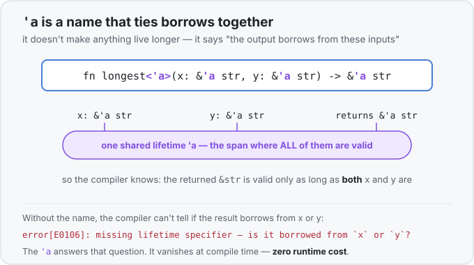

# Concept 25 · Lifetimes (`&'a`) — Use it

> Pair: **Use it** (you are here) · [Under the hood](under-the-hood.md)
> Track: [From-Zero: Rust](../README.md) · Previous: [Concept 24](../24-question-mark/use-it.md)

## The idea
A [reference](../10-borrowing-with-ref/use-it.md) is a borrow — a way to *look at* a value
someone else owns, without taking it. Concept 10 showed you how to make one with `&`. This
lesson is about the question that borrow quietly raises:

> What if the value you're pointing at **dies** while your reference is still pointing at it?

Then your reference points at memory that's been cleaned up and reused — a **dangling
reference**. Reading it gives garbage or crashes. In C this is a whole industry of bugs
(*use-after-free*). Rust's promise is that this **can never happen** — and **lifetimes** are how
it keeps that promise. A lifetime is simply: *how long a particular borrow stays valid.* The
compiler tracks one for every reference, and refuses to compile any program where a reference
could outlive the thing it borrows.

The surprise for beginners: you've been relying on lifetimes since Concept 10 **without ever
writing one**. Most of the time the compiler works them out silently. This lesson is about the
few times it can't — and asks you to write the name `'a` yourself.

### In one line
A reference breaks if its value is **destroyed while you're still pointing at it** — and it doesn't
matter *how* it got destroyed:

- it got **moved** somewhere else (ownership left),
- it went **out of scope** and was cleaned up,
- or the **function it lived in returned**.

`'a` is just the compiler proving *none of those happen* before you're finished with the reference.
That's the whole job of a lifetime.

## You've already used lifetimes (invisibly)
Every `&` you've written had a lifetime; the compiler just filled it in for you. This compiles
with no annotation:

```rust
fn first_two(text: &str) -> &str {
    &text[..2]
}
```

The returned `&str` borrows from `text`, and the compiler *knows* that because there's only one
possible source — the single input. This silent filling-in is called **lifetime elision**, and
it covers the common cases, which is why you've gotten this far without seeing `'a`.

## When you have to name one
The compiler gets stuck when a function **returns a reference** and there's more than one input
it *could* be borrowing from. Classic example — return whichever string is longer:

```rust
fn longest(x: &str, y: &str) -> &str {
    if x.len() >= y.len() { x } else { y }
}
```

This does **not** compile:

```
error[E0106]: missing lifetime specifier
  = help: this function's return type contains a borrowed value, but the
    signature does not say whether it is borrowed from `x` or `y`
```

Read the compiler's own words: it can't tell whether the returned `&str` borrows from `x` or
from `y`, so it can't work out how long the result stays valid. It needs *you* to say. You do
that by giving the borrows a shared **name**:

```rust
fn longest<'a>(x: &'a str, y: &'a str) -> &'a str {
    if x.len() >= y.len() { x } else { y }
}
```

Now it compiles.

## How to read `<'a>`
Three little pieces, and a lifetime name always starts with a tick `'`:

- **`<'a>`** after the function name — "I'm introducing a lifetime name called `a`," the same
  slot where a [generic `<T>`](../19-generics/use-it.md) type name would go. (A lifetime is a
  kind of generic — a generic over *how long*, instead of over *what type*.) You can name it
  anything; `'a` is just the customary first one.
- **`&'a str`** — "a borrowed string that is valid for the lifetime `'a`." It's a normal `&str`
  with a label on its borrow.
- **The same `'a` in three places** — on `x`, on `y`, and on the return — ties them together:
  *the result borrows for the same span that both inputs are valid for.*



The thing that trips everyone up: **`'a` is not a duration you set, and it does not make
anything live longer.** You're not commanding "keep this alive for 5 lines." You're *describing
a relationship* — "the output comes from these inputs" — which the compiler then **checks** and
enforces. If a caller tries to use the result after one of the inputs has died, that call won't
compile.

## What you're really promising
`fn longest<'a>(x: &'a str, y: &'a str) -> &'a str` reads, in plain words:

> "Give me two string borrows that are both alive for some span `'a`, and I'll give you back a
> borrow that's alive for that same span — no longer."

So the returned reference can never outlive the shorter-lived of its inputs. That's exactly the
guarantee that stops a dangling reference: the answer is provably tied to data that's still
alive.

## The trap: don't return a reference to something you made *inside*
This is the mistake almost everyone hits first. You make a value in the function and try to hand
back a reference to it:

```rust
fn generate_value<'a>() -> &'a String {
    let val = String::from("Hello World");  // a NEW value, born in this function
    &val                                     // ... hand back its address
}                                            // ← val is cleaned up here
```

It won't compile (`error[E0515]: cannot return value referencing temporary value`). Here's the
whole reason in three steps:

1. A reference isn't a copy — it's just an **address**, a note that says *"the value is over
   there."*
2. `String::from(...)` makes a **new value that lives inside this function**. `&val` is a note
   pointing at it.
3. When the function ends, that value is **cleaned up** — so the note now points at nothing. 💥

```
inside:  val ──► "Hello World"        after return:  val ──► 🔥 (cleaned up)
```

No `'a` can save this, because the value simply doesn't live long enough — there's nothing
outside for the borrow to tie to. **`'a` describes a borrow of data that already lives somewhere;
it can't keep a local value alive.**

The fix is to stop borrowing and **return the value itself** — hand over ownership, no lifetime
needed:

```rust
fn generate_value() -> String {
    let mut val = String::from("Hello World");
    val.push_str("!");
    val                                      // the value moves OUT to the caller
}
```

Rule of thumb: **made it inside → return the value. Borrowing something the caller already owns →
return a `&reference` (and that's when `'a` shows up).**

## Back to your own code
This is the `'a` you hit in the [Longest Common Prefix challenge](../../../challenges/longest-common-prefix/solution.rs.md):

```rust
fn longest_common_prefix<'a>(words: &[&'a str]) -> &'a str
```

Now it decodes cleanly: `&[&'a str]` is "a borrowed list of borrowed strings, all valid for
`'a`," and `-> &'a str` promises the returned slice borrows from that same text — which is true,
because we return `&first[..length]`, a slice *into* one of those words. The `'a` is what lets us
hand back a borrowed slice with **zero allocation** instead of copying into a new `String`.

## A note: structs can hold references too
The other place you'll meet `'a` is a `struct` that *stores* a reference — it must name the
lifetime so the compiler knows the struct can't outlive the data it points into:

```rust
struct Excerpt<'a> {
    text: &'a str,
}
```

Read it the same way: "an `Excerpt` borrows some text for `'a`, so it can't outlive that text."
We'll lean on this more later; for now, just recognize the shape.

## Exercises
1. **`longest`** — [starter](exercises/1-starter.rs) · [solution](exercises/1-solution.rs).
   Write `fn longest<'a>(x: &'a str, y: &'a str) -> &'a str` returning the longer of the two
   (by `.len()`). Call it with `("hello", "hi")` and `("cat", "zebra")`. (Try removing the `'a`
   first to see the `E0106` error for yourself.)
2. **`first` of a word list** — [starter](exercises/2-starter.rs) · [solution](exercises/2-solution.rs).
   Write `fn first<'a>(words: &[&'a str]) -> &'a str` returning the first word, or `""` if the
   list is empty — the exact `&[&'a str] -> &'a str` shape from the challenge. Call it with
   `["flower", "flow", "flight"]` and with an empty list.

## Next
- The memory picture underneath: what a dangling reference actually looks like on the stack, how
  the **borrow checker** compares "how long the value lives" against "how long the borrow is
  used," and why `'a` costs **nothing** at runtime (it's erased after compiling):
  [Under the hood](under-the-hood.md).
