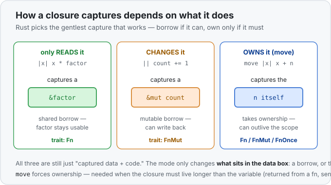

# Concept 26 · Closures (`|x| ...`) — Under the hood

> Pair: [Use it](use-it.md) · **Under the hood** (you are here)
> Track: [From-Zero: Rust](../README.md)

## A closure is data + code
The surface story ([Use it](use-it.md)) is "a closure can use variables from around it." The
memory story is *how*: when a closure captures a variable, the compiler **stores that variable
inside the closure**. A closure is not just code — it's a small, unnamed **struct** that bundles
its captured variables (the data) with the body to run (the code).

```rust
let factor = 3;
let scale = |x| x * factor;
```

The compiler turns `scale` into roughly this:

```rust
struct ScaleClosure { factor: i32 }     // the captured data
// with a "call" that does: |x| x * self.factor    // the code
let scale = ScaleClosure { factor: 3 };
```


Calling `scale(10)` runs the code against the struct's stored `factor`. This is also exactly why a
plain [`fn`](../04-functions-and-the-call-stack/use-it.md) can't capture: a `fn` is a bare code
pointer with **no data box** to stash `factor` in. The closure's captured-data box is the whole
difference.

## How it captures: borrow, mutably borrow, or own
What goes *in* that data box depends on what the closure does with each captured variable — and
Rust picks the **gentlest option that works**, the same ownership rules you already know from
[Phase 2](../README.md):

- **Only reads it → captures a shared borrow (`&`).** `|x| x * factor` just reads `factor`, so the
  box holds `&factor`. The original `factor` stays fully usable outside.
- **Changes it → captures a mutable borrow (`&mut`).** `|| count += 1` writes to `count`, so the
  box holds `&mut count`. (That's why such a closure must be stored in a `let mut`.)
- **`move`, or must own it → captures the value itself.** `move |x| x + n` moves `n` into the box,
  so the closure carries its own copy and no longer depends on the outer `n`.



## The three closure traits: `Fn`, `FnMut`, `FnOnce`
Because closures capture differently, they come in three flavours — and these are just
[traits](../20-traits/use-it.md) (contracts) describing how a closure can be called:

- **`Fn`** — only reads its captures (or captures nothing), so you can call it many times, even
  through a shared borrow. `|x| x * factor`.
- **`FnMut`** — mutates a capture, so calling it needs `&mut` access; still callable repeatedly.
  `|| count += 1`.
- **`FnOnce`** — *consumes* a capture (moves it out), so it can be called **once**. e.g. a closure
  that returns a `String` it captured by value.

You rarely name these when *writing* a closure — the compiler infers the right one from the body.
You mostly meet them when a function *accepts* a closure and has to say which kinds it allows
(`fn apply(f: impl Fn(i32) -> i32)`). The rule of thumb: reach for `Fn` unless the closure needs
to mutate (`FnMut`) or consume (`FnOnce`) what it captured.

## Why it's zero-cost
Each closure is its **own unique unnamed type** (that struct the compiler generated). So when you
pass a closure to `.filter(...)`, the compiler knows the exact type and **inlines the call** —
[monomorphization](../19-generics/under-the-hood.md), the same static-dispatch trick as generics
and trait bounds ([Concept 20](../20-traits/under-the-hood.md)). There's no lookup and no
indirection: an iterator chain with closures compiles down to the same machine code as the loop
you'd have written by hand. You get the readable, inline style **for free**. (The one time you pay
is when you deliberately box a closure behind `dyn Fn` — a [trait object](../21-trait-objects/use-it.md)
— to store many differently-shaped closures together; then it's one pointer-hop, just like any
`dyn`.)

## Predict the memory
```rust
fn main() {
    let base = 100;
    let mut hits = 0;

    let add_base = |x| x + base;      // closure A
    let mut record = || hits += 1;    // closure B

    println!("{}", add_base(5));
    record();
    record();
    println!("{hits}");
}
```

1. Closure **A** (`add_base`) captures `base`. Does its data box hold `&base` or an owned `base`,
   and is `base` still usable afterwards?
2. Closure **B** (`record`) captures `hits`. What does *its* box hold, and why must `record` be
   declared `let mut`?
3. Which trait does each closure satisfy — `Fn`, `FnMut`, or `FnOnce`?

<details>
<summary>Show the answer</summary>

1. **A holds `&base` (a shared borrow), and yes, `base` stays usable.** `add_base` only *reads*
   `base`, so Rust captures the gentlest way — a shared borrow — and never disturbs the original.
2. **B holds `&mut hits`, so it needs `let mut`.** `record` *writes* to `hits`, which requires a
   mutable borrow of it; calling a closure that holds a `&mut` capture mutates the closure's own
   state, so the binding itself must be `mut`.
3. **A is `Fn`** (reads only → callable many times), **B is `FnMut`** (mutates a capture → callable
   repeatedly but needs `&mut`). Neither is `FnOnce`, since neither moves a captured value *out*.
</details>

## Next
- Closures are the fuel; next comes the engine: the **iterator adapters** (`.map`, `.filter`,
  `.collect`, …) that take them — the rest of this phase. See the [roadmap](../README.md).
