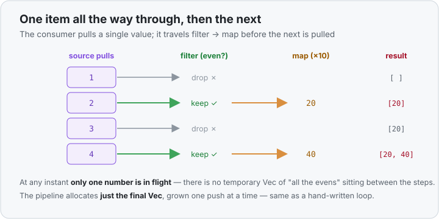

# Concept 27 · Iterator adapters (`.map` · `.filter` · `.collect`) — Under the hood

> Pair: [Use it](use-it.md) · **Under the hood** (you are here)
> Track: [From-Zero: Rust](../README.md)

## Laziness: an adapter builds a plan, not a result
The surface story ([Use it](use-it.md)) is "chain steps to transform a stream." The memory story
starts with one surprising fact: **an adapter does no work when you call it.** It just wraps the
previous iterator in a new one and returns immediately.

```rust
let numbers = vec![1, 2, 3];
let plan = numbers.iter().map(|n| n * 2);   // nothing has been doubled yet!
```

After that line, `plan` is not `[2, 4, 6]`. It's a little **struct** that remembers two things: the
iterator it came from, and the closure to apply. No number has been multiplied. `.map` didn't
*compute* anything — it *described* something. The doubling happens later, only when something
pulls on `plan`.

That "something" is a **consumer**. `.collect()`, `.sum()`, `.count()`, and a `for` loop are all
consumers: they call `.next()` over and over until the stream runs dry.

```rust
let doubled: Vec<i32> = plan.collect();   // NOW the doubling runs, item by item
```

If you never consume it, the work never runs — an adapter chain with no consumer is a plan nobody
executed.

## The pull model: one item all the way through, then the next
Here's the part that trips people up. A chain like `.filter(...).map(...)` does **not** filter the
*whole* vector into a temporary list, then map that *whole* list into another. That's what it looks
like on the page, but it's not what happens in memory.

Instead the consumer pulls **one item at a time**, and each item travels the *entire* pipeline
before the next one starts. `.collect` asks for the next item; that request flows back up the
chain; a single value comes down through `filter`, then `map`, and lands in the result; then
`.collect` asks again.

```rust
let out: Vec<i32> = vec![1, 2, 3, 4]
    .into_iter()
    .filter(|n| n % 2 == 0)
    .map(|n| n * 10)
    .collect();
```

Watch one full pull at a time — notice only **one** number is ever "in flight":

| pull | source yields | filter (`even?`) | map (`×10`) | result so far |
|------|---------------|------------------|-------------|---------------|
| 1 | `1` | drop | — | `[]` |
| 2 | `2` | keep | `20` | `[20]` |
| 3 | `3` | drop | — | `[20]` |
| 4 | `4` | keep | `40` | `[20, 40]` |
| — | done | — | — | `[20, 40]` |



The memory consequence is the whole point: **no intermediate `Vec` is allocated between `filter`
and `map`.** A naive imagination of the chain builds two throwaway vectors (one after filtering,
one after mapping) and then the final one — three allocations. The real pull model builds **only
the final `Vec`**, growing it one push at a time. The steps in between are just function calls on a
single value passing through.

## Why it's zero-cost
Each adapter is its own unique struct type, and each closure is [its own unique type](../26-closures/under-the-hood.md#why-its-zero-cost) too. So the compiler knows the exact type
at every link of the chain and **inlines everything** —
[monomorphization](../19-generics/under-the-hood.md), the same static-dispatch trick behind
generics and closures. There's no per-item function-call overhead and no dynamic lookup.

The result: the `filter/map/collect` chain above compiles down to essentially the *same machine
code* as the hand-written loop from [Use it](use-it.md) — one pass, one growing `Vec`, the test and
the multiply inlined into the loop body. You get the readable pipeline **for free**. This is Rust's
recurring promise: a high-level, expressive style that costs nothing at runtime.

## Predict the memory
```rust
fn main() {
    let numbers = vec![10, 20, 30, 40];

    let plan = numbers
        .iter()
        .filter(|&&n| n > 15)
        .map(|&n| n + 1);

    println!("plan built");          // line A

    let result: Vec<i32> = plan.collect();   // line B
    println!("{result:?}");
}
```

1. At **line A**, how many additions (`n + 1`) have actually run?
2. Between `.filter` and `.map`, does Rust build a temporary `Vec` of the items that passed the
   filter? How many separate `Vec`s does this whole program allocate for the pipeline?
3. At **line B**, in what order do the numbers move through the pipeline — all filtered first, then
   all mapped, or one number all the way through at a time?

<details>
<summary>Show the answer</summary>

1. **Zero.** `plan` is just a struct describing the work. Adapters are lazy; not a single `n + 1`
   has run at line A. The `println!` proves it — building the plan printed nothing about numbers.
2. **No temporary `Vec`.** Items pass through one at a time, so nothing is collected between the
   steps. The program allocates **one** `Vec` for the pipeline: the final `result` built by
   `.collect()`. (`numbers` itself is a separate, pre-existing `Vec` that `.iter()` only borrows.)
3. **One number all the way through at a time.** `.collect` pulls `20` → passes the filter → becomes
   `21` → pushed; *then* pulls `30` → `31` → pushed; *then* `40` → `41`. (`10` is pulled first but
   dropped by the filter.) Only ever one value in flight.
</details>

## Next
- Every chain so far started with `.iter()` or `.into_iter()` — and that choice decides whether the
  collection is **borrowed and survives**, **mutated in place**, or **consumed and gone**. The
  ownership fork at the *start* of a stream: [Concept 28 — `iter` vs `into_iter` vs `iter_mut`](../28-iter-into-iter-iter-mut/use-it.md).
