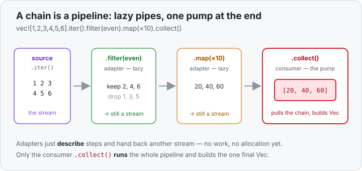

# Concept 27 · Iterator adapters (`.map` · `.filter` · `.collect`) — Use it

> Pair: **Use it** (you are here) · [Under the hood](under-the-hood.md)
> Track: [From-Zero: Rust](../README.md) · Previous: [Concept 26](../26-closures/use-it.md)

## The idea
An **iterator** is a stream of items you can pull one at a time. Almost everything with many
values gives you one: a `Vec`, a `HashMap`, a [range](../05a-loops-and-ranges/use-it.md) like
`1..=5`. Up to now you've walked those streams with a [`for` loop](../05a-loops-and-ranges/use-it.md)
and done the work by hand. This lesson shows the other style: **describe the transformation as a
chain of steps**, and let Rust run it.

Two kinds of things sit in that chain:
- **Adapters** reshape the stream and hand back *another stream* — `.map`, `.filter`, `.rev`, …
  They're lazy: they don't do any work yet, they just remember what to do.
- **Consumers** actually run the stream to the end and produce a final answer — `.collect`,
  `.count`, `.sum`. Nothing happens until a consumer asks.

The [closures](../26-closures/use-it.md) from last lesson are the fuel: each adapter takes a
closure saying *what to do with each item*.

## `.map` — transform every item
`.map(closure)` runs the closure on each item and streams out the results:

```rust
let numbers = vec![1, 2, 3, 4];
let doubled: Vec<i32> = numbers.iter().map(|n| n * 2).collect();
println!("{doubled:?}");   // [2, 4, 6, 8]
```

Read it as a sentence: *take each number, double it, gather the results into a `Vec`*. The
`.iter()` starts the stream (borrowing the vector — more on that next lesson), `.map` describes the
per-item work, and `.collect` is the consumer that builds the new `Vec`.

## `.filter` — keep only some items
`.filter(closure)` keeps the items where the closure returns `true` and drops the rest:

```rust
let numbers = vec![1, 2, 3, 4, 5, 6];
let evens: Vec<i32> = numbers.into_iter().filter(|n| n % 2 == 0).collect();
println!("{evens:?}");   // [2, 4, 6]
```

The closure `|n| n % 2 == 0` is a **test** — it returns a `bool`, and `.filter` uses it as a
gate. Items that pass flow on; items that fail are gone.

## Chaining — the whole point
Adapters return iterators, so you snap them together into a pipeline that reads top to bottom:

```rust
let numbers = vec![1, 2, 3, 4, 5, 6];

let result: Vec<i32> = numbers
    .iter()
    .filter(|&&n| n % 2 == 0)   // keep the evens:      2, 4, 6
    .map(|&n| n * 10)           // times ten:           20, 40, 60
    .collect();

println!("{result:?}");         // [20, 40, 60]
```

Compare it to the hand-written loop that does the same job:

```rust
let mut result = Vec::new();
for &n in numbers.iter() {
    if n % 2 == 0 {
        result.push(n * 10);
    }
}
```

Same work, same result — but the chain says *filter to evens, times ten, collect* in one breath,
with no scratch `result` to set up and push into. (The `&&n` and `&n` are just peeling the borrows
`.iter()` hands you — you met that in [`&` in patterns](../../../languages/rust.md#ref-pattern).
Next lesson's `.into_iter()` makes those `&`s disappear.)

## `.collect` — turn a stream back into a collection
`.collect()` is the consumer you'll reach for most: it runs the chain and gathers the results.
**It builds whatever collection you ask for** — the type annotation is what tells it which:

```rust
let v: Vec<i32>      = (1..=3).collect();   // [1, 2, 3]
let s: String        = ['h', 'i'].into_iter().collect();   // "hi"
```

If you leave the type off, Rust can't guess what to build and won't compile — so `.collect()`
almost always comes with a `Vec<_>` / `String` / … annotation, or a `.collect::<Vec<i32>>()`
turbofish, to name the target.

## Other consumers you'll use constantly
Not every chain ends in `.collect`. When you want a single value, reach for these:

```rust
let numbers = vec![1, 2, 3, 4, 5];
let total: i32   = numbers.iter().sum();                       // 15
let count: usize = numbers.iter().filter(|&&n| n > 2).count(); // 3
let biggest      = numbers.iter().max();                       // Some(&5)
```

Each of these *ends* the stream and hands back one answer instead of another stream. That's the
tell for a consumer vs an adapter: an adapter gives you back something you can keep chaining on; a
consumer gives you the final result.



## Handbook
The terse reference lives in the handbook: [iterator adapters](../../../languages/rust.md#iterator-adapters).

## Exercises
1. **Map then collect** — [starter](exercises/1-starter.rs) · [solution](exercises/1-solution.rs).
   Given `vec![1, 2, 3, 4, 5]`, build a `Vec<i32>` of each number **squared** using
   `.iter().map(...).collect()`. Print it with `{:?}` (expect `[1, 4, 9, 16, 25]`).
2. **Filter, map, sum** — [starter](exercises/2-starter.rs) · [solution](exercises/2-solution.rs).
   Given `vec![1, 2, 3, 4, 5, 6, 7, 8, 9, 10]`, keep the even numbers, triple each, and add them
   up into one `i32`. Print the total (expect `90`).

## Next
- Why the chain does **nothing** until a consumer pulls it, how items flow through **one at a
  time** without building throwaway vectors in between, and why the whole pipeline compiles down to
  the same machine code as the hand loop: [Under the hood](under-the-hood.md).
