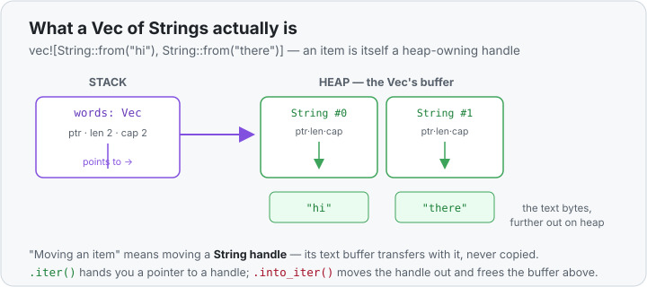

# Concept 28 · `iter` vs `into_iter` vs `iter_mut` (borrow · consume · mutate) — Under the hood

> Pair: [Use it](use-it.md) · **Under the hood** (you are here)
> Track: [From-Zero: Rust](../README.md)

## One `Vec`, three kinds of item
A [`Vec<T>`](../17-vec/use-it.md) is a small handle on the [stack](../04-functions-and-the-call-stack/use-it.md)
(pointer, length, capacity) that owns a block of items on the [heap](../07-the-heap-and-string/use-it.md).
The three iterator starters all walk that same heap block — they differ only in **what they hand you
for each slot**, and that decides who owns the data.

```rust
let words = vec![String::from("hi"), String::from("there")];
```



Each element here is itself a `String` — a little handle owning its own text buffer further out on
the heap. Keep that in mind: "moving an item" means moving that handle.

## `.iter()` → `&T`: a pointer to a slot, nothing moves
`.iter()` yields a `&T` — the *address* of each element, still living inside the `Vec`. Nothing is
copied out and nothing is taken; you're handed a finger pointing at data the `Vec` still owns.

- The item you get is `&String` — 8 bytes, a pointer into the `Vec`'s heap block.
- The `Vec` is untouched. When the loop ends, `words` still owns everything, still usable.
- Because it's a *shared* borrow, you can read (`w.len()`, `w.to_uppercase()`) but not modify.

This is why `.iter()` costs nothing and leaves the collection intact: it never touches ownership at
all, exactly like taking a `&` reference in [Concept 10](../10-borrowing-with-ref/use-it.md).

## `.iter_mut()` → `&mut T`: a writable pointer to the slot
`.iter_mut()` yields `&mut T` — the same *address*, but one you're allowed to write through. Still no
move: the value stays in its slot; you reach in and change it where it lives.

```rust
for n in numbers.iter_mut() {   // n: &mut i32
    *n *= 10;                   // *n follows the pointer, writes into the slot
}
```

The [`*n`](../10a-dereferencing-with-star/use-it.md) is load-bearing: `n` is a *pointer to* the
slot, so `*n` is the slot itself, and `*n *= 10` overwrites it in place. The `Vec`'s heap block is
the same block before and after — only the bytes inside changed. This is the
[borrow rule from Concept 11](../11-mut-references-and-borrow-rules/use-it.md) applied per element:
one mutable borrow at a time, handed out slot by slot as the loop advances.

## `.into_iter()` → `T`: the value is moved out, the `Vec` is consumed
`.into_iter()` is the different one. It yields `T` — the **owned value itself**, not a pointer. To
give you something you own, it has to *move the value out* of the `Vec`'s heap block. And once
values start moving out, the `Vec` can't be left half-empty and valid — so `into_iter` **takes
ownership of the whole `Vec`** (that's why `words` is moved and unusable afterward).

- Each item you get is a full `String` handle (24 bytes: pointer, len, capacity) **moved** out of
  the block. Its text buffer isn't copied — ownership of that buffer transfers to you. No clone.
- After the iterator is done, the now-emptied heap block is freed. `words` is gone; the compiler
  rejects any later use of it.

That's the trade in memory terms: `.iter()` gives cheap pointers but you don't own the results;
`.into_iter()` gives you owned values to move onward freely, at the cost of the original collection.

| starter | item type | item size | moves the value? | collection after |
|---------|-----------|-----------|------------------|------------------|
| `.iter()` | `&T` | pointer | no — borrows | intact, still owned |
| `.iter_mut()` | `&mut T` | pointer | no — borrows mutably | intact, contents edited |
| `.into_iter()` | `T` | the whole value | **yes — moved out** | **consumed, freed** |

## Predict the memory
```rust
fn main() {
    let mut a = vec![String::from("x"), String::from("y")];
    let b = vec![String::from("p"), String::from("q")];

    for s in a.iter_mut() {          // loop 1
        s.push('!');
    }

    let joined: String = b.into_iter().collect();   // loop 2

    println!("{a:?}");               // line A
    println!("{joined}");            // line B
    // println!("{b:?}");            // line C — commented out
}
```

1. In loop 1, what is the type of `s`, and does `a` survive to be printed at line A? What does it
   print?
2. In loop 2, what is the type of each item from `b.into_iter()`? Were the two `String`s cloned to
   build `joined`, or moved?
3. If you uncommented line C, would it compile? Why or why not?

<details>
<summary>Show the answer</summary>
<ol>
<li><strong><code>s</code> is <code>&amp;mut String</code></strong> (a mutable borrow of each slot). <code>.iter_mut()</code> never takes ownership, so <code>a</code> survives — line A prints <code>["x!", "y!"]</code>. The <code>push('!')</code> wrote through the reference into the existing slots.</li>
<li><strong>Each item is an owned <code>String</code></strong> (<code>T</code>, moved out of <code>b</code>). <code>.into_iter()</code> moved the two <code>String</code> handles into the chain and <code>.collect()</code> moved their text into <code>joined</code> — <strong>no clone</strong>. <code>joined</code> is <code>"pq"</code>.</li>
<li><strong>It would not compile.</strong> <code>b.into_iter()</code> consumed <code>b</code> — its heap block was emptied and freed — so <code>b</code> no longer exists. Any later use is a use-after-move, which the compiler rejects.</li>
</ol>
</details>

## Next
- More of the iterator toolbox, and beyond it the smart pointers (`Box` · `Rc` · `RefCell`) that
  let ownership be shared or deferred. See the [roadmap](../README.md).
