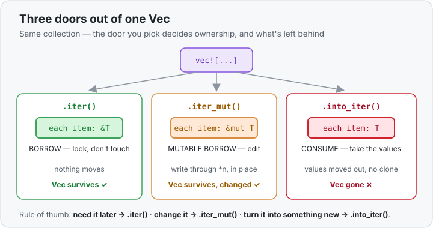

# Concept 28 · `iter` vs `into_iter` vs `iter_mut` (borrow · consume · mutate) — Use it

> Pair: **Use it** (you are here) · [Under the hood](under-the-hood.md)
> Track: [From-Zero: Rust](../README.md) · Previous: [Concept 27](../27-iterator-adapters/use-it.md)

## The idea
Last lesson every chain started with `.iter()` or `.into_iter()`, and you may have wondered why
there were two. Here's the answer: **how you start a stream decides what happens to the collection**
— whether it survives, gets edited in place, or is used up and gone.

A `Vec<T>` (or `HashMap`, array, …) hands you **three** ways to turn it into an iterator, and the
whole difference is the *ownership* of the items you get out:

| you call | each item is | the collection afterward |
|----------|--------------|--------------------------|
| `.iter()` | `&T` — a **borrow** | untouched, still yours |
| `.iter_mut()` | `&mut T` — a **mutable borrow** | still yours, now edited in place |
| `.into_iter()` | `T` — the **value itself** | **consumed** — moved away, gone |

This is the same ownership story from [Phase 2](../README.md) — borrow, mutably borrow, or move —
now applied to *iterating*. Pick the one that matches what you want to do with the collection after.

## `.iter()` — borrow: look but don't touch
`.iter()` gives you shared references `&T`. You can read every item; the collection is left
completely intact and you can keep using it afterward:

```rust
let numbers = vec![1, 2, 3];

let total: i32 = numbers.iter().sum();   // each item is &i32
println!("{total}");                     // 6
println!("{numbers:?}");                 // [1, 2, 3] — still here!
```

Because you only borrowed, `numbers` is untouched on the last line. This is the one to reach for
when you're computing *from* a collection you still need.

## `.iter_mut()` — mutable borrow: edit in place
`.iter_mut()` gives you `&mut T` — a mutable reference to each item — so you can change the elements
where they sit, without rebuilding the collection:

```rust
let mut numbers = vec![1, 2, 3];

for n in numbers.iter_mut() {   // each n is &mut i32
    *n *= 10;                   // follow the reference and write through it
}

println!("{numbers:?}");        // [10, 20, 30] — same Vec, new contents
```

Two things this needs: the binding must be `let mut` (you're changing it), and inside the loop you
write through the reference with [`*n`](../10a-dereferencing-with-star/use-it.md) — the `*` follows
the `&mut` back to the value to assign into it. The `Vec` is the same one; only its contents moved.

## `.into_iter()` — consume: take ownership of the items
`.into_iter()` hands you each item **by value** — the real `T`, not a reference. To give you owned
values it has to *take* them out of the collection, so the collection is **moved into** the iterator
and is gone afterward:

```rust
let words = vec![String::from("hi"), String::from("there")];

let shouts: Vec<String> = words
    .into_iter()                       // each item is an owned String
    .map(|w| w.to_uppercase())
    .collect();

println!("{shouts:?}");                // ["HI", "THERE"]
// println!("{words:?}");              // ❌ error: `words` was moved by into_iter
```

Uncomment that last line and it won't compile — `words` no longer exists, `.into_iter()` consumed
it. That's exactly what you want when you're **transforming a collection into a new one** and don't
need the original: taking the values by ownership means no borrowing to fight and, for types like
`String`, no clone.

## Why `String` made `.into_iter()` the natural choice
Notice the last example used `.into_iter()` where the earlier ones used `.iter()`. That wasn't
random. `w.to_uppercase()` builds a new `String` from `w`; giving `.map` an **owned** `String` per
item means it can move that value straight through with no copy. Had we used `.iter()`, each `w`
would be a `&String`, and turning borrowed data into an owned result often forces a
[`.clone()`](../09-clone-the-inefficient-fix/use-it.md). Choosing the iterator is choosing whether
you'll have to clone.

For plain [`Copy` types](../06-copy-types/use-it.md) like `i32` the stakes are tiny — an `i32` is
copied either way — which is why `.iter()` and `.into_iter()` on `vec![1, 2, 3]` feel
interchangeable. The difference *bites* the moment the items own heap data.

## The shorthand you've already been using
A plain `for` loop picks one of these for you automatically:

```rust
for x in &numbers      { /* x: &T      */ }   // desugars to numbers.iter()
for x in &mut numbers  { /* x: &mut T  */ }   // desugars to numbers.iter_mut()
for x in numbers       { /* x: T       */ }   // desugars to numbers.into_iter() — consumes!
```

So `for x in numbers` (no `&`) has *quietly moved* `numbers` all along — that's why you couldn't use
it afterward. Now you know the rule behind it: **the `&` is the difference between borrowing the
collection and consuming it.**



## Handbook
`.iter()` / `.enumerate()` are in the handbook: [for + .iter() + .enumerate()](../../../languages/rust.md#for-iter-enumerate).

## Exercises
1. **Edit in place** — [starter](exercises/1-starter.rs) · [solution](exercises/1-solution.rs).
   Given `let mut prices = vec![100, 200, 300];`, use `.iter_mut()` to add `5` to every price in
   place, then print the vector (expect `[105, 205, 305]`).
2. **Consume into a new collection** — [starter](exercises/2-starter.rs) · [solution](exercises/2-solution.rs).
   Given `vec![String::from("a"), String::from("b"), String::from("c")]`, use `.into_iter()` +
   `.map` to uppercase each `String`, and `.collect()` into a `Vec<String>` (expect
   `["A", "B", "C"]`). You should *not* need `.clone()`.

## Next
- The memory picture: what `&T`, `&mut T`, and `T` actually are as the items flow, and why
  `.into_iter()` leaves the original collection unusable: [Under the hood](under-the-hood.md).
