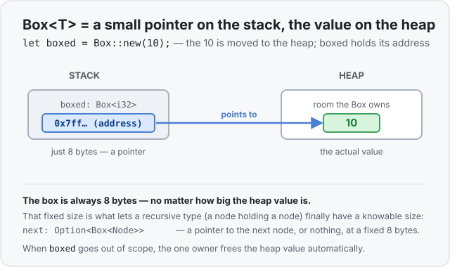

# Concept 29 · `Box<T>` (put one value on the heap) — Under the hood

> Pair: [Use it](use-it.md) · **Under the hood** (you are here)
> Track: [From-Zero: Rust](../README.md)

## Two boxes on the stack, one value on the heap
The mental model is small and exact. A `Box<T>` is **just a pointer** — an address, 8 bytes on
a 64-bit machine — and that pointer lives wherever you put the box (usually the stack). The `T`
it owns lives out on the **heap**. `let boxed = Box::new(10);` does two things:

1. asks the heap for room to hold an `i32`, and writes `10` there;
2. stores the **address** of that room in `boxed`, on the stack.



This is the same stack/heap split you saw with [`String`](../07-the-heap-and-string/under-the-hood.md):
a small fixed-size handle on the stack, the real data on the heap. `String` was a specialized
version (handle = pointer + length + capacity). `Box<T>` is the bare-bones version: the handle
is *just* the pointer, and the `T` is whatever you put in.

## Why `Box<i32>` and `Box<[i32; 100]>` are the same size
This is the property that makes `Box` useful, so it's worth seeing directly. The box stores an
**address**, and an address is the same size no matter how big the thing at that address is:

```rust
use std::mem::size_of;

println!("{}", size_of::<i32>());              // 4    — the number itself
println!("{}", size_of::<Box<i32>>());         // 8    — a pointer to it
println!("{}", size_of::<[i32; 100]>());       // 400  — a hundred numbers, inline
println!("{}", size_of::<Box<[i32; 100]>>());  // 8    — still just a pointer!
```

A hundred `i32`s inline is 400 bytes. Put them behind a box and the box is **8 bytes** — the
400 bytes moved to the heap, and the stack only keeps the address. That fixed 8 is exactly what
rescued the recursive `Node`: a node that stored another node inline had *infinite* size, but a
node that stores a `Box<Node>` stores an 8-byte pointer, so its size stops growing and becomes
knowable. The value it points at can be as big or as recursive as it likes; the pointer never
changes size.

## The `Option<Box<T>>` niche — free again
Remember the [niche trick](../15-option/under-the-hood.md) from `Option`, and again from
[`Result`](../23-result/under-the-hood.md): if a type has an impossible bit-pattern lying
around, Rust hides an enum's tag inside it instead of spending an extra byte. A pointer has one:
a valid heap address is never `0`. So `Option<Box<T>>` costs **nothing extra** — `None` is
stored as the all-zero address, and any non-zero address means `Some`:

```rust
use std::mem::size_of;
println!("{}", size_of::<Box<i32>>());          // 8
println!("{}", size_of::<Option<Box<i32>>>());  // 8  ← same! the tag hides in the 0 address
```

That's why the linked list's `Option<Box<Node>>` — "a pointer to the next node, or nothing" —
is as cheap as a bare pointer, with no null pointer anywhere in sight. The "or nothing" is free.

## Moving a box is cheap; the value never moves
A `Box` is a [move type](../08-ownership-and-moves/use-it.md) (it owns a heap allocation, just
like `String`), so handing it to someone else **moves** it:

```rust
let a = Box::new(String::from("hello"));
let b = a;             // the 8-byte pointer is moved into b; a is retired
// println!("{a}");    // ❌ a no longer owns anything
```

Here's the key part: the move copies **only the pointer** — 8 bytes on the stack. The `String`
out on the heap does not budge an inch; it's the same allocation, now owned by `b`. This is why
passing large values around inside a `Box` is cheap: you move an address, never the payload. It's
the exact same "move the handle, leave the heap data alone" you learned for `String`, because a
`Box` is that same shape stripped to its essentials.

And because there's exactly **one** owner at a time, cleanup is unambiguous: when the owning box
goes out of scope, Rust frees the heap value automatically — the [`Drop`](../08-ownership-and-moves/under-the-hood.md)
that comes with every owning type. One owner in, one free out. (What if you need *several*
owners of the same value? That single-owner rule is exactly what the next concept,
[`Rc`](../30-rc/use-it.md), relaxes.)

## Predict the memory
```rust
use std::mem::size_of;

struct Big { data: [u8; 1000] }

fn main() {
    println!("{}", size_of::<Big>());                 // ?
    println!("{}", size_of::<Box<Big>>());            // ?
    println!("{}", size_of::<Option<Box<Big>>>());    // ?
}
```

1. `Big` holds 1000 bytes **inline**. How big is a `Big` value itself?
2. A `Box<Big>` puts the `Big` on the heap and keeps only the address. How big is the box?
3. `Option<Box<Big>>` adds a "maybe nothing" wrapper around that box. Does it need an extra byte
   for the tag, or is there a spare pattern to hide it in?

<details>
<summary>Show the answer</summary>

1. **`Big` is 1000 bytes.** The array lives inline, so the whole value is exactly its contents.
2. **`Box<Big>` is 8 bytes.** The 1000 bytes moved to the heap; the box keeps only the 8-byte
   address, regardless of how big `Big` is. This is the whole point of a box.
3. **`Option<Box<Big>>` is 8 bytes** — no extra byte. A heap address is never `0`, so that
   impossible pattern *is* the `None` tag (niche optimization). "A pointer to a `Big`, or
   nothing" is the same size as the bare pointer.
</details>

## Next
- **[Concept 30 — `Rc<T>`](../30-rc/use-it.md):** a `Box` is single-owner — move it and the old
  variable is retired, because two owners freeing the same heap value would be a disaster. But
  some shapes (a value pointed at by several others) genuinely need **many** owners. `Rc` keeps a
  count of how many own the value and frees it only when the **last** one lets go. Next lesson.
