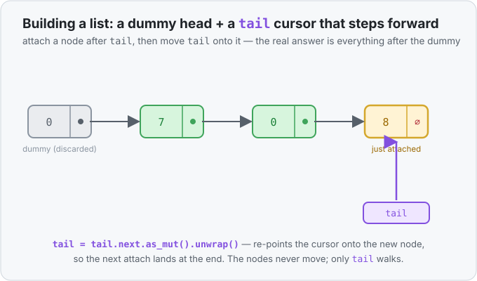

# Interlude 29a · Walking and building a linked list (the Add Two Numbers pattern) — Use it

> Interlude (single lesson) · Track: [From-Zero: Rust](../README.md)
> Sits right after [Concept 29 — `Box<T>`](../29-box/use-it.md)

## The idea
[Concept 29](../29-box/use-it.md) showed you why a self-referential node needs a box, and how to
*hand-build* a small chain:

```rust
struct ListNode {
    val: i32,
    next: Option<Box<ListNode>>,
}
impl ListNode {
    fn new(val: i32) -> Self { ListNode { val, next: None } }
}
```

That's the shape. Two everyday jobs remain, and both are the ones interview problems actually test:
**walk a list someone hands you** (visit every value), and **build a list one node at a time** as
answers come in. Neither has a `[i]` index to lean on — a linked list has no random access, only
"follow `.next` to the next node." So both jobs are really about one skill: *hold a moving pointer
into the chain and step it forward without breaking anything.* That's exactly what
[`.take()` and `.as_mut()` from Interlude 15b](../15b-taking-and-borrowing-inside-option/use-it.md)
are for.

## First, the honest question: why a linked list at all?
If you just want ordered digits, a [`Vec<i32>`](../17-vec/use-it.md) is almost always the better
tool — packed memory, instant `[i]` access, less ceremony. A `BTreeMap` would be worse still: it
adds sorted *keys* you don't need. So why does [Add Two Numbers](../../../problems/0002-add-two-numbers/README.md)
hand you a linked list?

Because the problem isn't really about adding numbers — it's a **exercise in node-by-node
ownership and traversal**. The linked list is chosen *precisely* so there's no index to fall back
on, forcing you to move a pointer along the chain by hand. Learn the moves here and the same shape
covers trees, graphs, and every "follow the pointer" structure later. (For a deeper look at the
list-vs-array trade-off, see the [linked list glossary entry](../../../glossary/linked-list.md).)

## Walking a list — read every value
Say you're handed a `list: Option<Box<ListNode>>` and want to print each value. You keep a
**cursor** that starts at the whole list and hops down `.next` until it hits `None`. To read
without tearing the list apart, borrow the inside with [`.as_ref()`](../15b-taking-and-borrowing-inside-option/use-it.md):

```rust
let mut cursor = list.as_ref();          // Option<&Box<ListNode>> — a borrowed peek

while let Some(node) = cursor {           // stops automatically at None (the end)
    print!("{} ", node.val);              // read this node's digit
    cursor = node.next.as_ref();          // hop: cursor now borrows the next node
}
// list is untouched — we only ever borrowed it
```

`while let Some(node) = cursor` is the loop that "keeps going as long as there's a next node." When
`cursor` finally borrows a `.next` that is `None`, the pattern fails, and the loop ends — the
`None` at the tail *is* the stop signal, no length counter needed.

## Building a list — the dummy-head + tail-cursor pattern
Building is the mirror image: instead of reading nodes off the front, you **attach new nodes to the
back**, one per step. The obstacle: to append, you need a pointer to the *current last node* so you
can set its `.next`. And the very first append has no previous node at all — a special case that
makes the code ugly.

The classic fix is a **dummy head**: create one throwaway node up front, keep a mutable cursor
`tail` pointing at it, and append after `tail` every time — including the first, which now has a
node to attach to. At the end, the real answer is `dummy.next` (everything *after* the throwaway).

```rust
let mut dummy = Box::new(ListNode::new(0));   // a throwaway node; its .val is never used
let mut tail = &mut dummy;                    // a &mut cursor at the current last node

for digit in [7, 0, 8] {
    tail.next = Some(Box::new(ListNode::new(digit)));  // attach a new node after tail
    tail = tail.next.as_mut().unwrap();                // STEP the cursor onto that new node
}

let answer = dummy.next;   // 7 -> 0 -> 8; the dummy's own 0 is discarded
```

The one line that trips everyone up is the step:

```rust
tail = tail.next.as_mut().unwrap();
```

Read it right-to-left. `tail.next` is the `Option<Box<ListNode>>` we just filled with `Some(new
node)`. We must *not* move it out (that would rip the node back off the list) — so
[`.as_mut()`](../15b-taking-and-borrowing-inside-option/use-it.md) borrows *into* the Option,
giving `Option<&mut Box<ListNode>>`, a mutable peek that leaves the node in the chain.
[`.unwrap()`](../15a-opening-options-safely/use-it.md) opens that `Some` — safe here because we
literally set it to `Some` on the line above — handing back the `&mut Box<ListNode>`. Assigning it
to `tail` **re-points the cursor** at the freshly attached node, so the next loop's `tail.next = …`
lands at the new end. The list itself never moves; only the little cursor walks forward.



## Putting both together: Add Two Numbers
Now the whole [Add Two Numbers](../../../problems/0002-add-two-numbers/README.md) solution reads as
plain English. Two numbers are stored as lists of digits **least-significant first**, so `342` is
`2 -> 4 -> 3` and `465` is `5 -> 6 -> 4`. Adding them digit-by-digit (with a carry) mirrors how you
add on paper, and the answer comes out in the same order: `7 -> 0 -> 8`, i.e. `807`.

```rust
let mut result_head = Box::new(ListNode::new(0));   // dummy head
let mut result_tail = &mut result_head;             // tail cursor
let mut carry = 0;

let mut first_digit = first_number;                 // Option<Box<ListNode>> we own
let mut second_digit = second_number;

while first_digit.is_some() || second_digit.is_some() || carry != 0 {
    let mut digit_sum = carry;

    if let Some(node) = first_digit.take() {        // .take(): read this node AND
        digit_sum += node.val;                      //   leave first_digit valid...
        first_digit = node.next;                    //   ...then step it to the next node
    }
    if let Some(node) = second_digit.take() {
        digit_sum += node.val;
        second_digit = node.next;
    }

    carry = digit_sum / 10;                         // tens place carries over
    result_tail.next = Some(Box::new(ListNode::new(digit_sum % 10)));  // ones place is this digit
    result_tail = result_tail.next.as_mut().unwrap();                  // step the tail cursor
}

result_head.next   // drop the dummy; return the real list
```

Every piece is now a tool you've met:

- **`.take()` steps each input forward.** `first_digit.take()` reads the node out *and* leaves
  `first_digit` as a valid `None`, so the next line can overwrite it with `node.next`. The plain
  `if let Some(node) = first_digit` would *move* `first_digit`, and the loop's next
  `first_digit.is_some()` wouldn't compile. (This is the [15b](../15b-taking-and-borrowing-inside-option/use-it.md)
  problem exactly.)
- **The `|| carry != 0` keeps the loop alive for a final carry.** Adding the single digits `5` and
  `5` gives `10`: a `0` written here and a carry of `1`. Both inputs are now used up, but that
  condition runs the loop once more to append the leading `1`, giving `0 -> 1` (i.e. `10`). Without
  it you'd lose the top digit of sums like `999 + 1`.
- **`digit_sum / 10` and `digit_sum % 10`** split a two-digit sum into "carry" and "digit written
  here" — [integer division truncates](../../../languages/rust.md#int-division) and `%` is the
  [remainder](../../../languages/rust.md#remainder).
- **The dummy head + `result_tail` cursor** build the answer back-to-front exactly as above.

## The one-line takeaways
- **Walk** a list with a borrowing cursor: `cursor = node.next.as_ref()` each pass; stop at `None`.
- **Build** a list with a dummy head and a `&mut` tail cursor: attach with `tail.next = Some(...)`,
  then step with `tail = tail.next.as_mut().unwrap()`.
- **Step an owned list forward** with `.take()`, which reads the node and leaves the variable a
  valid `None` to reassign.

## Exercises
1. **Sum a list** — [starter](exercises/1-starter.rs) · [solution](exercises/1-solution.rs).
   Given a hand-built `1 -> 2 -> 3`, walk it with an `.as_ref()` cursor and print the total (`6`),
   leaving the original list intact (print its head value afterward to prove it).
2. **Build from a slice** — [starter](exercises/2-starter.rs) · [solution](exercises/2-solution.rs).
   Write a function that takes `&[i32]` and builds a linked list of those digits using the
   dummy-head + tail-cursor pattern, then walk the result and print each value.

## Where this sits
This interlude belongs right after [Concept 29 (`Box`)](../29-box/use-it.md): once you can *define*
a boxed recursive node, the immediate next questions are "how do I read one I'm given?" and "how do
I build one as I go?" Both answers reuse [Interlude 15b's](../15b-taking-and-borrowing-inside-option/use-it.md)
`.take()` / `.as_ref()` / `.as_mut()`. The complete worked problem:
[Add Two Numbers](../../../problems/0002-add-two-numbers/README.md). Concept background:
[linked list glossary](../../../glossary/linked-list.md).
