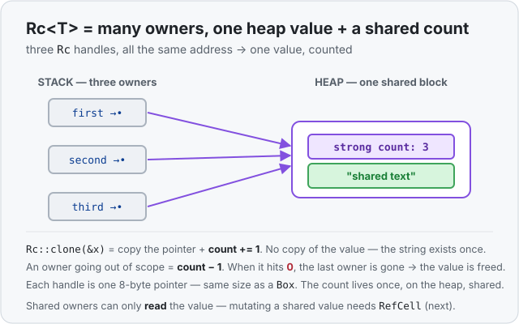

# Concept 30 · `Rc<T>` (many owners, one value) — Under the hood

> Pair: [Use it](use-it.md) · **Under the hood** (you are here)
> Track: [From-Zero: Rust](../README.md)

## The value and a counter, side by side on the heap
A [`Box<T>`](../29-box/under-the-hood.md) put *just* your value on the heap. `Rc<T>` puts your value on the heap **next to a counter**. Every `Rc` owner is a pointer aimed at that shared heap block, and the block holds two things:

- the **value** itself, and
- a **strong count** — how many `Rc` owners currently point here.



So the picture for three owners is: three 8-byte pointers (on the stack, or wherever the owners live), **all holding the same address**, and **one** heap block that says "count: 3" followed by the value. There is exactly one copy of the value, no matter how many owners there are.

Each `Rc` handle is itself just a pointer, so it's the same 8 bytes as a `Box`:

```rust
use std::mem::size_of;
use std::rc::Rc;

println!("{}", size_of::<Box<i32>>());   // 8
println!("{}", size_of::<Rc<i32>>());    // 8  — an Rc is one pointer, same as a Box
```

The count doesn't live *in* the handle — it lives once, on the heap, shared by all handles. That's why cloning is cheap: you copy the 8-byte pointer and reach through it to bump the one shared number.

## What `Rc::clone` and drop actually do
This is the entire mechanism, and it's smaller than it sounds:

- **`Rc::clone(&x)`** → copy the pointer (8 bytes), then follow it and do **count += 1**. No value is duplicated. That's it.
- **an `Rc` going out of scope** → follow the pointer and do **count -= 1**. Then check: is the count now `0`? If yes, this was the last owner, so **free the value** (and the block). If no, someone else still needs it, so leave it alone.

Trace it on a real run — the numbers below are printed by actual code:

| step | code                       | strong count             |
| ---- | -------------------------- | ------------------------ |
| 1    | `let a = Rc::new(s);`      | **1**                    |
| 2    | `let b = Rc::clone(&a);`   | **2**                    |
| 3    | `{ let c = Rc::clone(&a);` | **3**                    |
| 4    | `}` — `c` leaves scope     | **2**                    |
| 5    | `drop(a);`                 | **1**                    |
| 6    | end — `b` leaves scope     | **0** → value freed here |

The value outlives `a`, `c`, and every owner *except the last*. Only when the final owner lets go (count reaches `0`) does the free happen — automatically, driven entirely by the count. Nobody frees too early (the value is alive while *anyone* holds it) and nobody frees twice (only the zero-transition frees).

## Why `Rc::clone` is cheap but `String::clone` isn't
Both are spelled `.clone`, but they do opposite amounts of work, and the memory picture is why:

- **`String::clone`** ([Concept 09](../09-clone-the-inefficient-fix/use-it.md)) has to give you an *independent* second string, so it allocates a whole new heap buffer and copies every byte. Cost grows with the length of the string.
- **`Rc::clone`** gives you another *owner of the same* value — no independence needed — so it copies one pointer and adds `1` to the counter. Cost is the same tiny fixed amount no matter how big the value is.

That's the trade `Rc` makes: you give up the ability to mutate the shared value (many owners can't all safely write it), and in return sharing a new owner is nearly free. It's the reason idiomatic code writes the loud `Rc::clone(&x)` form — to mark "cheap count bump" and never let it be mistaken for a deep copy.

## Why you can't mutate through it — the borrow rules, again
The read-only limit from the *Use it* lesson isn't an arbitrary rule; it falls straight out of [Concept 11](../11-mut-references-and-borrow-rules/use-it.md). The borrow rules say: **many shared readers, or exactly one writer — never both.** An `Rc` with three owners is, by definition, three shared readers of one value. Handing out a `&mut` to any of them would be one writer coexisting with other readers — the precise thing that makes data corruption possible. So the compiler simply never lets an `Rc` give out `&mut`. To mutate a shared value safely you need a type that *checks*, at run time, that only one borrow is active at a time — that's `RefCell<T>`, the next concept, and the reason `Rc<RefCell<T>>` exists.

## Predict the memory
```rust
use std::rc::Rc;

fn main() {
    let a = Rc::new(String::from("data"));
    let b = Rc::clone(&a);
    let c = Rc::clone(&b);
    println!("A: {}", Rc::strong_count(&a));   // ?  (A)

    drop(b);
    drop(c);
    println!("B: {}", Rc::strong_count(&a));   // ?  (B)

    // Question C: how many copies of the string "data" exist on the heap
    // across this whole program?
}
```

<details>
<summary>Show the answer</summary>
<ul>
<li><strong>A: <code>3</code>.</strong> <code>a</code> made the value (count 1); <code>b</code> and <code>c</code> are each <code>Rc::clone</code>s of the same allocation (count 2, then 3). Note <code>c</code> clones <code>b</code>, but <code>b</code> points at the <em>same</em> block as <code>a</code>, so it's still the one shared count.</li>
<li><strong>B: <code>1</code>.</strong> Dropping <code>b</code> and <code>c</code> each subtract one, taking the count from 3 down to 1. <code>a</code> is still an owner, so the count is 1 and the string is very much alive.</li>
<li><strong>C: exactly one.</strong> <code>Rc::clone</code> never duplicates the value — it only adds owners of the single heap copy. There is one <code>"data"</code> on the heap the entire time, freed only when the last owner (<code>a</code>, at the end of <code>main</code>) goes out of scope.</li>
</ul>
</details>

## Next
- **`RefCell<T>` and interior mutability:** `Rc` shares a value but forbids changing it. `RefCell`
  is the other half — it *does* allow mutation of a shared value, by moving the borrow check from
  compile time to run time (borrow the wrong way and it panics instead of failing to compile). Put
  them together as `Rc<RefCell<T>>` and you get the pairing Rust reaches for whenever a value needs
  both **many owners** and **the ability to change**. Next concept.
